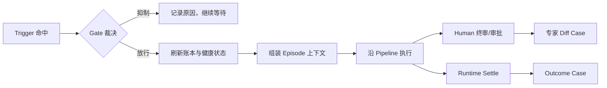
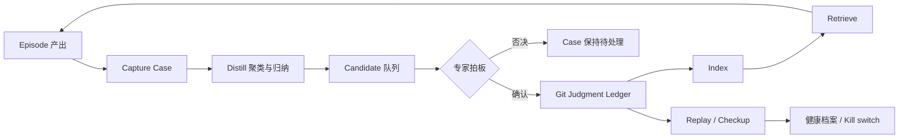
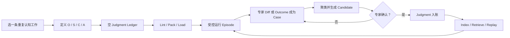

# 从专家反馈到可执行判断：OSCA 开放规范白皮书

> 一种可运行、可审计、可回放，并能从真实反馈中持续适应的 AI 认知工作流程开放规范
>
> 版本：v0.1-draft
>
> 日期：2026-07-12
>
> 对应规范：OSCA SPEC v0.3 + v0.4 draft

## 摘要

今天的 AI Agent 已经能够理解语言、检索知识、调用工具和执行多步任务。越来越多的产品把
Agent 描述为“数字员工”：人给它一项工作，它被唤起、处理、回答，然后等待下一次任务。
这个隐喻直观而有用，却容易遗漏另一种更基础的系统形态——许多组织中的认知工作并不是
一连串互不相干的问答，而是一条长期运行、反复交付、持续接受专家裁决的流水线。

OSCA 从这里出发。它把一个 AI Agent 定义为一条认知工作流水线：有明确的目标对象
（Object）、稳定的组合结构（Structure）、类型化的外部连接（Connector）和确定的触发
时机（Aware）；在这四层定义之上，人类专家过去确认的判断（Judgment）会在恰当情境中
重新生效。一个 Agent 因而不再只是临时接住任务的对话主体，而是一份可运行、可交付、
可审计的工作定义，外加一本随真实反馈更新的贡献账本。

这套设计在关键位置保留人，并不是因为人必然比 AI 更会判断——在许多局部任务上，事实
可能恰恰相反。人之所以仍站在关键位置，是因为嵌在现实组织、责任关系与业务现场中的人，
最先知道流水线之外的世界已经变化：政策换了，经营目标变了，领导对风险的容忍度变了，
原先合理的例外不再成立。人可以用一次删除、一处改写、一句备注或一次确认，把这个尚未
进入数据接口、模型输入和既有规则的新变化带回流水线。当变化已经能够被确定性观测时，
现实结果也可以通过 decision vs reality 对账成为“第二位专家”。

OSCA 使用纯 Markdown 和 YAML 表达 Agent，并把人的反馈保留在文本与 Git 层，而不是
直接内化进模型权重。每条正式判断必须带有出生证据、作者、确认与推翻计数、失效条件和
回放断言；新判断只能取代旧判断，不能抹去历史。模型可以帮助归纳候选判断，但不能自行
立法：证据由机器记录，专家负责拍板，确定性 Runtime 负责权限、预算、审批与启停。

Oscaware 是 OSCA 的参考工具、Runtime 与反馈飞轮实现。它用于证明规范可以被机器校验、
打包、装载、运行、采集、蒸馏、检索和回放，也为第三方实现兼容 Runtime 和飞轮提供一套
可讨论的行为基线。截至 2026-07-12，这些核心机制已经有代码、自动测试和合成/脱敏样例
演练；首个真实场景的 Phase 0 验证尚未完成。因此，本白皮书描述的是一套已形成工程机制、
但仍等待真实专家反馈和持续业务结果检验的开放规范，而不是一条已经得到商业证明的增长
曲线。

本白皮书面向关注 AI Agent 的产品与技术同行。它不替代字段级 SPEC 或参考实现文档，
而是解释 OSCA 为什么存在、各层设计如何互相支撑，以及开发者如何基于 OSCA 创建自己的
Agent。

## 开篇：AI Native 组织是一条认知工作流水线

> **AI Native 组织是一条认知工作流水线——AI 是稳定运转的流水线本身，专家是线上的判断节点，同时是线外的作者与所有者。**

这是 OSCA 和 Oscaware 选择技术方向之前，先作出的组织假设。

当我们把 Agent 想象成一名员工时，最自然的产品形态是给它一个入口：用户提出任务，Agent
理解意图，寻找资料，调用工具，交付答案。这种形态适合大量临时性、开放式和以对话为中心
的工作，也让人很容易理解 Agent 能做什么。

但组织里还有另一类工作。月度经营诊断、风险扫描、工单处置、临期定价、排班、审核和
报告生产，并不是每次从空白开始的随机任务。它们有持续存在的目标，有相对稳定的步骤，
连接固定的数据与执行系统，在某些时间或状态变化时启动，并在关键位置接受人的裁决。
每次产出可以结束，但负责产出它的工作系统不能每次重新发明。

OSCA 因而选择把 Agent 看成流水线，而不是一个等待派活的数字员工。这里的“流水线”不是
把认知工作降格为僵硬自动化，而是强调：即便工作中包含语言理解、模糊判断和例外处理，
承载这些认知活动的系统仍然需要回答五类稳定问题：

```text
这件工作围绕什么对象和目标？
它由哪些步骤组合而成？
它可以从哪里取数、向哪里行动？
什么时机值得启动？
过去被确认的专家裁决，如何约束这一次？
```

前四个问题构成 OSCA 的 O/S/C/A；第五个问题由判断账本回答。AI 模型参与这条流水线，
但不等于整条流水线：调度、权限、预算、审批、确定性取数、数值寻优和启停，不应该随着
模型的临场发挥而漂移；语言理解、例外处理、成文和解释，则可以在被约束的一次性认知
剧集中完成。

### 为什么关键位置要站人

在许多人机协作系统里，人的存在被解释为 AI 能力不足后的兜底：模型不够准，所以关键
步骤暂时交给人；等模型更强，人就可以退出。这不是 OSCA 保留人的主要理由。

关键位置站人，不是因为人天然比 AI 更会判断。对于已经被完整描述、数据充分、目标稳定
的局部问题，AI 或确定性算法完全可能比单个人更快、更一致，甚至更准确。真正的问题是，
任何一条运行中的认知流水线都只能依据它目前看得见的世界工作：已有输入、已有接口、已有
目标、已有判断。它无法自动知道那些尚未被表示出来的变化。

而专家生活在流水线之外。他知道新政策虽然还没进入数据库，却已经改变了风险边界；知道
这次费用上涨不是异常，而是组织正在检修；知道过去必须上报的事项现在应当压制；也知道
某条看似合理的规则，在新的责任关系下已经不能继续使用。专家的一次删除、改写、备注或
确认，不只是对当前产出进行质量检查，也可能是在报告：**流水线所依据的世界模型已经过期。**

因此，反馈是一次跨越系统边界的动作。它把外部世界的变化带入流水线。OSCA 要解决的，
不是如何让人永远重复同一个终审动作，而是如何让这次动作留下证据，经确认后成为下一次
运行能够自动使用的判断。

专家也因此拥有双重身份。

- 在线上，专家是判断节点：审批、终审、纠正系统尚未覆盖的例外。
- 在线外，专家是作者与所有者：其真实反馈可以被署名、归属、确认、推翻和取代，成为
  组织持有的判断资产。

人并不是流水线里一块永远不能自动化的人工零件。理想结果恰恰是：已经重复确认的裁决，
下一次由流水线自动执行；人把注意力移向新变化、新例外和新边界。人的价值不在于反复
替系统完成旧判断，而在于不断把尚未进入系统的新现实带回来。

这也不是唯一的变化入口。当价格、销量、损耗、故障或履约结果已经可以被 Connector
确定性观测时，Runtime 可以把当时的决策与后来的现实结果自动对账。现实无需说话，也能
推翻一条判断。OSCA 把这种 outcome 视为第二类出生证据——现实是第二位专家。

所以，OSCA 所说的适应，并不是模型在无人监督下修改自己。它是一个受控过程：人或现实
提供反馈，机器忠实记账，AI 帮助归纳，专家确认是否立法，Runtime 在后续情境中执行，
回放器再检查这条判断是否仍然有效。

这也是一种**按需进化**。系统不会为了“持续学习”而持续改写自己；只有当专家反馈或现实
结果表明外部世界已经变化，新的 Case 才进入飞轮，经过归纳、确认和回放，按需要调整当前
有效的判断。这里的“进化”是中性词：它不承诺系统越用越好，只承诺系统能够越用越顺手——
因为它始终在尝试贴合当下的环境。贴合可能意味着新增一条判断，也可能意味着降低 Trust、
推翻旧判断、缩短自动化边界，甚至把一个步骤重新交还给人。是否真的变好，仍要由返工量、
推翻率和现实结果裁决。

这套组织观目前仍是一项待验证假设。代码可以证明机制能够运转，合成样例可以证明链路
能够演练；只有真实场景中的专家是否愿意参与、判断是否会再次命中、返工量是否下降，才能
证明它是否值得成为一种新的组织基础设施。

## 前言：如何阅读这份白皮书

### 写给谁

本白皮书写给已经了解 LLM、Agent、RAG、工具调用和工作流编排的产品与技术同行。我们
不会从“大模型是什么”开始，而会集中解释 OSCA 试图补上现有 Agent 技术栈中的哪一层。

读完后，读者应当能够判断一个场景是否适合 OSCA，理解一个 `.osca` 包如何定义和运行，
并沿公开 SPEC 与样例创建自己的 OSCA Agent。读者可以采用 Oscaware，也可以实现自己的
兼容 Runtime、Connector、采集器、蒸馏器和回放器。

### 它不是什么

这不是字段参考手册、Python 代码讲解或 Oscaware 产品功能清单。精确的文件格式、运行
语义和机器校验口径，分别由 [OSCA SPEC v0.3](OSCA-SPEC-v0.3.md)、
[v0.4 增量草案](OSCA-SPEC-v0.4-draft.md)与
[Lint 规则清单](OSCA-LINT-RULES.md)定义。

本文也不是“AI 会自动越用越聪明”的承诺。OSCA 只主张反馈可以被采集、判断可以被确认
和取代、当前有效判断可以在后续运行中生效、判断效果可以被回放检验。系统是否因此变好，
必须由真实数据回答。

### 证据等级

为避免混淆，本白皮书使用四种证据口径：

| 口径 | 含义 |
|---|---|
| **设计原则** | OSCA 主张一个兼容系统应该怎样工作 |
| **已实现** | Oscaware 参考实现已有对应代码和自动测试 |
| **已演练** | 已经使用合成数据或脱敏样例跑通 |
| **已验证** | 已经由真实业务、真实专家和持续结果证明 |

如果一项能力只达到“已实现”或“已演练”，本文不会把它写成“已验证”。

## 第一部分：为什么需要 OSCA

### 第 1 章：现有 Agent 缺少的不是又一个工作流引擎

#### Agent 已经能做很多事

今天的 Agent 技术栈已经覆盖了相当广泛的能力：模型能够理解自然语言和图片，RAG 能够
检索组织知识，工具调用可以连接数据库与业务系统，工作流框架可以编排多步骤，多 Agent
系统可以分工，观测与评估工具则帮助开发者分析运行结果。

OSCA 不以否定这些能力为起点，也不打算重新发明一个通用工作流引擎。相反，OSCA 依赖
其中很多能力。它提出的问题发生在更长的时间尺度上：

> 一次工作结束后，专家刚刚作出的裁决，怎样成为下一次运行可以自动执行、又始终能够被人检查和撤销的资产？

#### 从“第一次做对”到“长期贴合现场”

为了让 Agent 第一次产出更好，团队通常会优化 Prompt、补充知识库、增加工具、细化流程、
改用更强模型。这些手段都很重要。但当专家在真实工作中改掉 Agent 的结果后，常见的后续
处理仍然比较零散：

- 实施人员把经验补进 Prompt；
- 把专家说明追加到知识库；
- 保留对话历史，希望模型下次记得；
- 在代码中增加一个特例；
- 积累数据后重新微调；
- 或者什么也不做，下次继续让专家改。

它们并非都错，但缺少一种共同的、可移植的判断资产形态。Prompt 中的改动很难逐条归属；
知识库中的新文档需要模型主动检索和正确解释；对话记忆依赖特定运行环境；代码特例把领域
判断埋进实现；微调则把判断内化到难以阅读、撤销和迁移的权重中。

结果是，Agent 可能越来越复杂，却很难回答几个朴素问题：这条行为为什么改变？是谁作出
的裁决？依据哪一次真实工作？现在还有效吗？换一个模型后会不会失效？如果专家推翻它，
历史如何保留？

#### 知识不等于判断

知识与判断经常被一起放进“记忆”这个宽泛概念，但它们承担不同职责。

| | 知识 | 判断 |
|---|---|---|
| 典型内容 | 事实、制度、文档、经验说明 | 在特定情境中应当怎样裁决 |
| 使用方式 | 被查询、阅读、总结 | 直接约束流程去向或产出 |
| 例子 | “检修期通常增加差旅支出” | “检修期差旅上涨不报警，除非超过历史峰值” |
| 变化方式 | 文档更新、知识同步 | 确认、推翻、取代、失效 |
| 关键问题 | “有什么材料可参考？” | “这次究竟应该怎么做？” |

知识可以帮助模型理解背景，却不天然等于一条应当执行的裁决。即使知识库已经写着“检修
会增加差旅”，Agent 仍可能在月度报告中机械地把 45% 涨幅列为异常，因为“知道一件事”
和“在这个裁决点压下报警”之间，还缺少一层明确约束。

这就是 OSCA 所说的判断层。可以用一句话记住二者的区别：

> **知识库是 Agent 去查它；判断账本是它自己生效。**

这里的“自己生效”不是把自然语言当作不可质疑的硬编码。它意味着 Runtime 先根据当前
Object、Aware 和情境筛选相关 Judgment，再把少量命中判断与出生 Case 注入本次 Episode；
模型在这些判断限定的可行域中完成认知工作，Policy 则在模型之外执行硬约束。

#### 贯穿案例：第一次月度经营诊断

设想一个月度经营诊断 Agent。它在财务关账后读取费用明细和检修计划，识别异常，形成
诊断报告，再交给业务专家终审。

第一次运行时，Agent 看到某单位差旅费环比上涨 45%，于是把它写进异常清单。专家知道
该单位当月正处于计划检修期，这类差旅增长通常属于正常波动，于是删除整段，并补充一句：
“检修期先不报，除非超过过去三年检修期峰值。”

对于普通工作流，这次任务已经完成：专家修正了报告，最终版本可以交付。但从组织资产的
角度，真正重要的事情才刚刚发生。专家不只是润色了一段文字，而是给出了一个带适用边界
和例外条件的裁决。下个月再遇到类似情境，如果系统仍然生成同样的误报，说明这次真实反馈
没有进入流水线。

OSCA 要保存的不是“专家删了 83 个字”这个表面 diff，也不是把整篇报告塞回知识库，而是
保存从这次行为中出生、经专家确认的一条判断，并让它在以后恰当的情境中重新生效。

#### OSCA 要补的是判断基础设施

工作流编排回答：

```text
先做什么，再做什么，调用什么。
```

判断基础设施回答：

```text
在这个具体情境下，过去被确认的裁决怎样改变这一次的去向？
```

因此，OSCA 的目标不是与编排、RAG、模型或工具生态竞争，而是提供一组开放约定，使它们
运行过程中产生的人类裁决能够被采集、署名、检索、执行、推翻和回放。它关注的不只是
Agent 能不能工作，还关注这条工作流水线能不能在外部世界变化后继续贴合现场。

#### 开发者带走什么

如果一个 Agent 只需要把已知步骤自动执行一次，现有工作流工具可能已经足够。只有当同类
工作会反复发生、人的修改中包含可复用裁决、这些裁决需要影响下一次运行时，OSCA 的判断
层才产生独立价值。

### 第 2 章：OSCA 的核心主张

#### 一句话定义

> **OSCA 是一种用纯文本定义 AI 认知工作流程的开放规范。它描述工作目标、组合步骤、外部能力与触发时机，并允许经真实反馈确认的人类判断在后续运行中自动生效。**

OSCA 的名称来自 Object、Structure、Connector、Aware 四层定义。这里的“认知工作流程”
指包含理解、判断、例外处理、成文或解释，但又具有稳定目标和重复结构的工作。OSCA 不规定必须
使用哪个模型、云平台、向量数据库或 Agent 框架；它规定的是一份可移植的 Agent 资产需要
表达什么，以及兼容 Runtime 在装载、触发、执行、权限和判断使用上应遵守什么契约。

#### O/S/C/A 与 Judgment

OSCA 用四个问题定义一条认知工作流水线：

| 层 | 回答的问题 |
|---|---|
| **O — Object** | 这件工作围绕什么对象和目标？ |
| **S — Structure** | 它由哪些步骤组合而成？ |
| **C — Connector** | 数据从哪里来，动作向哪里去？ |
| **A — Aware** | 什么时间或状态变化值得启动？ |

四层之上是 Judgment：过去被确认的专家裁决，在什么对象、时机与条件下应当生效。O/S/C/A
给出工作的稳定结构，Judgment 让结构在环境变化中保持贴合，而不需要每次重写整条流水线。

后续章节会分别展开这五层。此处先强调一个边界：Judgment 不是模型随意写入的长期记忆，
也不是开发者凭经验预填的规则。它必须出生于真实行为或现实结果，有证据，有作者，有使用
后的确认与推翻记录，并能被取代和回放。

#### 一个 Agent 是一份资产，而不只是一个进程

OSCA 将一个 Agent 表达为一个 `.osca` 文件夹。它主要由 Markdown 和 YAML 构成，可以
放进 Git、被人阅读、经过 Lint、打包交付、校验完整性并由不同 Runtime 装载。

这种文本形态不是为了追求“配置即一切”，而是服务于几个长期属性：

- **可检查**：专家、客户和审计者能够看到 Agent 的目标、边界和当前判断；
- **可归属**：每条 Judgment 能追溯到作者与出生 Case；
- **可撤销**：判断被推翻时通过 Supersedes 保留历史，而不是从权重中猜测如何删除；
- **可迁移**：更换模型或 Runtime 时，包和账本仍可保留，并重新运行 Replay；
- **可交付**：客户获得的不只是平台账号，而是一份可以持有和迁移的工作资产。

#### OSCA 与 Oscaware

OSCA 和 Oscaware 不是同一个层级的名称。

```text
OSCA
开放规范、文件格式与运行契约

Oscaware
OSCA 的参考工具、Runtime 与反馈飞轮实现
```

OSCA 希望允许多种实现。开发者可以只使用 SPEC 编写包，可以实现自己的 Linter 和 Runtime，
也可以把现有 Agent 平台做成 OSCA 兼容实现。Oscaware 的作用是提供第一套可运行答案，
用实现暴露规范歧义，并展示判断账本如何从反馈中形成。参考实现应当帮助规范变得可执行，
而不应把自己的内部结构变成唯一合法路径。

#### OSCA 不是什么

OSCA 不是一个新模型。它不解决基础模型能力本身，也不声称文本判断能弥补模型所有缺陷。

OSCA 不是 RAG 的替代品。知识库继续负责提供事实、文档和背景；Judgment Ledger 负责保留
会改变裁决结果的判断。两者可以在同一 Agent 中共同工作。

OSCA 不是通用 BPM 或工作流引擎的替代品。确定性业务流程可以继续由成熟系统承载；OSCA
聚焦的是含认知步骤、人类判断和反馈适应的工作定义，并可以与既有编排系统组合。

OSCA 也不是让 Agent 自主改写自己。AI 可以从多个真实 Case 中归纳 Candidate，但 Candidate
在专家确认前不进入正式包，不参与检索，也不能改变 Runtime 行为。Evidence 和 Meta 由机器
管账，专家负责是否立法，Runtime 负责执行和拦截。

#### 从“自学习”到“有证据的适应”

“自学习 Agent”很容易让人联想到一个系统在无人监管下不断修改自己，并且必然越来越好。
OSCA 不作这种承诺。环境变化后，旧 Judgment 可能失效；新反馈也可能互相冲突；不同模型
对同一判断的遵循程度可能不同。适应是中性过程，不是单调进步。

OSCA 能提供的是一个受控循环：

```text
真实工作产生反馈
→ 反馈作为 Case 留下证据
→ AI 归纳 Candidate
→ 专家确认是否成为 Judgment
→ Runtime 在后续情境中使用
→ 专家或现实再次确认、推翻
→ Replay 检查换模型或环境变化后的有效性
```

这条循环是否产生价值，要看 Judgment 是否再次命中、专家是否减少返工、推翻率是否受控，
以及换模型后能否通过 Replay。代码和合成测试只能证明循环有实现，不能替代这些真实证据。

#### 开放规范的开发者承诺

OSCA 的开发者承诺不是“采用 Oscaware 才能获得能力”，而是：一个 Agent 的核心定义和
判断资产应当可以离开特定模型与单一平台；第三方应能阅读公开规范、创建自己的包、实现
兼容工具，并对同一份资产给出可比较的运行和回放结果。

这要求 OSCA 不只保持文件格式开放，还要逐步明确运行语义、兼容边界和测试凭据。Oscaware
将作为参考实现提供最早的行为基线，但规范的长期价值取决于是否有人能在它之外创建新的
Agent 和实现。

#### 开发者带走什么

OSCA 的最小采用单位不是迁移整个平台，而是创建一份可通过 `osca lint` 的 `.osca` 包。
开发者可以从一个空 Judgment Ledger 开始，让真实工作产生第一批 Case，再选择使用
Oscaware 或自己的飞轮将反馈变成后续判断。

## 第二部分：OSCA 如何定义一个 Agent

### 第 3 章：O/S/C/A/J——五层认知工作定义

OSCA 不是从“给模型写一段角色设定”开始定义 Agent，而是先把一件认知工作拆成五个责任
边界。这样做的目的不是让 YAML 变多，而是把原本混在 Prompt、代码、调度器和实施人员
脑中的信息分开：哪些是领域对象，哪些是稳定步骤，哪些是外部能力，哪些是启动条件，哪些
是会随真实反馈变化的判断。

五层分别回答：

```text
O — Object：这件工作围绕什么？
S — Structure：这件工作怎样组合？
C — Connector：这件工作如何接触外部世界？
A — Aware：什么时候值得行动？
J — Judgment：过去的裁决如何约束这一次？
```

#### O：Object——建立稳定的领域名词

Object 是 OSCA 对工作对象的正式定义。它可能是一个领域实体，例如单位、客户、商品或
工单；也可能是一项指标、一份中间产物、一份最终报告，或者一个需要优化并在事后对账的
目标。

Object 的价值首先不是提供一份严密数据库 Schema，而是建立稳定的领域语言。Agent、
Runtime、判断账本和人类专家需要对“费用异动”“诊断报告”“售罄率”“风险事件”这些词
有共同理解。否则同一条 Judgment 在不同步骤中可能指向不同事物，检索命中也无法形成
可靠边界。

OSCA 当前把 Object 分为若干语义类型：

- **Entity**：需要识别和追踪的领域实体；
- **Artifact**：流程内部或对外交付的产出物；
- **Metric**：有单位、方向和来源的指标；
- **Composite**：由其他对象组合或计算而成的对象；
- **Objective**：供 Optimizer 寻优、并可在事后 Settle 的目标。

白皮书不展开各类型的字段约束。重要的是：Object 让输入、产出、判断签名和对账目标拥有
可被不同实现共同识别的名字与含义。

在月度经营诊断案例中，可以至少识别出：

```text
费用明细          领域输入
检修计划          情境输入
费用异动报警      流程内部 Artifact
月度诊断报告      最终 Artifact
诊断有效性        可对账的 Objective
```

如果某个名词只在一个步骤内部临时使用，可以先保持轻量；一旦它进入 Judgment 的适用边界、
跨步骤传递或对外交付，就应当获得正式 Object 身份。

#### S：Structure——定义组合骨架，而不是塞满判断

Structure 描述一件工作由哪些步骤组成、每步由谁执行、使用什么、接收什么、产生什么。它
类似一张薄的工艺路线图：足够让 Runtime 知道怎样推进，却不把所有领域知识和例外条件都
硬编码进流程。

月度经营诊断可能包含：

```text
1. 提取财务与经营数据       Connector
2. 识别候选异动             Agent 或确定性算法
3. 在约束内排序与筛选       Optimizer
4. 结合判断形成报告草稿     Agent + Judgments
5. 专家终审                 Human
6. 事后效果对账             Runtime
```

这种拆分让每一种 Performer 做自己擅长的事。Connector 不进行语言推理，Agent 不临场写
SQL，Optimizer 不让 LLM 猜数，Human 不必重复执行已经稳定的机械步骤，Runtime 则负责
确定性控制。

Structure 应当保持“薄”。如果检修期差旅上涨是否报警被写死在某个流程分支里，那么专家
改变判断时就必须修改工作流代码。OSCA 更希望稳定的步骤保持不变，把这类会随现场变化的
裁决放进 Judgment Ledger。

#### C：Connector——用类型化契约接触外部世界

Connector 定义 Agent 需要哪些外部能力，例如读取财务明细、查询检修计划、发送报告、
更新价签或调用另一个 Agent。模型只能按已声明名称使用这些能力，不能在运行时凭空发明
接口、连接串或执行语句。

OSCA 将 Connector 分成三个层面：

```text
Manifest    包内：需要什么接口、输入输出和权限
Binding     环境：这个客户的接口实际在哪里、使用哪个 Secret
Executor    部署：SQL、OpenAPI、MCP 或其他协议怎样真正执行
```

这层分离解决两个问题。

第一，Agent 包可以在不同环境间迁移。同一个 `FINANCE_DB` 逻辑能力，在开发、测试和客户
生产环境中可以绑定到不同端点，而不需要改包。

第二，真实地址和密钥不进入可交付资产。`.osca` 包只声明需求和权限，部署环境负责注入
实际 Binding，Secret 的值继续留在客户自己的安全设施里。

Connector 不是“给模型更多工具”的简单清单。它同时是契约测试：当包声明的接口和企业
系统实际提供的接口发生漂移时，兼容 Runtime 应当在装载或调用处明确失败，而不是让模型
猜一个相似接口继续运行。

#### A：Aware——定义系统何时值得醒来

许多 Agent 被设计成一个等待用户输入的对话框。OSCA 的认知流水线可以被人主动调用，
也需要描述它在什么时间、状态或事件下应当自行启动。

Aware 把“感知到事情发生”和“决定值得唤醒”分开：

- **Trigger** 报告一个原始事件，例如每月 9 日 09:00、关账状态变化、操作者按下按钮；
- **Gate** 组合多个 Trigger，并检查前置条件、启停状态与 Debounce，决定是否真正创建
  Episode。

Trigger 可以是定时器、轮询器或外部事件。Gate 可以要求任意一个条件满足、全部条件都
满足，或按声明顺序发生。Debounce 用来抑制短时间内的重复唤醒；Precondition 则在启动
认知工作之前做最后一次确定性业务检查。

在经营诊断案例中，“每月 9 日”只是一个时间信号。如果财务系统尚未关账，流水线不应
为了到点而生成一份缺数据的报告。因此 Trigger 命中不等于 Agent 必须工作：触发负责
报告变化，闸门负责裁决是否值得为它付出一次认知 Episode 的成本。

Aware 还携带本次行动的预算和裁量说明。预算限制最长时长、步骤、工具调用或 Token；
Discretion 则只向本次被命中的 Episode 说明，在这个 Aware 下模型可以主动到什么程度。

#### J：Judgment——为稳定结构叠加可变裁决

Judgment 不是 O/S/C/A 之外又一种普通配置文件。前四层定义工作的稳定骨架，Judgment
记录从真实工作中出生、会随环境变化而被确认或推翻的裁决。

一条 Judgment 可以被理解成一个带证据的函数：

```text
签名：对哪个 Object、在哪个 Aware、满足什么 Guard 时生效
函数体：应该怎样裁决，以及有什么“除非”条件
证据：它出生于哪些真实 Case
状态：作者、确认、推翻与 Trust
防腐：什么变化会让它失效，怎样 Replay
```

经营诊断中的判断可以表达为：当对象是“费用异动报警”，当前处于月度诊断 Aware，费用
科目为差旅费、涨幅超过阈值且存在检修期上下文时，通常压制该报警；除非涨幅同时超过该
单位近三年检修期峰值。

这里的 Guard 给出适用边界，Body 给出裁决，Evidence 说明它不是开发者凭空想象出来的
“最佳实践”。后续运行中，Runtime 先按签名缩小候选范围，再将少量命中 Judgment 与代表
Case 注入 Episode。模型不需要在整本账本中自行搜索，也不应把一条客户私有判断扩张到
没有证据支持的情境。

#### 五层怎样协作

可以把五层的变化频率与责任归纳如下：

| 层 | 主要内容 | 典型变化原因 |
|---|---|---|
| Object | 领域名词、产出与目标 | 领域模型或交付物变化 |
| Structure | 稳定步骤与 Performer | 工艺路线变化 |
| Connector | 外部能力契约 | 系统接口或权限变化 |
| Aware | 触发、Gate 与预算 | 运营节奏或事件来源变化 |
| Judgment | 情境化裁决 | 专家反馈与现实结果变化 |

这并非绝对静态/动态划分。外部世界变化时，任何层都可能需要更新。但 OSCA 希望先辨认：
这次变化是在重构工作本身，还是在修正同一工作中的一条判断。只有后者才应进入 Judgment
Ledger。把所有变化都蒸馏成 Judgment，会让账本成为无边界的杂物间；把所有判断都固化
进 Structure，又会让流水线难以适应。

#### 开发者带走什么

创建 OSCA Agent 时，不要先问“Prompt 应该怎么写”，而要先逐一回答五个问题。如果一项
信息无法明确归入 O/S/C/A/J，通常意味着领域边界、运行责任或反馈归属还没有想清楚。

### 第 4 章：`.osca` 包——可交付的 Agent 资产

OSCA 不把 Agent 的核心定义只保存在某个平台数据库里。一个 Agent 的开发态形态是一个
`.osca` 文件夹，也是一座 Git 仓库；交付时可以被打包成带完整性清单的归档文件。

```text
<agent>.osca/
├── osca.yaml
├── AGENT.md
├── policy.yaml
├── structure.yaml
├── objects/
├── connectors/
├── aware/
├── judgments/
├── cases/
├── indexes/
└── bindings.example.yaml
```

这棵目录不是实现内部结构的偶然暴露，而是一组资产边界。

#### 身份、劝告、笼子与骨架

包根目录的四个文件承担不同职责：

- `osca.yaml` 是包的身份证，声明格式版本、Package ID、入口、Runtime 与 Binding 需求；
- `AGENT.md` 是给认知平面读取的入口，说明身份、目标、领域语言和行为边界；
- `policy.yaml` 是确定性 Runtime 执行的笼子，规定权限、审批、预算、脱敏和 Kill switch；
- `structure.yaml` 是组合骨架，声明 Pipeline 与 Performer。

这种分离最重要的一点是：**AGENT 是劝告，Policy 是笼子。**

AGENT 可以告诉模型“不要编造没有数据支撑的结论”，塑造模型行为；Policy 则确保模型即使
忘记这句话、遭遇 Prompt Injection 或被另一个模型替换，也不能调用白名单外工具、绕过
审批或突破预算。Policy 不进入模型上下文，模型甚至不需要知道笼子的全部形状。

#### 领域定义、外部能力和感知时机

`objects/`、`connectors/` 和 `aware/` 分别承载 O、C、A。Structure 通过 ID 引用它们，
Judgment 的 Signature 也通过 ID 限定适用范围。

跨文件只使用稳定 ID，而不依赖中文名或文件名。中文名可以随业务语言调整，ID 一经分配
则不复用。这样一条 Judgment 的证据链不会因为“费用报警”改名为“费用异动提醒”而断裂。

#### Judgment 与 Case 为什么分开

`judgments/` 存放已经被确认、能够参与后续裁决的判断；`cases/` 存放这些判断出生和被
再次检验的原始证据。

分开之后，读者可以同时看到：

```text
现在系统依什么判断工作？          查看 judgments/
这些判断为什么存在？              追溯 evidence 指向的 cases/
某条判断后来怎样被确认或推翻？    查看 Meta 与 Git 历史
```

Case 可以包含专家 Diff，也可以包含 Decision vs Reality。体积很大的原始报文可以放在
外部存储，但包内必须保留内容哈希、逻辑 Store 和对象 Key；真实存储端点仍由部署 Binding
解析。

#### 文件是真相，索引是缓存

OSCA 把人能阅读的文件当作资产真相，把 `indexes/` 当作可丢弃缓存。

索引可以包括：

- 用于 Signature 硬过滤的 Judgment 表；
- 用于桶内语义排序的向量；
- 用于整本 Replay 的健康档案；
- 用于完整性校验的文件清单。

除完整性清单外，这些索引不应成为人手维护的业务事实。缓存缺失、损坏或模型过期时，
系统应从包文件重建或明确退化，而不是让坏索引反过来改写 Judgment Ledger。

这条原则也降低了早期工程复杂度。账本只有数十或数百条时，Git、YAML 和轻量向量文件
足以支撑验证；不需要为了“未来可能有十万条”在第一天引入一套难以审计的分布式知识
基础设施。规模真正到来后，索引层可以迁移，资产层不必随之重写。

#### 开发态、交付态与运行态

一个 `.osca` 包经历三种状态：

```text
开发态 Git 目录
→ lint
→ pack
→ 可复现交付件
→ load
→ 校验并重建索引的运行态目录
```

`osca lint` 把包结构、ID、引用、账本纪律和零密钥边界变成机器规则；`osca pack` 只接受
通过 Lint 的资产，排除真实 Binding 和机器缓存，并以固定顺序与元数据生成可复现归档；
`osca load` 检查完整性、再次 Lint、比对部署 Binding，并重建运行索引。

可复现打包意味着相同内容生成相同字节和哈希，便于签名与发布比对。但包内校验和本身
不能证明发布者身份：攻击者如果能够同时替换内容和清单，也能重新计算哈希。生产发布仍
需要外部可信哈希、数字签名或等价的供应链信任机制。

#### 包内零密钥

一个可交付、可打印、可审计的 Agent 资产不应夹带客户数据库地址、Token、私钥或真实
Binding。OSCA 将这些值留在部署环境，通过逻辑 Binding 名称连接包与环境。

这不只是防止 Git 泄密。它还让包的所有权与运行权限分开：客户可以审阅和持有 Agent 包，
但包被复制到另一台机器后，不会自动获得原环境中的数据访问能力。

#### Git 为什么是账本，而不只是版本控制

对 Judgment Ledger 而言，Git 原生提供了一组有价值的语义：

- Commit 表示一次追加或取代；
- Author/Blame 提供变更归属；
- History 保留判断与证据的时间线；
- Checkout 可以恢复某个历史版本用于 Replay；
- Diff 可以展示一次反馈究竟改变了什么。

OSCA 不把 Git Commit 等同于专家立法本身。正式 Judgment 仍需经过 Candidate 确认、Lint
和账本事务。但一旦入账，Git 提供了比隐藏数据库记录更透明的资产轨迹。

#### 客户拥有什么

如果 Agent 只存在于供应商平台中，客户实际拥有的可能只是使用权。OSCA 希望客户能够
持有以下内容：

- 领域 Object 与工作 Structure；
- Connector Manifest 与安全 Policy；
- 当前有效 Judgment；
- Judgment 的出生 Case 与取代历史；
- 用不同模型重新 Replay 所需的断言。

这不意味着所有实现代码和蒸馏工艺都必须进入同一个开放许可。规范、资产、参考 Runtime、
第一方产品和客户私有账本可以有不同开放边界。关键是：客户自己的工作定义与判断资产不应
因为更换模型或平台而消失。

#### 开发者带走什么

`.osca` 包不是把 Prompt、工作流和知识文件随意放进同一目录。每种文件都有明确消费者和
权力边界：模型读什么、Runtime 强制什么、部署环境注入什么、哪些内容是资产真相、哪些
只是缓存。理解这些边界，比记住每个 YAML 字段更重要。

## 第三部分：OSCA Agent 如何运行

### 第 5 章：双平面运行模型

一个 `.osca` 包只有在 Runtime 中被装载、布防和唤醒，才从静态资产变成正在工作的 Agent。
OSCA 把运行系统分为控制平面与认知平面，原因不是为了追求分布式架构，而是为了把两类
完全不同的责任分开。

```text
控制平面：什么时候醒、能做什么、花多少、何时停
认知平面：本次情境怎样理解、判断、成文和解释
```

#### 控制平面：确定性、常驻、便宜

控制平面通常由 Host 或其他兼容 Runtime 承担。它长期运行，但不需要一个模型持续在线
“思考”。它负责：

- 装载和校验 Package；
- 把 Trigger 编译成 Watcher；
- 通过 Gate 决定是否唤醒；
- 组装本次 Episode 上下文；
- 执行 Policy、审批、预算和 Kill switch；
- 代理 Connector 调用；
- 记录审计与运行状态；
- 在闭环场景中执行 Settle。

这里所说的“控制平面无 LLM”，是责任语义，而不一定要求物理上部署为两个进程。参考实现
当前可以由同一个 Host 进程在独立线程中发起认知 Episode 的 LLM 请求，但 Trigger、Gate、
权限、预算和启停的裁决不依赖模型输出。第三方实现可以把 Episode Worker 拆成独立服务，
也可以保留单进程部署，只要权力边界不发生变化。

#### 认知平面：按需唤醒的短命 Episode

认知平面只在 Gate 放行后创建。每次 Episode 都有自己的 ID、触发来源、预算、上下文、
步骤记录、产出和终态。Pipeline 完成、到达人类节点、预算用尽或步骤失败后，Episode 结束。

不存在一个不断积累隐式对话状态、持续运行的模型。跨 Episode 记忆只来自显式资产：

```text
Package 定义
Judgment Ledger
Case 证据
Git 历史
```

这种短命模型让成本与实际工作次数相关，也使一次输出使用了什么上下文、判断和工具更容易
审计。它还迫使系统正面回答长期记忆在哪里，而不是把记忆寄托在不可见的会话状态中。

#### 从 Trigger 到 Episode

一次运行可以概括为：



Trigger 命中后，Gate 先检查组合条件、Precondition、Debounce 与 Enabled。放行前，长跑
Runtime 还应确保正在使用的账本是一个完整、通过 Lint 的一致快照。如果蒸馏器正在写账、
磁盘账本不合规或索引重建失败，本次唤醒应被拒绝或安全退化，不能用“半条新 Judgment”
装配 Episode。

#### 一次性上下文里有什么

Episode 不是把整个 `.osca` 包塞进模型上下文。参考装配语义包括：

```text
AGENT.md
+ structure.yaml
+ 当前 Aware 的 Discretion
+ 本次引用的 Objects
+ 检索命中的 top 3–7 Judgments
+ 每条 Judgment 的一个代表 Case
```

这种渐进披露有三个目的。

第一，控制 Token 和注意力成本。账本增长时，单次 Episode 的上下文不应线性增长。

第二，减少无关判断冲突。Runtime 先按 Object、Aware 等可确定比较的签名维度硬过滤，
再结合 Guard、当前查询与索引能力在小候选桶内排序，而不是要求模型在整本账本中自行
寻找规则。当前参考实现尚未把所有自然语言 Guard 编译成确定性表达式，这一边界将在后文
作为开放问题保留。

第三，保留证据。只注入 Judgment Body 容易让模型把自然语言规则理解成绝对命令；附带
一个代表 Case，可以展示它在真实工作中怎样出生和被使用。

Policy 刻意不进入模型上下文。AGENT 可以被模型理解，Policy 必须由 Runtime 强制。模型
不需要知道“自己是否有机会绕过笼子”。

#### 五类 Performer

Structure 的每个步骤由受限 Performer 执行。

**Connector** 负责确定性取数和执行。模型只能按 Manifest 声明的接口名调用，Connector
Proxy 解析 Binding、检查接口与权限、执行脱敏并记录回执。取数失败时，认知步骤不能靠
猜测补出一份报告。

**Agent** 负责语言理解、未覆盖例外的保守处理、成文和解释。它读取本次一次性上下文，
输出中凡依据某条 Judgment 裁决的段落，应标注 Judgment ID，为后续反馈归属提供输入。

**Optimizer** 负责确定性数值寻优。Judgment 可以限定可行域和禁止项，Optimizer 在可行域
内计算最优；LLM 不负责猜数或替代数值算法。

**Human** 负责审批、终审和新变化的反馈。当 Pipeline 到达人类节点时，机器侧可以停止并
等待回执。当前界面可以是 CLI、文档编辑或审批卡，但其语义都是一次可采集的裁决点。

**Runtime** 负责调度、状态和对账。它不参与语言成文，而把 Episode 的 Decision 与后来的
Reality 形成 Outcome Case。

这种分工不是宣称每一种工作永远只能由一种 Performer 完成，而是避免把所有能力混进同一
模型调用。边界越清楚，权限、失败原因和反馈归属越容易解释。

#### Policy：模型之外的权力边界

Policy Interceptor 位于工具调用、外部访问、写动作和预算消耗之前。典型裁决包括：

- Pipeline 步骤是否在工具白名单中；
- 写接口是否获得一次性审批；
- 本 Episode 的 Tool Calls、Token、步骤或时长是否达到硬顶；
- 外部域名是否在 Egress 白名单；
- 输入和输出是否需要脱敏；
- 账本推翻率或 Replay 红灯率是否触发 Kill switch。

安全配置错误应向安全侧倒。例如非法预算不能被解释成无限额度，非法审批清单不能被解释为
无需审批，非法脱敏配置也不能静默关闭保护。这类 Fail-closed 语义应由 Lint 和 Runtime
共同执行。

#### Connector Proxy：调用必须经过的窄门

Runtime 不把 Binding 和 Secret 直接注入模型。Connector Proxy 接收一个类型化接口引用，
依次执行：

```text
步骤工具授权
→ Manifest 契约检查
→ 写权限与审批
→ Binding/Secret 解析
→ Egress 检查
→ Executor 调用
→ 结果脱敏
→ 生成调用回执
```

如果模型调用了未声明接口，系统应报告接口漂移；如果环境缺少 Binding，系统应拒绝；如果
写接口未获审批，内部 Runtime 调用也不应获得特权。模型只能使用这条窄门提供的能力。

#### 三级停

OSCA 区分三个作用范围不同的停止动作：

| 层级 | 停止什么 | 典型原因 |
|---|---|---|
| Episode 停 | 本次工作 | Pipeline 完成、失败或预算硬顶 |
| Aware 停 | 一个触发入口 | 暂停月度扫描，保留包内其他能力 |
| Package 停 | 整个 Agent | 风险异常、部署撤销或人工停机 |

Package 停不能只从注册表删除名字。它还应撤销 Watcher、清理 Binding、让 Policy 进入
Revoked 状态，并使在途 Episode 在步骤边界停止，后续 Connector 调用全部拒绝。启停是
Runtime 对能力的操作，不是向模型发出“请停止”的提示。

#### Settle：现实进入流水线

对于 Objective 型场景，Episode 产出的 Decision 往往不能立即判断好坏。定价要等闭店，
排班要等实际履约，告警处置要看故障是否发生。Object 可以声明一个 Settle 接口，Runtime
在合适时机读取 Reality，形成 Outcome Case：

```text
当时为什么启动
当时有哪些 Judgment 生效
Episode 作出了什么 Decision
现实后来发生了什么
```

参考实现当前能够执行受限 Settle 契约；复杂营业日历与延迟调度仍属于部署侧能力。关键
语义是：对账不需要再启动一个 LLM Episode。现实回声是确定性采集动作，不应消耗认知
预算。

#### 贯穿案例：一次月度诊断怎样运行

把前面的经营诊断案例串起来：

1. Host 装载通过 Lint 的经营诊断包，校验财务 Binding 并注册 Watcher；
2. 每月 9 日的 Schedule Trigger 命中；
3. Gate 调用财务 Connector 检查关账状态，未关账则拦截并留痕；
4. Gate 放行后，Runtime 刷新当前账本，重算 Kill switch；
5. Runtime 组装一次性 Episode：AGENT、Structure、本次 Aware、相关 Object、少量 Judgment
   和代表 Case；
6. Connector 步读取费用明细与检修计划，回执进入 Episode 台账；
7. Agent 识别和成文，Optimizer 在需要时做确定性排序；
8. 命中的检修期 Judgment 压制普通差旅报警，只保留超过历史峰值的例外；
9. 草稿到达 Human 步，专家终审；
10. 专家的保留、删除、改写和备注形成下一阶段可采集的 Diff。

这一轮结束后，模型不保留隐藏会话记忆。下个月能否做得更贴合，取决于本轮反馈是否被
忠实采集、确认入账，并在下一轮被正确检索，而不是取决于模型是否“记得上次聊过什么”。

#### 当前证据边界

Oscaware 参考 Host 已实现 Loader、Trigger Table、Gate、Episode Assembler、Policy、
Connector Proxy、Runner 与 Settle，并有自动测试和脱敏/合成演练。真实 SQL/OpenAPI/MCP
Executor、复杂延迟调度、面向专家的审批界面和生产级运维不由这些测试证明。本章定义的
运行边界是 OSCA 的参考语义；第三方实现可以采用不同进程、存储和调度架构，但需要保持
同等可解释的权限、启停和反馈契约。

#### 开发者带走什么

双平面的核心不是“Host 必须用哪种技术”，而是不能让一次 LLM 调用同时拥有感知、调度、
权限、取数、判断、记忆和自我修改的全部权力。控制决策应当确定、可审计；认知 Episode
应当短命、有界；长期适应应当通过显式账本完成。

## 第四部分：贡献账本与反馈飞轮

### 第 6 章：从反馈到判断资产

一次专家修改并不天然等于一条可复用判断。专家可能只是在改错别字、调整语气、响应一次性
要求，也可能在表达一条以后应当反复生效的业务边界。OSCA 不允许模型看到一个 Diff 就
立即把它写进长期记忆，而是在原始证据与正式判断之间设置一个候选层。

#### Case、Candidate 与 Judgment

三种对象对应三种不同权力状态：

| 对象 | 含义 | 是否进入正式包 | 是否影响后续运行 |
|---|---|---:|---:|
| **Case** | 一次真实反馈或现实结果的原始证据 | 是 | 仅作为证据 |
| **Candidate** | AI 从一组 Case 归纳出的候选判断 | 否，默认在包外队列 | 否 |
| **Judgment** | 经专家确认、通过 Lint 后正式入账的判断 | 是 | 是 |

Case 先于解释存在。采集器的首要职责不是理解专家为什么改，而是忠实保存当时输入、Agent
草稿、专家终稿、备注、当时生效的 Judgment 集合和运行上下文。后续蒸馏器可以重新解释
这些证据，但不能篡改它们。

Candidate 是一种立法草案。它可以被查看、修改、确认或否决，却还不是组织资产中的现行
规则。把 Candidate 放在包外，意味着它不会进入交付件、不会被 Runtime 检索，也不能因为
AI 自信地输出了一段 YAML 就改变生产行为。

Judgment 才是现行裁决。它必须有 Evidence，有作者和状态，符合账本纪律，并通过机器
Lint。确认动作使它获得进入账本的资格；之后的真实使用决定它能否积累 Trust。

#### 一条 Judgment 的五段式

判断不是一句脱离情境的“经验总结”。一条完整 Judgment 至少包含五个部分。

**第一段：Signature。** 它说明 Judgment 对哪个 Object、在哪个 Aware，以及满足什么
Guard 时可能生效。Signature 是判断的类型边界，也是检索第一阶段的基础。

**第二段：Body。** 它用一到数句自然语言给出裁决，可以包含“除非”子句。Body 不应成为
一篇领域知识文章，而应能够改变一次具体决策、动作或产出。

**第三段：Evidence。** 它列出 Judgment 出生所依据的 Case。没有出生证据的判断不能入账；
专家口述也需要先成为一种带作者和时间的 Case，而不是绕过证据纪律直接写规则。

**第四段：Meta。** 它记录作者、蒸馏批次、确认日期、Confirmed、Overruled、Trust 和
当前状态。计数由机器根据真实使用更新，人不能手工把一条新 Judgment 标成 High Trust。

**第五段：Expiry 与 Replay。** Expiry 说明什么变化发生时应当重审；Replay 则声明使用
哪些出生 Case 检查它是否仍在起作用。

可以将它概括成一个带证据和生命周期的函数：

```text
Judgment(当前 Object, Aware, 情境)
→ 在适用边界内给出裁决
→ 能追溯为什么存在
→ 能说明何时失效
→ 能在换模型后重新体检
```

#### 五条账本纪律

OSCA 用几条不变量防止 Judgment Ledger 退化成不可审计的“长期记忆”。

**一，只追加，不抹除。** 判断被推翻时，新 Judgment 通过 Supersedes 指向旧 Judgment，
旧文件改为 Superseded 并保留。删除旧判断会同时删除组织为什么改变的历史。

**二，无证据不入账。** Evidence 必须指向包内真实存在的 Case。这个约束防止开发者或 AI
凭空编写一套看似专业、却没有经历现场裁决的规则库。

**三，Trust 由使用驱动。** 新 Judgment 从 Provisional 开始。它在后续 Episode 中真正
参与裁决，并被专家保留或被现实结果支持，才能累积 Confirmed；被推翻则累积 Overruled，
达到重审条件后进入 Review。参考实现当前使用一组明确阈值，最终阈值仍需真实 P0 校准。

**四，每条 Judgment 能够 Replay。** 判断必须声明至少一个回放断言。无法在出生情境中
重新检查的判断，很难证明它在换模型、改 Prompt 或改 Structure 后仍然有效。

**五，负判断与正判断同权。** “生成一个报警”容易被看见，“不要生成这条噪音”同样可能
产生价值。被正确压制的无效动作也应当被标注、归属和确认。

#### Supersedes：账本怎样改变而不失忆

判断的演化不是原地覆盖。假设初版判断为：

```text
J-0405：费用涨幅超过 30% 就进入报告。
```

真实运行中，专家多次删除检修期差旅报警，旧 Judgment 进入 Review。蒸馏器从这些 Case
中归纳出：

```text
J-0417：检修期差旅上涨通常不报，除非超过历史检修期峰值。
```

确认后，`J-0417 supersedes J-0405`，旧判断改为 Superseded。后续检索只使用 Active
Judgment，但审计者仍可沿链看到：过去为什么采用简单阈值、哪些 Case 推翻了它、新判断
如何获得名分。

Supersedes 应保持单一现役后继、无自指、无环、无分叉。否则同一条旧判断同时拥有多个
互相竞争的“合法继承人”，账本就失去明确裁决口径。多个新观点需要先被整合成一条现役
判断，或者在 Signature 上明确分成不同适用边界。

#### 确认不等于 Confirmed

“专家确认 Candidate”与 Meta 中的 `confirmed` 容易混淆。

前者是立法动作：专家认为这条归纳足以进入账本试行。后者是使用结果：这条 Judgment 在
以后某次真实工作中再次生效，专家没有推翻它，或现实对账支持了它。

所以一条新 Judgment 即使由资深专家亲自确认，也从 Provisional 和零使用计数开始。这样
可以避免把专家对抽象问句的一次点头，误写成这条规则已经在多个真实情境中被证明。

#### 署名不是装饰

如果专家反馈只被平台吸收成“系统越来越好”，贡献者就失去了作者身份，客户也难以知道
组织资产由谁形成。OSCA 把作者放进 Judgment Meta，并让 Confirmed Judgment 的实际裁决
次数可以按作者聚合。

这为贡献展示、专家声誉和未来激励提供了机器口径，但白皮书不预设具体积分或版税方案。
激励设计必须防止为了增加计数而制造低质量 Judgment，也必须让被 Supersede 的历史贡献
仍然可见。

#### 开发者带走什么

不要把数据库中的“记忆记录”都称为 Judgment。只有能够说明适用边界、改变裁决、带真实
证据、接受人类立法并支持回放的内容，才值得进入 Judgment Ledger。Case 越忠实，后续
算法越有改进空间；原始证据一旦被总结覆盖，就再也无法重蒸。

### 第 7 章：两种证据——人类反馈与现实回声

OSCA 的第一条设计公理是：判断只能从真实行为中采集，不能凭空录入。真实行为有两个主要
物种——专家对产出的修改，以及决策与现实的对账。它们分别回答：“人怎样裁？”和“世界
后来怎样回应？”

#### 专家 Diff：判断厚场景的主粮

在报告、审核、诊断、方案和话术等场景中，专家最自然的行为通常不是打开一个规则编辑器，
而是在原有交付界面中修改 Agent 草稿。删除、保留、改写和加注本身，就是高密度反馈。

一个可信 Diff Case 至少需要保留：

- Agent 当时看到的业务输入；
- 当时生效并被注入的 Judgment 集合；
- Agent 原始草稿；
- 专家最终稿；
- 可选专家备注；
- 触发来源、Episode、时间和产出物上下文。

“当时生效判断集”尤其重要。今天的账本可能已经新增或取代多条 Judgment；如果 Case 不
记录采集当时的判断集合，后续 A/B Replay 会错误地使用未来知识重演过去。

#### 段落级 Judgment ID 与归属

当 Agent 依据某条 Judgment 形成一段结论时，参考运行语义要求在段末标注 Judgment ID。
这不是为了让最终报告充满技术编号，而是为采集器提供一条可审计归属线。

机械采集可以先采用克制口径：

```text
引用 Judgment 的整段被原样保留    → Confirmed +1
整段从专家终稿中消失               → Overruled +1
段落被改写                         → 暂不计数，Diff 留给蒸馏
判断在上下文中但草稿没有引用       → Uncited，不计数
```

改写不自动算成功或失败，因为它可能表示措辞润色、部分正确、补充例外或完全改变含义。让一个
轻量字符相似度算法替专家解释所有改写，会过早污染 Trust。原始 Diff 被完整保存后，后续
蒸馏策略仍可以改善。

这套机械口径也有边界。段落切分、ID 标注丢失、引用多个 Judgment、专家重排内容，都可能
影响归属。当前参考阈值只经合成样例验证，P0 必须记录误判，而不是把计数当作天然真相。

#### Outcome：闭环场景的现实回声

有些场景不依赖专家逐字改稿。定价、排班、库存、风控处置和告警决策，可以在事后观察现实
结果。OSCA 允许 Runtime 在 Episode 完成后执行 Settle：保存当时 Decision，调用 Connector
获取 Reality，并生成 Outcome Case。

Outcome 不等于一个简单奖励分数。一个完整对账至少要保留：

```text
当时目标与约束
触发和情境
当时生效 Judgment
系统作出的 Decision
后来观测到的 Reality
对账时间与数据来源
```

Reality 可能支持一条判断，也可能推翻它，还可能因为数据缺失而无法得出结论。无法观测
不是失败，观测结果不理想也不应被蒸馏器偷偷改写成成功。

#### 侧栏案例：临期商品定价

设想一个临期商品定价 Agent。它每天根据库存、保质期、销量和价格约束生成调价方案。某天
系统把两种商品纳入降价清理，店长却把它们改为退供，并解释：这两个供应商合同允许退回，
继续降价会浪费毛利。

这次工作可以同时产生两种证据：

- 店长把“降价”改成“退供”，形成专家 Diff；
- 闭店或结算后记录是否退供成功、实际损耗和毛利，形成 Outcome。

多次类似 Case 可能归纳出一条 Judgment：对具备退供条款、距离到期仍满足供应商窗口的
商品，优先进入退供流程；除非退供物流成本超过预计降价损失。

专家 Diff 告诉系统组织愿意怎样裁，Outcome 告诉系统这个裁决在现实中产生了什么结果。
两者合流时，Judgment 不只是“店长偏好”，也获得现实回声。

#### 现实是第二位专家，但不是万能裁判

把现实称作第二位专家，是为了强调 Outcome 与人的终审同样可以成为判断证据，不是宣称
所有组织目标都能由一个数值自动裁决。

现实数据可能延迟、缺失、受其他变量干扰；指标也可能被错误选择。一次销量上升并不能证明
定价 Judgment 在所有情境下正确，一次经营指标下降也可能来自系统无法控制的外部事件。
Outcome 必须与当时目标、约束和上下文一起解释。

因此，OSCA 不让 LLM 做数值寻优，也不让一个单一奖励自动重写账本。确定性 Optimizer 在
明确可行域内计算，Runtime 忠实对账，蒸馏器归纳候选，人再决定是否立法。未来某些高度
闭环场景可以提高自动确认程度，但必须先证明指标能够代表真实目标。

#### 口述也要先成为 Case

有些判断来自专家访谈，而不是 Diff 或 Outcome。OSCA 不禁止口述证据，但要求先记录成
带作者、时间、上下文和原话的 Case。这样一条 Judgment 至少能回答“谁在什么背景下这样
说过”，也可以在后续真实运行中积累 Confirmed 或 Overruled。

“专家说这是常识”不能成为绕过 Evidence 的快捷通道。越是看似显然的常识，越可能隐藏
客户、时间和责任边界。

#### 高频场景为什么重要

飞轮需要反馈供料。月频报告可能每月只有一次终审，而且一次 Diff 中只有少量可复用判断；
默认至少需要多个相似 Case 才适合归纳 Candidate。要获得二十条真实 Judgment，通常需要
明显多于二十次反馈。

因此首个 P0 应优先选择高频、同类任务重复、专家自然参与、草稿与终稿可比较的工作。慢场景
可以铸造高价值资产，却不适合用来快速训练采集、聚类和确认机制。

#### 开发者带走什么

设计反馈飞轮时，先问专家现在怎样工作，而不是先设计一个“请录入规则”的新界面。最好的
采集点通常已经存在于终审、审批、改稿和现实对账中。系统要做的是忠实记录，并把解释权与
立法权分开。

### 第 8 章：飞轮——归纳给 AI，拍板给人

贡献账本不会因为保存了 Diff 就自动形成。OSCA 的反馈飞轮把原始证据逐步转化为可执行
Judgment，并在后续运行中继续接受检验。



#### Capture：零智能、忠实记账

采集器不负责从一次修改中总结规则。它接收 Agent 草稿和专家终稿，保存 Case，并按明确、
保守的归属口径更新相关 Judgment 计数。一条 Case 对应一次 Git Commit，使证据与计数更新
处在同一条账本记录中。

账本写入需要事务边界：工作区应当干净，Case ID 原子分配，写入期间持包级锁，修改后先
运行 Lint，任一步骤失败都要回滚 Case、计数和暂存区。否则重试一次采集可能让同一反馈被
重复计数，或者留下“计数已经增加、证据文件却不存在”的半截账。

Host Settle 产生的 Outcome Case 可以先落盘，再由 Sweep 逐条 Commit。多个写入者——采集、
对账、确认——必须共享同一套锁与编号协议。

#### Distill：从相似证据归纳 Candidate

蒸馏器批量读取 Pending Diff Case，先做确定性分组，再在有条件时进行语义并簇。

确定性分组可以依据专家动作和共享情境字段。例如，同为“删除”、都发生在检修期、都涉及
差旅费的 Case 先进入同一候选簇。语义并簇则寻找表面动作不同但情境相似的簇，使“45%
上涨被删除”和“85% 上涨被保留”有机会归纳出带“除非”条件的判断。

聚类阈值不是规范真理。参考实现的字符相似度和向量余弦阈值目前只经脱敏合成夹具验证，
真实 P0 需要记录错并、漏并和候选过碎/过大的情况。

LLM 获得聚类中的原始 Draft、Final、上下文、Object 和既有 Judgment，可以起草：

- Signature 与 Guard；
- Judgment Body 与“除非”子句；
- Expiry；
- Replay 断言；
- 面向专家的一句话确认问题；
- Supersedes 建议。

它无权选择 Evidence、修改 Meta、分配 Judgment ID 或直接 Commit。Evidence 等于机器实际
聚类的 Case 集合；Supersedes 由确定性归属复算约束；LLM 输出如果不是合法形状、引用了
不存在的 Object/Aware，或 Replay 指向聚类外 Case，Candidate 应被拒绝而不是猜测修复。

#### Candidate：包外的立法草案

Candidate 默认存放在 Package 之外。专家看到的是一条可读问句，例如：

> 您连续删除了检修期内的普通差旅报警。规则是不是：检修期内不报，除非涨幅超过该单位历史检修期峰值？

专家可以确认或否决。确认前，Candidate 对 Runtime 没有任何权力。

Confirm 需要再次验证 Candidate 属于当前包、出生 Case 仍为 Pending、Case 内容自蒸馏后没有
变化。否则一个上午生成、晚上确认的旧 Candidate，可能已经不再对应当前证据。确认事务在
锁内分配新 ID、写 Judgment、更新 Supersedes、标记 Case 已蒸馏、运行 Lint 并 Commit；
失败时 Candidate 保留在队列，账本整体回滚。

当前第一方实现的 Reject 会让 Candidate 出队、Case 保持 Pending，以便以后重新归纳。为了
计算真实 Candidate 确认率并避免反复生成同类坏候选，P0 还需要保存拒绝时间、原因和专家
意见；这是产品评估所需的审计数据，而不只是界面功能。

#### Ledger：Git 是资产本体

专家确认后，新 Judgment 成为一条 Git Commit。被取代 Judgment 保留，出生 Case 标记本次
蒸馏批次和 Resulted In。Post-commit 可以触发索引重建，但缓存失败不能否定已经完成的
账本 Commit。

Git 在这里承担追加、归属、历史和版本回放；Lint 承担资产不变量；包级锁与事务承担多个
写入者的一致性。三者共同构成账本，而不是单独把一个目录放进 Git 就自动获得可信性。

#### Index：便宜的签名表与可替换的向量

索引器生成两类缓存。

第一类是 Signature Table，收集 Active Judgment 的 Object、Aware、Guard、Status 和 Trust
等字段，供确定性第一阶段过滤。

第二类是向量索引，通常对 Guard 与 Body 建立 Embedding。内容哈希没有变化时复用旧向量；
嵌入模型改变时整表过期并重建。Embedding 的 URL、模型和 Key 属于部署环境，不进入包。

索引损坏、缺失或模型不匹配时，系统可以退回 Trust/Confirmed 排序并留痕。退化不是静默
声称“仍在语义检索”，而是明确告诉操作者本次使用了什么能力。

#### Retrieve：先硬过滤，再桶内排序

两段式检索遵循：

```text
全部 Active Judgments
→ Object/Aware 等签名维度硬过滤
→ 小候选桶
→ 结合 Guard 和 Query 做语义排序
→ top 3–7 + 代表 Case
```

向量比较只发生在候选桶内，而不是对整本账本做无边界相似搜索。这既控制成本，也减少一条
语义相似但适用对象完全不同的客户私有 Judgment 被错误注入。

当前实现仍有边界：结构化硬过滤主要覆盖 Object 与 Aware，自然语言 Guard 尚未全部编译
为可确定求值表达式；第一方语义检索器与公开 Host 的可插拔接入仍需在集成层明确。这些
边界必须由 P0 的漏命中、错命中和 Guard 表达失败记录反哺 SPEC。

#### Replay：一条 Judgment 是否仍在起作用

单条 Replay 使用同一个出生 Case 运行两臂：

```text
Without：使用采集当时的 Judgment 集合，但移除目标 Judgment
With：使用同一集合，并加入目标 Judgment
```

两臂的设计差异只有目标 Judgment 是否在场，然后比较输出是否从 Agent 原草稿向专家终稿
移动。参考实现当前使用字符序列相似度形成移动分数；这是一种可重复的最小机器判据，不是
完整语义正确性证明。措辞变化、远程模型非确定性和评估指标选择都可能产生误判。

Replay 断言中的自然语言期望给人阅读，机器不依赖另一个 LLM 去解释“是否满足断言”，避免
评估器本身变成无法审计的新判断主体。

#### Checkup：从单条体检到整本健康档案

整本 Checkup 对全部 Active Judgment 逐条复用单条 Replay 内核，汇总三种结果：

- **Green**：注入后输出向专家终稿移动；
- **Red**：注入没有产生期望方向的移动；
- **Error**：证据形状、模型调用或其他条件使本次无法完成证明。

健康档案记录模型名、时间、每条灯色和 `red_rate = red / (green + red)`。Error 单列，不进入
分母，因为“无法证明”不等于“已经证明失效”。但大量 Error 仍是一项可用性风险，不能因为
不进入 Red Rate 就被忽略。

Checkup 不自动把 Red Judgment 降级或删除。Replay 是体检，不是处决；红灯提供重审建议，
真正改变账本仍需 Evidence 和 Confirm。健康档案作为可重建缓存，可以成为 Policy 中“回放
红灯率超过阈值”Kill switch 的确定性输入。红灯使巡检命令返回非零，便于接入部署侧任务。

#### 换模型就是重新体检，而不是迁移记忆

Judgment 留在文本层后，模型迁移不需要把某个模型的隐藏记忆搬到另一个模型。部署方切换
LLM 配置，用新模型重跑 Checkup，得到：

```text
哪些 Judgment 仍是 Green
哪些变成 Red
哪些因为证据或能力差异无法 Replay
```

失败项可以补 Case、改写 Body、缩小 Guard 或重新进入 Review。这样“国产模型是否接得住”
从一个整体恐惧，变成逐条可处理的迁移清单。

#### 贯穿案例：第二个月不再重复犯错

回到经营诊断。第一个月，专家删除检修期差旅报警，形成 C-0091；另一次类似报告中，专家
保留了超过历史峰值的高涨幅并补充原因，形成 C-0094。蒸馏器把两个对比 Case 聚成一簇，
归纳出带“除非”子句的 Candidate。专家确认后，J-0417 入账并取代简单阈值判断。

第二个月，月度扫描再次唤醒。Runtime 根据当前 Aware 与费用异动 Object 检索到 J-0417，
将它和代表 Case 注入 Episode。普通检修期差旅噪音被压制，超过历史峰值的例外仍进入报告。
专家终审保留该段，采集器为 J-0417 增加一次 Confirmed。

换一个模型后，Checkup 使用 C-0091 和 C-0094 重跑 With/Without。若新模型在注入 J-0417
后仍然从“机械报警”移向专家终稿，判断保持 Green；否则进入重审清单。流水线、账本与证据
没有因为换模型而消失。

#### 当前证据边界

截至 2026-07-12，Oscaware 第一方飞轮的 Capture、Distill、Confirm、Git Ledger、Index、
Retrieve 与 Checkup 已有可运行实现和合成端到端测试，Checkup 健康档案也已接入公开 Host
的 Kill switch 参考语义。可以称为 M3 工程机制收官。

不能据此声称蒸馏或检索效果已得到真实业务证明。聚类阈值、段落归属、Candidate 质量、
真实 Embedding 排序、Guard 表达力、专家确认负担和返工收敛都等待 P0。当前 Outcome 可以
被 Settle 和 Sweep 入账，第一方自动蒸馏仍主要处理专家 Diff；这也是闭环场景继续演进的
边界。

#### 开发者带走什么

飞轮不是一个“把所有对话写进向量库”的后台任务。它是一条有权力闸门的资产生产线：
原始证据先保真，AI 负责归纳，人负责立法，机器负责计数与事务，Runtime 负责执行，Replay
负责体检。任何省略 Evidence、Confirm 或 Replay 的捷径，都会削弱 Judgment 的可审计性。

## 第五部分：安全、审计与可迁移性

### 第 9 章：为什么 Judgment 留在文本层

OSCA 选择不把 Judgment 直接内化进模型权重。这不是否定微调、偏好优化或更强基础模型，
而是判断：组织中的现行裁决需要一种独立于模型、能够被客户持有和治理的资产形态。

#### 文本判断与权重记忆解决不同问题

| | Judgment Ledger | 模型权重中的学习 |
|---|---|---|
| 可读性 | 每条判断可直接阅读 | 通常无法逐条读取 |
| 证据 | 指向具体 Case | 训练样本与行为变化难一一对应 |
| 归属 | 记录作者和蒸馏批次 | 难把单次行为归属到个人 |
| 撤销 | Supersedes 保留历史 | 删除某条行为影响困难 |
| 迁移 | 换模型后逐条 Replay | 与具体模型和训练方式绑定 |
| 适用范围 | Signature 显式声明 | 边界隐含在分布中 |
| 更新速度 | 一条确认后即可入账 | 通常需要训练和发布周期 |

微调可以改善通用风格、能力和分布行为；Judgment Ledger 适合保存客户、时间和责任边界明确、
需要被审计和撤销的裁决。两者可以共同存在：基础模型提供能力，账本提供当前组织的显式法。

#### 一条输出怎样追溯

理想的 OSCA 产出可以沿以下链路追溯：

```text
输出中的一个裁决段落
→ 段末 Judgment ID
→ Judgment Signature 与 Body
→ Meta 中的作者和状态
→ Evidence 指向的 Case
→ 当时 Agent Draft 与 Expert Final / Outcome
→ 对应 Git Commit
```

这条链路回答“谁裁的、凭什么、何时进入系统、现在是否仍有效”。审计者不必相信模型关于
自己推理过程的事后解释，而可以检查真正被注入的 Judgment、调用回执和原始反馈。

并非每个自然语言句子都能归到一条 Judgment。未被账本覆盖的段落应当明确是模型根据通用
能力生成，而不是伪造一个 ID。判断覆盖率因此是一项重要护栏：覆盖过低说明账本尚薄，覆盖
异常高也可能说明系统在滥用宽泛 Judgment。

#### 模型迁移成为逐条审计

模型替换通常令人担心：旧 Prompt、旧工具和旧经验在新模型上是否仍然有效？如果经验只
存在于权重或隐式会话中，很难把风险拆开。

OSCA 的迁移路径是：

1. 保持 `.osca` 包、Case 与 Judgment 不变；
2. 切换目标 LLM 与 Embedding 配置；
3. 重建向量索引；
4. 用新模型运行整本 Checkup；
5. 比较新旧健康档案；
6. 对 Red/Error Judgment 定向补 Case、缩小 Guard 或重审；
7. 在满足发布标准后切换生产 Runtime。

Replay 不能证明新模型在所有未来情境中安全，却能把迁移从一次整体赌博，变成一组有出处
的回归测试。账本越厚，这套迁移测试越有价值；同时也越需要控制 Case 质量和测试成本。

#### 安全不是让模型背规则

可审计 Judgment 解决的是认知裁决，不替代 Runtime 安全。即使一条 Judgment 写着“不得
外发敏感数据”，真正的 Egress、脱敏、写权限和审批仍必须由 Policy 强制。

OSCA 的安全故事包含多层：

- Package 内零真实密钥和连接端点；
- Manifest 与 Binding 分离；
- Connector 接口与写权限显式声明；
- Policy 白名单默认拒绝；
- 安全配置非法时 Fail-closed；
- Episode 预算与三级停；
- 所有调用和审批留回执；
- 账本健康恶化时 Kill switch；
- 交付件完整性校验与外部签名能力。

这些机制不能保证系统绝对安全。真实生产还需要身份认证、Secret Manager、网络隔离、日志
留存、供应链签名、灾难恢复和组织审批制度。白皮书描述的是 OSCA Package 与 Runtime 的
责任边界，不是完整企业安全产品清单。

#### 健康档案怎样驱动 Kill switch

账本健康度可以从两类确定性信号进入 Policy。

第一类是现役 Judgment 的 Overruled/Confirmed 比率。被 Superseded 的历史计数冻结，不应
永远压住当前账本；真正需要关注的是现役判断是否持续被推翻。

第二类是整本 Checkup 的 Replay Red Rate。健康档案缺失或损坏与配置非法是不同问题：
前者说明目前没有可用体检数据，应留痕并按部署策略处理；后者说明 Policy 本身不可信，
应当 Fail-closed。

Kill switch 是停止继续自动行动，不是自动删除 Judgment。熔断后仍需要人查看红灯、Evidence
与外部变化，决定重跑体检、重审判断、切换模型或缩小自动化边界。

#### 所有权、开放与隐私

文本账本让客户能够持有资产，也带来新的治理责任。Case 可能包含业务敏感内容、专家身份
和决策历史；Git 的永久历史意味着错误提交很难真正抹除。真实语料不应为了演示或开源直接
进入公共仓库。

开放 OSCA SPEC 不等于公开客户账本。可以同时成立：

```text
规范开放
参考 Runtime 开放或可审计
蒸馏实现拥有不同商业许可
每个客户的 Judgment Ledger 私有且由客户持有
脱敏样例公开用于兼容测试
```

第三方实现也应明确数据边界：Embedding 和 LLM 请求发送到哪里，哪些 Case 可以离开客户
环境，健康档案是否包含敏感输出，作者署名如何获得授权。

#### 账本本身也可能腐烂

把 Judgment 留在文本层并不会自动保证它正确。账本可能出现：

- Guard 过宽，导致错误命中；
- Body 含糊，不同模型解释不同；
- Case 只代表单一专家或短期环境；
- Trust 因机械归属误判而失真；
- 多个 Judgment 互相冲突；
- Expiry 已满足但没人重审；
- Replay 判据无法捕捉真实语义。

因此 OSCA 把账本健康视为安全问题，而不只是内容运营问题。可读、可回放和可撤销并不等于
永远正确，它们意味着错误可以被发现、定位和处置。

#### 开发者带走什么

模型负责提供能力，Judgment Ledger 负责保存组织当前认可的显式裁决，Runtime 负责执行
权力边界。不要让其中任何一层假装替代另外两层。文本判断的价值不在于它比模型“更聪明”，
而在于它可被人和机器共同治理。

## 第六部分：基于 OSCA 创建自己的 Agent

### 第 10 章：什么场景适合 OSCA

OSCA 不是所有 Agent 的默认答案。它为一种特定问题而设计：一项认知工作会反复发生，
过程中存在不能完全预先编码的情境化裁决，并且运行之后能够得到人的反馈或现实结果。

判断一个场景是否值得建设 OSCA Agent，可以先问三个问题。

#### 第一问：这项工作是否会重复发生

重复不只意味着“每天运行一次”。只要工作围绕相对稳定的 Object，以可辨认的 Structure
重复交付，就具备流水线化的基础。例如月度经营诊断每月只运行一次，但目标、数据来源、
步骤、交付物和终审关系会持续存在；它仍然是一条低频流水线。

如果任务每次目标都不同、参与者和资料临时组成、完成后不会再次出现，那么通用对话 Agent、
研究助手或项目型工作台通常更合适。OSCA 可以帮助其中某个重复子过程，却不必把整个开放
项目装进一个 `.osca` 包。

#### 第二问：工作中是否真的存在判断

这里的“判断”不是任何需要 AI 的步骤，而是相同输入在不同语境下可能需要不同处置，且
处置边界会被专家或现实持续修正。

例如，“环比涨幅超过 30%”只是一个确定性条件；“检修期内的差旅上涨通常不应报警，除非
超过近三年同类峰值”才是一条带语境和例外的 Judgment。前者适合普通规则引擎，后者需要
保存它从何而来、何时生效、谁确认过、何时被推翻。

如果工作只是固定字段搬运、格式转换、阈值计算或确定性审批路由，应优先使用脚本、RPA、
BPM 或规则引擎。给没有判断的流程增加 LLM 和 Judgment Ledger，只会提高成本与不确定性。

#### 第三问：反馈能否回到系统

一个场景可以有很高的判断密度，却未必具备飞轮条件。OSCA 至少需要一种可获得的证据：

- 专家会终审、删除、改写、确认或备注；
- 后续结果可以被确定性观测并与当时决策对账；
- 组织已有可归属的历史裁决，能够先整理成 Case，再由专家确认。

如果没有人对结果负责，也没有现实指标可以回收，系统就无法区分“没有反馈”与“已经做对”。
这时仍可用 O/S/C/A 定义和运行工作，但不应宣称它会形成可靠的判断飞轮。没有证据来源的
Judgment，只是开发者写进 YAML 的观点。

#### 一个简单的准入矩阵

| 重复工作 | 判断密度 | 反馈闭环 | 更合适的起点 |
|---|---|---|---|
| 高 | 高 | 有 | OSCA 的优先场景 |
| 高 | 低 | 有或无 | 规则、工作流、RPA；必要时只让局部步骤调用模型 |
| 低 | 高 | 有 | 先用 Copilot 或人工项目制，观察能否抽出重复子流程 |
| 高 | 高 | 无 | 可做受控试验，但先补责任人和证据回流，不承诺进化 |
| 低 | 低 | 无 | 通常没有建设 OSCA Agent 的必要 |

准入不是一次性的产品分类。一个原本开放的任务可能在持续交付中逐渐显露稳定 Structure；
一条确定性流程也可能因为环境变化频繁而出现 Judgment 层。开发者应当选择最小、可反复
观察的工作单元，而不是一开始就试图定义“整个财务部 Agent”或“整个门店 Agent”。

#### 为什么优先高频、反馈快、错误可控的场景

第一个场景最好同时满足三个条件：运行频率高，反馈到达快，早期错误可以由人拦住且代价
可控。原因不是这类场景商业价值必然最高，而是它能更快暴露规范和飞轮的问题。

月度经营诊断适合解释 OSCA 的完整结构，但一年只有十二次自然运行，判断收敛速度有限。
双周报、外呼话术迭代、工单质检等工作可能更适合校准 Capture、Distill 和 Retrieve。
临期定价则代表另一类试验田：销量、毛利和损耗较快返回，Outcome 能补充专家反馈。

高价值、低频、错误昂贵的场景并非不能采用 OSCA，但应缩短自动化的缰绳：让系统先做取数、
成文、提示和候选排序，把不可逆动作留在审批之后；同时用高频低风险场景先练成熟管道。

#### 暂不适合的场景

以下情况应当谨慎，甚至直接放弃：

- 目标无法定义，工作每次都从零开始；
- 没有稳定的责任人能够确认 Case 或 Candidate；
- 无权保存输入、终稿、结果或作者信息，因而无法形成合规证据；
- 结果要很久以后才出现，又没有任何中间反馈；
- 错误会直接造成不可逆的人身、法律或重大财务后果，却没有审批和停止机制；
- 所谓“反馈”只是用户是否点击，没有足够信息解释为什么；
- 团队真正需要的是确定性优化器，却用语言模型替代可以验证的算法。

OSCA 提供审计和权限结构，但不会把一个本来没有责任边界、数据权利或反馈机制的组织过程
自动变得可治理。流程进入规范之前，组织仍然要先决定谁拥有目标、谁能裁决、谁承担结果。

#### 贯穿案例的准入判断

月度经营诊断通过了三问：它每月重复交付，有大量依赖业务语境的异常裁决，专家会对报告
终审并留下 Diff。它的弱点也很清楚：频率低、反馈主要依赖少数专家、经营结果未必能够
直接归因到一条报告判断。因此它适合铸造高价值判断资产，却不是校准蒸馏阈值的唯一场景。

这正是场景准入的意义：不是证明一个案例完美，而是在开发之前诚实标出它能喂养飞轮的
部分和不能回答的问题。

#### 开发者带走什么

先找重复、判断和反馈的交集，再谈模型与框架。OSCA 的最小采用单元是一条有责任人、会
再次发生、能够留下证据的认知工作流水线，而不是一个听起来足够宏大的 Agent 名称。

### 第 11 章：创建第一个 OSCA Agent

创建 OSCA Agent 的正确起点不是先写一份很长的 System Prompt，也不是先编造几十条
“专家经验”。开发者要先定义稳定工作，再让判断从真实运行中出生。

下面是一条面向首次采用者的路径。它描述的是规范上的构建顺序；具体命令以参考 CLI 和
Runtime 文档为准，第三方实现可以提供不同界面。

首次动手可以沿以下入口阅读：[SPEC v0.3](OSCA-SPEC-v0.3.md)定义包和账本，
[v0.4 增量草案](OSCA-SPEC-v0.4-draft.md)定义运行语义，
[Lint 规则清单](OSCA-LINT-RULES.md)给出机器门禁，
[经营诊断样例](../examples/oper-diagnosis.osca/README.md)展示完整包，
[CLI 指南](../cli/README.md)与[Host 指南](../host/README.md)用于实际演练。创建新包时可以
参考样例的目录和字段，但不应复制它的 Case、作者和 Judgment 冒充自己的业务证据。

#### 第 0 步：写下验收对象和证据来源

在创建目录之前，先用一页纸回答：

```text
每次运行要交付什么 Object？
谁会对它终审或承担结果？
相同工作何时会再次发生？
专家反馈以什么形式留下？
是否有可观测 Outcome？多久返回？
哪些错误必须由人拦住？
```

这一步决定 Agent 的边界，也决定 P0 怎样验收。若这些问题没有答案，写得再完整的 YAML
也只是一个无法喂养的演示包。

#### 第 1 步：定义 Object

从一个主要产出开始，而不是从企业全部领域对象开始。为它说明：

- 输入与输出的最小形状；
- 质量标准和业务目标；
- 它是主观终审型，还是可以依据 Outcome 对账的 Objective 型；
- 如果可以对账，决策与现实分别从哪里取得。

经营诊断的主要 Object 是月度诊断报告；费用异动报警和收敛目标是它依赖或产生的其他
Object。第一版不需要穷举所有名词，只需让当前流水线中的引用没有歧义。

#### 第 2 步：定义 Structure

把稳定工艺写成步骤和依赖关系：取数、诊断、成文、终审、发送、对账。为每一步选择受限的
Performer，例如 Connector、Agent、Optimizer、Human 或 Runtime。

Structure 应当薄。不要因为在某次访谈里听到“检修期差旅通常不报”，就立刻把它写成
流程里的 `if/else`。这类情境化裁决属于未来的 Judgment；Structure 只说明稳定地把什么
交给什么。

#### 第 3 步：定义 Connector

先声明逻辑能力，再处理具体接入。包内 Manifest 应写清接口名称、输入输出和访问意图；
开发或客户环境用 Binding 指向真实端点和 Secret 名；Executor 决定怎样执行 SQL、OpenAPI、
MCP 或其他协议。

开发阶段可以使用脱敏固件和 Mock Binding 证明数据形状。不要为了让 Demo 跑起来，把真实
连接串、Token、内部域名或客户标识写进包。一个无法在零密钥状态下交付的 Agent，还没有
完成资产与环境的分离。

#### 第 4 步：定义 Aware

选择最小可演练的 Trigger：一个受限 Schedule、一个轮询状态变化，或一个外部 Event。
然后定义 Gate 的组合、前置条件、Debounce 与 Enabled 状态。

第一次运行不需要自动化所有触发源。可以先用人工 Event 发射，验证一次 Episode；但最终
应明确生产中的变化是谁报告、Gate 又根据什么拒绝无效唤醒。触发不等于工作，正是 OSCA
把运行成本和业务前提显式化的地方。

#### 第 5 步：写 AGENT，另写 Policy

`AGENT.md` 说明入口身份、工作目标、语言风格、边界提示和装载纪律；它帮助模型理解本次
工作。`policy.yaml` 则定义工具白名单、审批门、预算、Egress、脱敏和 Kill switch；它由
Runtime 强制执行，不应作为“请模型自觉遵守”的 Prompt 注入上下文。

同一个限制若关系到权限和损失，应写进 Policy；若只是输出偏好或领域解释，可以写进
AGENT、Object 或 Structure。不要用一份无边界的总 Prompt 混合身份、流程、知识、权限和
客户密钥。

#### 第 6 步：从空账本开始

第一版 `.osca` 包可以、也通常应该拥有空的 Judgment Ledger。空账本不是功能缺失，而是
诚实地承认：流水线尚未获得足够的真实裁决。

开发者可以把已经发生、可追溯且得到专家确认的历史材料整理成 Case，包括口述证据；但
不能凭想象手写“专家一定会这样判断”，再给它配一个虚构作者和高 Trust。判断必须先有
出生证据，Candidate 必须经过有权专家拍板，Trust 必须来自后续使用，而不是配置者的信心。

因此，Phase 0 的“至少 20 条真账本”是一个内容线验收目标，不是 Runtime 启动的前置条件。
不必等账本攒够才运行 Agent；恰恰要先让空账本 Agent 进入受控真实工作，才会产生第一批
可信 Case。

#### 第 7 步：Lint、Pack 与 Load

参考 CLI 将开发态到运行态分成三道门：

```bash
osca lint path/to/my-agent.osca
osca pack path/to/my-agent.osca
osca load my-agent.osca.zip --dest path/to/deploy --bindings /secure/bindings.yaml
```

`lint` 检查目录、Schema、引用、账本纪律和零密钥边界；`pack` 只接受 Lint 通过的包，排除
真实 Binding 和可重建索引，并生成可复现交付件；`load` 校验完整性、重新 Lint、比对部署
Binding 并重建索引。

不要把 Lint 当成发布前最后一次格式检查。它是规范的可执行部分，应进入编辑器反馈、CI、
确认入账和部署门禁。同一份包在开发、拍板和装载时使用同一套规则，才能避免多份真理。

#### 第 8 步：先跑通一个 Episode

为 Connector 准备脱敏固件，为 Agent Performer 配置模型网关或确定性 Mock，然后启动兼容
Host。经营诊断参考实现可以先人工发射样例 Event，再导出剧集台账：

```bash
osca-host run --load path/to/my-agent.osca
osca-host fire my-agent AW-001/T3
osca-host episodes
osca-host episode EP-0001
```

验收的重点不是“模型写得像不像人”，而是完整责任链：Trigger 是否可见，Gate 为什么放行，
哪些 Judgment 被检索，装配了哪些 Object，调用了哪些 Connector，Policy 作出什么裁决，
花了多少预算，在哪一步交给人，最后状态为何完成或停止。

命令中的 ID 和 Trigger 类型要与自己的包一致；Schedule 与 Watch 不应伪装成人工 Event。
生产部署还应验证触发器停、包停和剧集停，而不是只保留一条成功路径。

#### 第 9 步：采集第一条真实 Case

把 Episode 草稿交给真正承担交付责任的专家。保存 Agent 草稿、专家终稿、当时生效的
Judgment ID、情境输入和可选备注；如果是 Objective 型工作，则保存当时决策，并在结果
返回后补充 Reality。

采集器必须忠实记录，不在这一刻解释专家为什么修改。一次修改也不必立刻变成 Judgment。
它先是一条 Case，等待与其他证据形成可归纳的模式。

#### 第 10 步：Distill、Confirm，再入账

当相似 Case 达到预设批量时，蒸馏器可以按确定性情境和语义相似度聚类，让模型生成五段式
Candidate 与一句话确认问句。实现必须保证：Evidence 由机器从簇中填写，Meta 由机器计数，
模型不能扩大证据范围或给自己设置 Trust。

专家可以确认、拒绝或要求重写。只有确认后的 Candidate 才获得 `J-xxxx` ID，更新可能的
Supersedes 链，通过 `osca lint`，并以独立 Commit 进入账本。第三方无需复刻 Oscaware 的
聚类算法，但若声称兼容 OSCA 账本纪律，就不能绕过证据、拍板和 Lint 门禁。

#### 第 11 步：Index、Retrieve 与 Replay

入账后重建签名表；如果部署选择使用 Embedding，再为当前 Active Judgment 建立可丢弃的
向量索引。运行时应先按 Aware、Object 和状态硬过滤，再在小桶内根据当前 Query 排序，
只向 Episode 注入少量判断和代表 Case。

对新 Judgment 运行单条 Replay，对全本 Active Judgment 定期 Checkup。换模型、修改 Prompt、
调整检索器或升级 Runtime 时，也应重新回放。红灯意味着需要重审，不等于机器有权自动删除；
Error 则表示目前无法证明，不能伪装成绿灯。

#### 第 12 步：用真实运行决定下一步

第一轮之后，应优先观察：

- 专家返工量是否随轮次下降；
- 同一 Judgment 是否在后续情境中真实命中并被确认；
- 推翻率是否升高；
- Judgment 覆盖率在环境变化后能否恢复；
- 人工审批和 Gate 是否拦住了高代价错误；
- 专家是否觉得反馈和确认增加了额外负担。

如果运行四轮后返工量没有下降趋势，应停下来检查场景边界、Case 质量、聚类和检索，而不是
继续制造更多 Judgment。账本条数是库存，不是价值；真正有意义的是判断被使用、被确认，
并且没有以更高推翻率换取表面增长。

#### 一条最小采用路径



#### 开发者带走什么

先造一条能在空账本状态下诚实运行、能够停止、能够留下 Case 的流水线，再让真实反馈扩充
Judgment。不要把“写满规则”误认为创建 Agent；OSCA 的判断资产出生于运行，而不是出生于
配置者的想象。

## 第七部分：Oscaware 参考实现

### 第 12 章：从规范到可运行系统

开放规范只有字段定义是不够的。如果没有能够装载真实包、暴露语义冲突并留下可重复结果的
实现，许多重要问题会一直隐藏在文字里。Oscaware 的定位因此不是 OSCA 的唯一产品形态，
而是一套参考实现：它把规范主张变成可执行行为，并为第三方实现提供可以比较的基线。

#### 参考实现为什么必要

OSCA 同时跨越资产格式、运行时、反馈飞轮和治理。仅靠 Schema 很难回答：两个 Watcher
是否可以跨包共享；Trigger 到底何时算命中；Policy 在模型上下文之内还是之外；旧 Judgment
被取代后是否继续影响 Kill switch；换模型后怎样区分 Replay 红灯和执行错误。

参考实现至少承担四项责任：

1. **证明可实现**：规范中的责任边界可以组成一个真实运行系统，而非概念图；
2. **发现歧义**：实现和测试会迫使自然语言规范给出明确口径；
3. **提供兼容样本**：第三方可以用同一脱敏包、Lint 结果和回放行为比较实现；
4. **限制叙事**：代码与测试做到哪里，项目就只能声明到哪里。

兼容 OSCA 不等于必须使用 Python、复刻同一进程结构或采用 Oscaware 的商业组件。第三方
可以使用其他语言、调度系统、模型网关、向量库和交互界面；需要一致的是包资产的含义、
账本纪律和对权限、证据、状态、回放的可观察行为。

#### Oscaware 的公开参考层

截至 2026-07-12，公开仓库包含：

| 层 | 公开资产 | 当前证据 |
|---|---|---|
| 规范 | OSCA SPEC v0.3、v0.4 增量草案、Lint 规则清单 | 可阅读、可讨论；v0.4 仍是草案 |
| 样例 | 脱敏月度经营诊断 `.osca` 包 | 可打印、可 Lint、含 Case、Judgment 与 Supersedes 链 |
| CLI | `lint / pack / load / replay` | 已实现并由自动测试覆盖 |
| Runtime | `osca-host` 七组件参考实现 | 已实现；合成固件和脱敏样例可演练 |
| 工程纪律 | 测试、CI、脱敏提交钩子、可复现打包 | 已实现 |

公开 CLI 是规范的机器化入口。Lint 将包结构、引用、账本、Replay 和零密钥纪律变成错误或
警告；Pack 与 Load 证明 Agent 可以作为独立交付件迁移；单条 Replay 则给 Judgment 一个
最小可执行体检。

公开 Host 把包从静态资产变成运行中的流水线：Loader、Trigger Table、Gate、Episode
Assembler/Runner、Policy Interceptor、Connector Proxy 和 Settler 已有参考代码。控制平面
保持确定性；模型只在短命 Episode 中通过抽象网关被调用。三级停、预算、审批、脱敏、
Connector 回执和剧集台账均可观察。

这些状态表示机制已经实现，并不表示真实生产部署已经完成。参考 Host 内置 Mock Executor
用于测试；真实 SQL、OpenAPI、MCP 与企业消息系统适配仍需部署实现和 M6 对接约定。外部
事件订阅、营业日历和生产级高可用也不应从本地 Unix Socket 演示中推断出来。

#### 第一方反馈飞轮实现

Oscaware 的第一方后台飞轮位于独立私有仓库 `oscapipe`。这种拆分是项目的开放边界选择，
不是 OSCA 规范要求：规范与公开工具用于促进共同语言和兼容实现；聚类、蒸馏、检索调优与
交互工艺可以由不同团队分别实现。

截至同一日期，第一方 M3 工程机制已经覆盖：

```text
capture → distill → queue / confirm → git ledger
        → index → retrieve → checkup → replay health
```

采集器可以接收专家 Diff 或 Host Episode 导出；蒸馏器生成包外 Candidate；确认后以一条
Judgment 一个 Commit 入账；索引器复用公开签名表逻辑并可选构建向量缓存；检索器执行硬
过滤后桶内排序；整本 Checkup 复用公开单条 Replay 内核，并把红灯率写入 Host 可读取的
健康档案。

这条链路已有自动测试和脱敏合成夹具，属于“已实现”和“已演练”。真实业务 Case 尚未用于
校准相似度阈值、Candidate 质量和排序命中率，因此不能称为“已验证”。Outcome Case 已能
由 Settler 落盘并被 Sweep 入账，但与专家 Diff 同等成熟的自动 Outcome 蒸馏仍未完成。

#### 客户账本不等于私有产品仓库

需要区分两种“私有”：

- `oscapipe` 私有，是第一方实现与商业许可选择；
- 客户 Judgment Ledger 私有，是数据、判断和组织资产边界。

即使第三方完全自行实现开源工具，客户的真实 Case、作者信息、Binding、健康档案和
Judgment 仍应由客户控制。反过来，使用私有蒸馏实现也不意味着实现方自动拥有客户账本。
规范开放、工具许可与数据所有权是三个独立问题。

#### 实现怎样反过来喂规范

Oscaware 的开发过程提供了若干有代表性的例子。

- 第一批 Lint 在公开样例中发现 YAML 语法错误、缺失 `binding_ref`、Object 缺失 `kind`
  和声明了却不存在的 SQL 文件。样例修复的同时，九处规范含糊点进入 SPEC v0.3。
- SPEC 曾允许大报文使用完整 URI 外置，却与包内禁止真实地址的零密钥边界冲突；v0.3 将其
  改为 `{content_hash, store, key}` 逻辑指针，由部署 Binding 解析真实端点。
- 样例中的自然语言 Schedule 无法被不同 Runtime 确定性解释；v0.4 草案改为结构化语法，
  Lint 与 Host 共用同一解析器。
- Watcher 的初版去重设想跨包共享，但相同 Connector ID 在不同包可能绑定不同客户系统；
  实现最终只允许纯时间 Schedule 跨包共享，Watch 按包隔离。
- Kill switch 最初统计全部历史 Judgment，结果被已经 Superseded 的争议永久压住；实现改为
  只计算 Active Judgment，并把语义补回草案。
- Policy 被刻意排除在模型上下文之外。它不是给模型阅读的建议，而是 Runtime 必须执行的
  笼子。

这些修正说明，参考实现的价值不只是展示功能。它让规范中的边界接受运行数据结构、失败
路径和测试的反向审查。一个好的开放规范不应假装初稿完美，而应能说明每次语义变化为什么
发生、兼容实现需要怎样调整。

#### 当前能力与未完成部分

按证据等级概括，截至 2026-07-12：

| 项目 | 状态 | 不能由此推出什么 |
|---|---|---|
| SPEC v0.3、CLI、样例包 | 已实现、已演练 | 不代表 v0.4 运行语义已定稿 |
| Host 七组件、三级停、Episode 执行 | 已实现、已演练 | 不代表生产连接器和高可用部署完成 |
| M3 六组件与整本 Checkup | 已实现、合成夹具演练 | 不代表蒸馏、检索效果经真实业务验证 |
| 单条 Replay A/B | 已在脱敏 Case 演练 | 不代表机器判据覆盖所有语义正确性 |
| Outcome 落 Case | 已实现 | 不代表 Outcome 已能自动形成可靠 Judgment |
| Phase 0 真账本 | 尚未完成 | 目前不能声明返工收敛或判断复利 |

仍待完成的主要工作包括：

- **P0 内容线**：在一个真实场景中运行，取得至少 20 条真账本并校准飞轮；
- **M4 三种界面**：专家 Diff/确认、运营控制台和管理审批界面；
- **M5 Creator**：把访谈和配置编辑合成能够产出 Lint 合规包的创建工具；
- **M6 集成**：生产 Connector 对接约定、完整八步旅程和 1.0 发布验收；
- **运行语义**：v0.4 草案定稿、私有语义检索与公开 Host 的正式接入、Guard 表达力与多专家
  冲突等开放问题。

M3 的工程收官和 P0 的业务验收并不矛盾。前者证明管道各组件能够咬合，后者用真实水流
检查管道是否有用、阈值是否合理、专家是否愿意参与。最合理的顺序是先完成可运行管道，
再让 P0 全程使用它；但 P0 不应等所有界面和 1.0 产品化完成。CLI 和人工确认足以开始，
真实反馈会反过来决定 M4、M5 和规范下一版真正需要什么。

#### 第三方开发者怎样使用参考实现

第三方可以选择不同深度：

1. 只按 SPEC 创建 `.osca` 包，用公开 CLI 做兼容检查；
2. 部署或扩展参考 Host，为自己的系统实现 Binding 与 Executor；
3. 实现独立 Runtime，以公开样例、Lint 和 Replay 结果做行为对照；
4. 实现自己的采集、蒸馏、检索和回放管道，但保留 OSCA 的证据与拍板纪律；
5. 提出 SPEC Issue，把实现中发现的歧义反馈给开放规范。

第三方实现不需要等待 Oscaware 的 M4～M6，也不应把私有 `oscapipe` 当成采用 OSCA 的
必要依赖。开放规范真正成立的标志，正是其他实现能够在不复制第一方产品的前提下，创建、
交付和运行同一类可审计 Agent 资产。

#### 开发者带走什么

OSCA 是规范，Oscaware 是可以被质疑、替换和比较的参考实现。采用者应复用已经机器化的
纪律，也应对尚未验证的飞轮效果保持怀疑。最有价值的贡献不只是增加功能，而是用另一个
实现、另一个场景或一条真实 Case，迫使规范把边界说得更清楚。

## 第八部分：生态、评估与开放问题

### 第 13 章：兼容实现与 Agent 组合

### 第 14 章：如何判断 OSCA 是否真的有效

### 第 15 章：诚实边界与开放问题

## 结语：把人的裁决留在系统里

## 附录 A：术语表

## 附录 B：最小 `.osca` 包示意

## 附录 C：十条设计公理

## 附录 D：文档导航

## 附录 E：版本与证据声明
