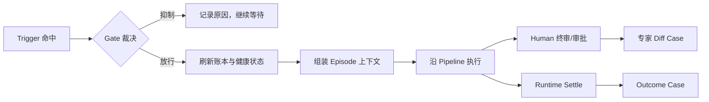

# 从专家反馈到可执行判断：OSCA 开放规范白皮书

> 一种可运行、可审计、可回放，并能从真实反馈中持续适应的 AI 认知工作流程开放规范
>
> 版本：v0.1-draft
>
> 日期：2026-07-12
>
> 对应规范：OSCA SPEC v0.3 + v0.4 draft

## 摘要

今天的 AI Agent 已经能够理解语言、检索知识、调用工具和执行多步任务。越来越多的产品把
Agent 描述为“数字员工”：人给它一项工作，它被唤起、处理、回答，然后等待下一次任务。
这个隐喻直观而有用，却容易遗漏另一种更基础的系统形态——许多组织中的认知工作并不是
一连串互不相干的问答，而是一条长期运行、反复交付、持续接受专家裁决的流水线。

OSCA 从这里出发。它把一个 AI Agent 定义为一条认知工作流水线：有明确的目标对象
（Object）、稳定的组合结构（Structure）、类型化的外部连接（Connector）和确定的触发
时机（Aware）；在这四层定义之上，人类专家过去确认的判断（Judgment）会在恰当情境中
重新生效。一个 Agent 因而不再只是临时接住任务的对话主体，而是一份可运行、可交付、
可审计的工作定义，外加一本随真实反馈更新的贡献账本。

这套设计在关键位置保留人，并不是因为人必然比 AI 更会判断——在许多局部任务上，事实
可能恰恰相反。人之所以仍站在关键位置，是因为嵌在现实组织、责任关系与业务现场中的人，
最先知道流水线之外的世界已经变化：政策换了，经营目标变了，领导对风险的容忍度变了，
原先合理的例外不再成立。人可以用一次删除、一处改写、一句备注或一次确认，把这个尚未
进入数据接口、模型输入和既有规则的新变化带回流水线。当变化已经能够被确定性观测时，
现实结果也可以通过 decision vs reality 对账成为“第二位专家”。

OSCA 使用纯 Markdown 和 YAML 表达 Agent，并把人的反馈保留在文本与 Git 层，而不是
直接内化进模型权重。每条正式判断必须带有出生证据、作者、确认与推翻计数、失效条件和
回放断言；新判断只能取代旧判断，不能抹去历史。模型可以帮助归纳候选判断，但不能自行
立法：证据由机器记录，专家负责拍板，确定性 Runtime 负责权限、预算、审批与启停。

Oscaware 是 OSCA 的参考工具、Runtime 与反馈飞轮实现。它用于证明规范可以被机器校验、
打包、装载、运行、采集、蒸馏、检索和回放，也为第三方实现兼容 Runtime 和飞轮提供一套
可讨论的行为基线。截至 2026-07-12，这些核心机制已经有代码、自动测试和合成/脱敏样例
演练；首个真实场景的 Phase 0 验证尚未完成。因此，本白皮书描述的是一套已形成工程机制、
但仍等待真实专家反馈和持续业务结果检验的开放规范，而不是一条已经得到商业证明的增长
曲线。

本白皮书面向关注 AI Agent 的产品与技术同行。它不替代字段级 SPEC 或参考实现文档，
而是解释 OSCA 为什么存在、各层设计如何互相支撑，以及开发者如何基于 OSCA 创建自己的
Agent。

## 开篇：AI Native 组织是一条认知工作流水线

> **AI Native 组织是一条认知工作流水线——AI 是稳定运转的流水线本身，专家是线上的判断节点，同时是线外的作者与所有者。**

这是 OSCA 和 Oscaware 选择技术方向之前，先作出的组织假设。

当我们把 Agent 想象成一名员工时，最自然的产品形态是给它一个入口：用户提出任务，Agent
理解意图，寻找资料，调用工具，交付答案。这种形态适合大量临时性、开放式和以对话为中心
的工作，也让人很容易理解 Agent 能做什么。

但组织里还有另一类工作。月度经营诊断、风险扫描、工单处置、临期定价、排班、审核和
报告生产，并不是每次从空白开始的随机任务。它们有持续存在的目标，有相对稳定的步骤，
连接固定的数据与执行系统，在某些时间或状态变化时启动，并在关键位置接受人的裁决。
每次产出可以结束，但负责产出它的工作系统不能每次重新发明。

OSCA 因而选择把 Agent 看成流水线，而不是一个等待派活的数字员工。这里的“流水线”不是
把认知工作降格为僵硬自动化，而是强调：即便工作中包含语言理解、模糊判断和例外处理，
承载这些认知活动的系统仍然需要回答五类稳定问题：

```text
这件工作围绕什么对象和目标？
它由哪些步骤组合而成？
它可以从哪里取数、向哪里行动？
什么时机值得启动？
过去被确认的专家裁决，如何约束这一次？
```

前四个问题构成 OSCA 的 O/S/C/A；第五个问题由判断账本回答。AI 模型参与这条流水线，
但不等于整条流水线：调度、权限、预算、审批、确定性取数、数值寻优和启停，不应该随着
模型的临场发挥而漂移；语言理解、例外处理、成文和解释，则可以在被约束的一次性认知
剧集中完成。

### 为什么关键位置要站人

在许多人机协作系统里，人的存在被解释为 AI 能力不足后的兜底：模型不够准，所以关键
步骤暂时交给人；等模型更强，人就可以退出。这不是 OSCA 保留人的主要理由。

关键位置站人，不是因为人天然比 AI 更会判断。对于已经被完整描述、数据充分、目标稳定
的局部问题，AI 或确定性算法完全可能比单个人更快、更一致，甚至更准确。真正的问题是，
任何一条运行中的认知流水线都只能依据它目前看得见的世界工作：已有输入、已有接口、已有
目标、已有判断。它无法自动知道那些尚未被表示出来的变化。

而专家生活在流水线之外。他知道新政策虽然还没进入数据库，却已经改变了风险边界；知道
这次费用上涨不是异常，而是组织正在检修；知道过去必须上报的事项现在应当压制；也知道
某条看似合理的规则，在新的责任关系下已经不能继续使用。专家的一次删除、改写、备注或
确认，不只是对当前产出进行质量检查，也可能是在报告：**流水线所依据的世界模型已经过期。**

因此，反馈是一次跨越系统边界的动作。它把外部世界的变化带入流水线。OSCA 要解决的，
不是如何让人永远重复同一个终审动作，而是如何让这次动作留下证据，经确认后成为下一次
运行能够自动使用的判断。

专家也因此拥有双重身份。

- 在线上，专家是判断节点：审批、终审、纠正系统尚未覆盖的例外。
- 在线外，专家是作者与所有者：其真实反馈可以被署名、归属、确认、推翻和取代，成为
  组织持有的判断资产。

人并不是流水线里一块永远不能自动化的人工零件。理想结果恰恰是：已经重复确认的裁决，
下一次由流水线自动执行；人把注意力移向新变化、新例外和新边界。人的价值不在于反复
替系统完成旧判断，而在于不断把尚未进入系统的新现实带回来。

这也不是唯一的变化入口。当价格、销量、损耗、故障或履约结果已经可以被 Connector
确定性观测时，Runtime 可以把当时的决策与后来的现实结果自动对账。现实无需说话，也能
推翻一条判断。OSCA 把这种 outcome 视为第二类出生证据——现实是第二位专家。

所以，OSCA 所说的适应，并不是模型在无人监督下修改自己。它是一个受控过程：人或现实
提供反馈，机器忠实记账，AI 帮助归纳，专家确认是否立法，Runtime 在后续情境中执行，
回放器再检查这条判断是否仍然有效。

这也是一种**按需进化**。系统不会为了“持续学习”而持续改写自己；只有当专家反馈或现实
结果表明外部世界已经变化，新的 Case 才进入飞轮，经过归纳、确认和回放，按需要调整当前
有效的判断。这里的“进化”是中性词：它不承诺系统越用越好，只承诺系统能够越用越顺手——
因为它始终在尝试贴合当下的环境。贴合可能意味着新增一条判断，也可能意味着降低 Trust、
推翻旧判断、缩短自动化边界，甚至把一个步骤重新交还给人。是否真的变好，仍要由返工量、
推翻率和现实结果裁决。

这套组织观目前仍是一项待验证假设。代码可以证明机制能够运转，合成样例可以证明链路
能够演练；只有真实场景中的专家是否愿意参与、判断是否会再次命中、返工量是否下降，才能
证明它是否值得成为一种新的组织基础设施。

## 前言：如何阅读这份白皮书

### 写给谁

本白皮书写给已经了解 LLM、Agent、RAG、工具调用和工作流编排的产品与技术同行。我们
不会从“大模型是什么”开始，而会集中解释 OSCA 试图补上现有 Agent 技术栈中的哪一层。

读完后，读者应当能够判断一个场景是否适合 OSCA，理解一个 `.osca` 包如何定义和运行，
并沿公开 SPEC 与样例创建自己的 OSCA Agent。读者可以采用 Oscaware，也可以实现自己的
兼容 Runtime、Connector、采集器、蒸馏器和回放器。

### 它不是什么

这不是字段参考手册、Python 代码讲解或 Oscaware 产品功能清单。精确的文件格式、运行
语义和机器校验口径，分别由 [OSCA SPEC v0.3](OSCA-SPEC-v0.3.md)、
[v0.4 增量草案](OSCA-SPEC-v0.4-draft.md)与
[Lint 规则清单](OSCA-LINT-RULES.md)定义。

本文也不是“AI 会自动越用越聪明”的承诺。OSCA 只主张反馈可以被采集、判断可以被确认
和取代、当前有效判断可以在后续运行中生效、判断效果可以被回放检验。系统是否因此变好，
必须由真实数据回答。

### 证据等级

为避免混淆，本白皮书使用四种证据口径：

| 口径 | 含义 |
|---|---|
| **设计原则** | OSCA 主张一个兼容系统应该怎样工作 |
| **已实现** | Oscaware 参考实现已有对应代码和自动测试 |
| **已演练** | 已经使用合成数据或脱敏样例跑通 |
| **已验证** | 已经由真实业务、真实专家和持续结果证明 |

如果一项能力只达到“已实现”或“已演练”，本文不会把它写成“已验证”。

## 第一部分：为什么需要 OSCA

### 第 1 章：现有 Agent 缺少的不是又一个工作流引擎

#### Agent 已经能做很多事

今天的 Agent 技术栈已经覆盖了相当广泛的能力：模型能够理解自然语言和图片，RAG 能够
检索组织知识，工具调用可以连接数据库与业务系统，工作流框架可以编排多步骤，多 Agent
系统可以分工，观测与评估工具则帮助开发者分析运行结果。

OSCA 不以否定这些能力为起点，也不打算重新发明一个通用工作流引擎。相反，OSCA 依赖
其中很多能力。它提出的问题发生在更长的时间尺度上：

> 一次工作结束后，专家刚刚作出的裁决，怎样成为下一次运行可以自动执行、又始终能够被人检查和撤销的资产？

#### 从“第一次做对”到“长期贴合现场”

为了让 Agent 第一次产出更好，团队通常会优化 Prompt、补充知识库、增加工具、细化流程、
改用更强模型。这些手段都很重要。但当专家在真实工作中改掉 Agent 的结果后，常见的后续
处理仍然比较零散：

- 实施人员把经验补进 Prompt；
- 把专家说明追加到知识库；
- 保留对话历史，希望模型下次记得；
- 在代码中增加一个特例；
- 积累数据后重新微调；
- 或者什么也不做，下次继续让专家改。

它们并非都错，但缺少一种共同的、可移植的判断资产形态。Prompt 中的改动很难逐条归属；
知识库中的新文档需要模型主动检索和正确解释；对话记忆依赖特定运行环境；代码特例把领域
判断埋进实现；微调则把判断内化到难以阅读、撤销和迁移的权重中。

结果是，Agent 可能越来越复杂，却很难回答几个朴素问题：这条行为为什么改变？是谁作出
的裁决？依据哪一次真实工作？现在还有效吗？换一个模型后会不会失效？如果专家推翻它，
历史如何保留？

#### 知识不等于判断

知识与判断经常被一起放进“记忆”这个宽泛概念，但它们承担不同职责。

| | 知识 | 判断 |
|---|---|---|
| 典型内容 | 事实、制度、文档、经验说明 | 在特定情境中应当怎样裁决 |
| 使用方式 | 被查询、阅读、总结 | 直接约束流程去向或产出 |
| 例子 | “检修期通常增加差旅支出” | “检修期差旅上涨不报警，除非超过历史峰值” |
| 变化方式 | 文档更新、知识同步 | 确认、推翻、取代、失效 |
| 关键问题 | “有什么材料可参考？” | “这次究竟应该怎么做？” |

知识可以帮助模型理解背景，却不天然等于一条应当执行的裁决。即使知识库已经写着“检修
会增加差旅”，Agent 仍可能在月度报告中机械地把 45% 涨幅列为异常，因为“知道一件事”
和“在这个裁决点压下报警”之间，还缺少一层明确约束。

这就是 OSCA 所说的判断层。可以用一句话记住二者的区别：

> **知识库是 Agent 去查它；判断账本是它自己生效。**

这里的“自己生效”不是把自然语言当作不可质疑的硬编码。它意味着 Runtime 先根据当前
Object、Aware 和情境筛选相关 Judgment，再把少量命中判断与出生 Case 注入本次 Episode；
模型在这些判断限定的可行域中完成认知工作，Policy 则在模型之外执行硬约束。

#### 贯穿案例：第一次月度经营诊断

设想一个月度经营诊断 Agent。它在财务关账后读取费用明细和检修计划，识别异常，形成
诊断报告，再交给业务专家终审。

第一次运行时，Agent 看到某单位差旅费环比上涨 45%，于是把它写进异常清单。专家知道
该单位当月正处于计划检修期，这类差旅增长通常属于正常波动，于是删除整段，并补充一句：
“检修期先不报，除非超过过去三年检修期峰值。”

对于普通工作流，这次任务已经完成：专家修正了报告，最终版本可以交付。但从组织资产的
角度，真正重要的事情才刚刚发生。专家不只是润色了一段文字，而是给出了一个带适用边界
和例外条件的裁决。下个月再遇到类似情境，如果系统仍然生成同样的误报，说明这次真实反馈
没有进入流水线。

OSCA 要保存的不是“专家删了 83 个字”这个表面 diff，也不是把整篇报告塞回知识库，而是
保存从这次行为中出生、经专家确认的一条判断，并让它在以后恰当的情境中重新生效。

#### OSCA 要补的是判断基础设施

工作流编排回答：

```text
先做什么，再做什么，调用什么。
```

判断基础设施回答：

```text
在这个具体情境下，过去被确认的裁决怎样改变这一次的去向？
```

因此，OSCA 的目标不是与编排、RAG、模型或工具生态竞争，而是提供一组开放约定，使它们
运行过程中产生的人类裁决能够被采集、署名、检索、执行、推翻和回放。它关注的不只是
Agent 能不能工作，还关注这条工作流水线能不能在外部世界变化后继续贴合现场。

#### 开发者带走什么

如果一个 Agent 只需要把已知步骤自动执行一次，现有工作流工具可能已经足够。只有当同类
工作会反复发生、人的修改中包含可复用裁决、这些裁决需要影响下一次运行时，OSCA 的判断
层才产生独立价值。

### 第 2 章：OSCA 的核心主张

#### 一句话定义

> **OSCA 是一种用纯文本定义 AI 认知工作流程的开放规范。它描述工作目标、组合步骤、外部能力与触发时机，并允许经真实反馈确认的人类判断在后续运行中自动生效。**

OSCA 的名称来自 Object、Structure、Connector、Aware 四层定义。这里的“认知工作流程”
指包含理解、判断、例外处理、成文或解释，但又具有稳定目标和重复结构的工作。OSCA 不规定必须
使用哪个模型、云平台、向量数据库或 Agent 框架；它规定的是一份可移植的 Agent 资产需要
表达什么，以及兼容 Runtime 在装载、触发、执行、权限和判断使用上应遵守什么契约。

#### O/S/C/A 与 Judgment

OSCA 用四个问题定义一条认知工作流水线：

| 层 | 回答的问题 |
|---|---|
| **O — Object** | 这件工作围绕什么对象和目标？ |
| **S — Structure** | 它由哪些步骤组合而成？ |
| **C — Connector** | 数据从哪里来，动作向哪里去？ |
| **A — Aware** | 什么时间或状态变化值得启动？ |

四层之上是 Judgment：过去被确认的专家裁决，在什么对象、时机与条件下应当生效。O/S/C/A
给出工作的稳定结构，Judgment 让结构在环境变化中保持贴合，而不需要每次重写整条流水线。

后续章节会分别展开这五层。此处先强调一个边界：Judgment 不是模型随意写入的长期记忆，
也不是开发者凭经验预填的规则。它必须出生于真实行为或现实结果，有证据，有作者，有使用
后的确认与推翻记录，并能被取代和回放。

#### 一个 Agent 是一份资产，而不只是一个进程

OSCA 将一个 Agent 表达为一个 `.osca` 文件夹。它主要由 Markdown 和 YAML 构成，可以
放进 Git、被人阅读、经过 Lint、打包交付、校验完整性并由不同 Runtime 装载。

这种文本形态不是为了追求“配置即一切”，而是服务于几个长期属性：

- **可检查**：专家、客户和审计者能够看到 Agent 的目标、边界和当前判断；
- **可归属**：每条 Judgment 能追溯到作者与出生 Case；
- **可撤销**：判断被推翻时通过 Supersedes 保留历史，而不是从权重中猜测如何删除；
- **可迁移**：更换模型或 Runtime 时，包和账本仍可保留，并重新运行 Replay；
- **可交付**：客户获得的不只是平台账号，而是一份可以持有和迁移的工作资产。

#### OSCA 与 Oscaware

OSCA 和 Oscaware 不是同一个层级的名称。

```text
OSCA
开放规范、文件格式与运行契约

Oscaware
OSCA 的参考工具、Runtime 与反馈飞轮实现
```

OSCA 希望允许多种实现。开发者可以只使用 SPEC 编写包，可以实现自己的 Linter 和 Runtime，
也可以把现有 Agent 平台做成 OSCA 兼容实现。Oscaware 的作用是提供第一套可运行答案，
用实现暴露规范歧义，并展示判断账本如何从反馈中形成。参考实现应当帮助规范变得可执行，
而不应把自己的内部结构变成唯一合法路径。

#### OSCA 不是什么

OSCA 不是一个新模型。它不解决基础模型能力本身，也不声称文本判断能弥补模型所有缺陷。

OSCA 不是 RAG 的替代品。知识库继续负责提供事实、文档和背景；Judgment Ledger 负责保留
会改变裁决结果的判断。两者可以在同一 Agent 中共同工作。

OSCA 不是通用 BPM 或工作流引擎的替代品。确定性业务流程可以继续由成熟系统承载；OSCA
聚焦的是含认知步骤、人类判断和反馈适应的工作定义，并可以与既有编排系统组合。

OSCA 也不是让 Agent 自主改写自己。AI 可以从多个真实 Case 中归纳 Candidate，但 Candidate
在专家确认前不进入正式包，不参与检索，也不能改变 Runtime 行为。Evidence 和 Meta 由机器
管账，专家负责是否立法，Runtime 负责执行和拦截。

#### 从“自学习”到“有证据的适应”

“自学习 Agent”很容易让人联想到一个系统在无人监管下不断修改自己，并且必然越来越好。
OSCA 不作这种承诺。环境变化后，旧 Judgment 可能失效；新反馈也可能互相冲突；不同模型
对同一判断的遵循程度可能不同。适应是中性过程，不是单调进步。

OSCA 能提供的是一个受控循环：

```text
真实工作产生反馈
→ 反馈作为 Case 留下证据
→ AI 归纳 Candidate
→ 专家确认是否成为 Judgment
→ Runtime 在后续情境中使用
→ 专家或现实再次确认、推翻
→ Replay 检查换模型或环境变化后的有效性
```

这条循环是否产生价值，要看 Judgment 是否再次命中、专家是否减少返工、推翻率是否受控，
以及换模型后能否通过 Replay。代码和合成测试只能证明循环有实现，不能替代这些真实证据。

#### 开放规范的开发者承诺

OSCA 的开发者承诺不是“采用 Oscaware 才能获得能力”，而是：一个 Agent 的核心定义和
判断资产应当可以离开特定模型与单一平台；第三方应能阅读公开规范、创建自己的包、实现
兼容工具，并对同一份资产给出可比较的运行和回放结果。

这要求 OSCA 不只保持文件格式开放，还要逐步明确运行语义、兼容边界和测试凭据。Oscaware
将作为参考实现提供最早的行为基线，但规范的长期价值取决于是否有人能在它之外创建新的
Agent 和实现。

#### 开发者带走什么

OSCA 的最小采用单位不是迁移整个平台，而是创建一份可通过 `osca lint` 的 `.osca` 包。
开发者可以从一个空 Judgment Ledger 开始，让真实工作产生第一批 Case，再选择使用
Oscaware 或自己的飞轮将反馈变成后续判断。

## 第二部分：OSCA 如何定义一个 Agent

### 第 3 章：O/S/C/A/J——五层认知工作定义

OSCA 不是从“给模型写一段角色设定”开始定义 Agent，而是先把一件认知工作拆成五个责任
边界。这样做的目的不是让 YAML 变多，而是把原本混在 Prompt、代码、调度器和实施人员
脑中的信息分开：哪些是领域对象，哪些是稳定步骤，哪些是外部能力，哪些是启动条件，哪些
是会随真实反馈变化的判断。

五层分别回答：

```text
O — Object：这件工作围绕什么？
S — Structure：这件工作怎样组合？
C — Connector：这件工作如何接触外部世界？
A — Aware：什么时候值得行动？
J — Judgment：过去的裁决如何约束这一次？
```

#### O：Object——建立稳定的领域名词

Object 是 OSCA 对工作对象的正式定义。它可能是一个领域实体，例如单位、客户、商品或
工单；也可能是一项指标、一份中间产物、一份最终报告，或者一个需要优化并在事后对账的
目标。

Object 的价值首先不是提供一份严密数据库 Schema，而是建立稳定的领域语言。Agent、
Runtime、判断账本和人类专家需要对“费用异动”“诊断报告”“售罄率”“风险事件”这些词
有共同理解。否则同一条 Judgment 在不同步骤中可能指向不同事物，检索命中也无法形成
可靠边界。

OSCA 当前把 Object 分为若干语义类型：

- **Entity**：需要识别和追踪的领域实体；
- **Artifact**：流程内部或对外交付的产出物；
- **Metric**：有单位、方向和来源的指标；
- **Composite**：由其他对象组合或计算而成的对象；
- **Objective**：供 Optimizer 寻优、并可在事后 Settle 的目标。

白皮书不展开各类型的字段约束。重要的是：Object 让输入、产出、判断签名和对账目标拥有
可被不同实现共同识别的名字与含义。

在月度经营诊断案例中，可以至少识别出：

```text
费用明细          领域输入
检修计划          情境输入
费用异动报警      流程内部 Artifact
月度诊断报告      最终 Artifact
诊断有效性        可对账的 Objective
```

如果某个名词只在一个步骤内部临时使用，可以先保持轻量；一旦它进入 Judgment 的适用边界、
跨步骤传递或对外交付，就应当获得正式 Object 身份。

#### S：Structure——定义组合骨架，而不是塞满判断

Structure 描述一件工作由哪些步骤组成、每步由谁执行、使用什么、接收什么、产生什么。它
类似一张薄的工艺路线图：足够让 Runtime 知道怎样推进，却不把所有领域知识和例外条件都
硬编码进流程。

月度经营诊断可能包含：

```text
1. 提取财务与经营数据       Connector
2. 识别候选异动             Agent 或确定性算法
3. 在约束内排序与筛选       Optimizer
4. 结合判断形成报告草稿     Agent + Judgments
5. 专家终审                 Human
6. 事后效果对账             Runtime
```

这种拆分让每一种 Performer 做自己擅长的事。Connector 不进行语言推理，Agent 不临场写
SQL，Optimizer 不让 LLM 猜数，Human 不必重复执行已经稳定的机械步骤，Runtime 则负责
确定性控制。

Structure 应当保持“薄”。如果检修期差旅上涨是否报警被写死在某个流程分支里，那么专家
改变判断时就必须修改工作流代码。OSCA 更希望稳定的步骤保持不变，把这类会随现场变化的
裁决放进 Judgment Ledger。

#### C：Connector——用类型化契约接触外部世界

Connector 定义 Agent 需要哪些外部能力，例如读取财务明细、查询检修计划、发送报告、
更新价签或调用另一个 Agent。模型只能按已声明名称使用这些能力，不能在运行时凭空发明
接口、连接串或执行语句。

OSCA 将 Connector 分成三个层面：

```text
Manifest    包内：需要什么接口、输入输出和权限
Binding     环境：这个客户的接口实际在哪里、使用哪个 Secret
Executor    部署：SQL、OpenAPI、MCP 或其他协议怎样真正执行
```

这层分离解决两个问题。

第一，Agent 包可以在不同环境间迁移。同一个 `FINANCE_DB` 逻辑能力，在开发、测试和客户
生产环境中可以绑定到不同端点，而不需要改包。

第二，真实地址和密钥不进入可交付资产。`.osca` 包只声明需求和权限，部署环境负责注入
实际 Binding，Secret 的值继续留在客户自己的安全设施里。

Connector 不是“给模型更多工具”的简单清单。它同时是契约测试：当包声明的接口和企业
系统实际提供的接口发生漂移时，兼容 Runtime 应当在装载或调用处明确失败，而不是让模型
猜一个相似接口继续运行。

#### A：Aware——定义系统何时值得醒来

许多 Agent 被设计成一个等待用户输入的对话框。OSCA 的认知流水线可以被人主动调用，
也需要描述它在什么时间、状态或事件下应当自行启动。

Aware 把“感知到事情发生”和“决定值得唤醒”分开：

- **Trigger** 报告一个原始事件，例如每月 9 日 09:00、关账状态变化、操作者按下按钮；
- **Gate** 组合多个 Trigger，并检查前置条件、启停状态与 Debounce，决定是否真正创建
  Episode。

Trigger 可以是定时器、轮询器或外部事件。Gate 可以要求任意一个条件满足、全部条件都
满足，或按声明顺序发生。Debounce 用来抑制短时间内的重复唤醒；Precondition 则在启动
认知工作之前做最后一次确定性业务检查。

在经营诊断案例中，“每月 9 日”只是一个时间信号。如果财务系统尚未关账，流水线不应
为了到点而生成一份缺数据的报告。因此 Trigger 命中不等于 Agent 必须工作：触发负责
报告变化，闸门负责裁决是否值得为它付出一次认知 Episode 的成本。

Aware 还携带本次行动的预算和裁量说明。预算限制最长时长、步骤、工具调用或 Token；
Discretion 则只向本次被命中的 Episode 说明，在这个 Aware 下模型可以主动到什么程度。

#### J：Judgment——为稳定结构叠加可变裁决

Judgment 不是 O/S/C/A 之外又一种普通配置文件。前四层定义工作的稳定骨架，Judgment
记录从真实工作中出生、会随环境变化而被确认或推翻的裁决。

一条 Judgment 可以被理解成一个带证据的函数：

```text
签名：对哪个 Object、在哪个 Aware、满足什么 Guard 时生效
函数体：应该怎样裁决，以及有什么“除非”条件
证据：它出生于哪些真实 Case
状态：作者、确认、推翻与 Trust
防腐：什么变化会让它失效，怎样 Replay
```

经营诊断中的判断可以表达为：当对象是“费用异动报警”，当前处于月度诊断 Aware，费用
科目为差旅费、涨幅超过阈值且存在检修期上下文时，通常压制该报警；除非涨幅同时超过该
单位近三年检修期峰值。

这里的 Guard 给出适用边界，Body 给出裁决，Evidence 说明它不是开发者凭空想象出来的
“最佳实践”。后续运行中，Runtime 先按签名缩小候选范围，再将少量命中 Judgment 与代表
Case 注入 Episode。模型不需要在整本账本中自行搜索，也不应把一条客户私有判断扩张到
没有证据支持的情境。

#### 五层怎样协作

可以把五层的变化频率与责任归纳如下：

| 层 | 主要内容 | 典型变化原因 |
|---|---|---|
| Object | 领域名词、产出与目标 | 领域模型或交付物变化 |
| Structure | 稳定步骤与 Performer | 工艺路线变化 |
| Connector | 外部能力契约 | 系统接口或权限变化 |
| Aware | 触发、Gate 与预算 | 运营节奏或事件来源变化 |
| Judgment | 情境化裁决 | 专家反馈与现实结果变化 |

这并非绝对静态/动态划分。外部世界变化时，任何层都可能需要更新。但 OSCA 希望先辨认：
这次变化是在重构工作本身，还是在修正同一工作中的一条判断。只有后者才应进入 Judgment
Ledger。把所有变化都蒸馏成 Judgment，会让账本成为无边界的杂物间；把所有判断都固化
进 Structure，又会让流水线难以适应。

#### 开发者带走什么

创建 OSCA Agent 时，不要先问“Prompt 应该怎么写”，而要先逐一回答五个问题。如果一项
信息无法明确归入 O/S/C/A/J，通常意味着领域边界、运行责任或反馈归属还没有想清楚。

### 第 4 章：`.osca` 包——可交付的 Agent 资产

OSCA 不把 Agent 的核心定义只保存在某个平台数据库里。一个 Agent 的开发态形态是一个
`.osca` 文件夹，也是一座 Git 仓库；交付时可以被打包成带完整性清单的归档文件。

```text
<agent>.osca/
├── osca.yaml
├── AGENT.md
├── policy.yaml
├── structure.yaml
├── objects/
├── connectors/
├── aware/
├── judgments/
├── cases/
├── indexes/
└── bindings.example.yaml
```

这棵目录不是实现内部结构的偶然暴露，而是一组资产边界。

#### 身份、劝告、笼子与骨架

包根目录的四个文件承担不同职责：

- `osca.yaml` 是包的身份证，声明格式版本、Package ID、入口、Runtime 与 Binding 需求；
- `AGENT.md` 是给认知平面读取的入口，说明身份、目标、领域语言和行为边界；
- `policy.yaml` 是确定性 Runtime 执行的笼子，规定权限、审批、预算、脱敏和 Kill switch；
- `structure.yaml` 是组合骨架，声明 Pipeline 与 Performer。

这种分离最重要的一点是：**AGENT 是劝告，Policy 是笼子。**

AGENT 可以告诉模型“不要编造没有数据支撑的结论”，塑造模型行为；Policy 则确保模型即使
忘记这句话、遭遇 Prompt Injection 或被另一个模型替换，也不能调用白名单外工具、绕过
审批或突破预算。Policy 不进入模型上下文，模型甚至不需要知道笼子的全部形状。

#### 领域定义、外部能力和感知时机

`objects/`、`connectors/` 和 `aware/` 分别承载 O、C、A。Structure 通过 ID 引用它们，
Judgment 的 Signature 也通过 ID 限定适用范围。

跨文件只使用稳定 ID，而不依赖中文名或文件名。中文名可以随业务语言调整，ID 一经分配
则不复用。这样一条 Judgment 的证据链不会因为“费用报警”改名为“费用异动提醒”而断裂。

#### Judgment 与 Case 为什么分开

`judgments/` 存放已经被确认、能够参与后续裁决的判断；`cases/` 存放这些判断出生和被
再次检验的原始证据。

分开之后，读者可以同时看到：

```text
现在系统依什么判断工作？          查看 judgments/
这些判断为什么存在？              追溯 evidence 指向的 cases/
某条判断后来怎样被确认或推翻？    查看 Meta 与 Git 历史
```

Case 可以包含专家 Diff，也可以包含 Decision vs Reality。体积很大的原始报文可以放在
外部存储，但包内必须保留内容哈希、逻辑 Store 和对象 Key；真实存储端点仍由部署 Binding
解析。

#### 文件是真相，索引是缓存

OSCA 把人能阅读的文件当作资产真相，把 `indexes/` 当作可丢弃缓存。

索引可以包括：

- 用于 Signature 硬过滤的 Judgment 表；
- 用于桶内语义排序的向量；
- 用于整本 Replay 的健康档案；
- 用于完整性校验的文件清单。

除完整性清单外，这些索引不应成为人手维护的业务事实。缓存缺失、损坏或模型过期时，
系统应从包文件重建或明确退化，而不是让坏索引反过来改写 Judgment Ledger。

这条原则也降低了早期工程复杂度。账本只有数十或数百条时，Git、YAML 和轻量向量文件
足以支撑验证；不需要为了“未来可能有十万条”在第一天引入一套难以审计的分布式知识
基础设施。规模真正到来后，索引层可以迁移，资产层不必随之重写。

#### 开发态、交付态与运行态

一个 `.osca` 包经历三种状态：

```text
开发态 Git 目录
→ lint
→ pack
→ 可复现交付件
→ load
→ 校验并重建索引的运行态目录
```

`osca lint` 把包结构、ID、引用、账本纪律和零密钥边界变成机器规则；`osca pack` 只接受
通过 Lint 的资产，排除真实 Binding 和机器缓存，并以固定顺序与元数据生成可复现归档；
`osca load` 检查完整性、再次 Lint、比对部署 Binding，并重建运行索引。

可复现打包意味着相同内容生成相同字节和哈希，便于签名与发布比对。但包内校验和本身
不能证明发布者身份：攻击者如果能够同时替换内容和清单，也能重新计算哈希。生产发布仍
需要外部可信哈希、数字签名或等价的供应链信任机制。

#### 包内零密钥

一个可交付、可打印、可审计的 Agent 资产不应夹带客户数据库地址、Token、私钥或真实
Binding。OSCA 将这些值留在部署环境，通过逻辑 Binding 名称连接包与环境。

这不只是防止 Git 泄密。它还让包的所有权与运行权限分开：客户可以审阅和持有 Agent 包，
但包被复制到另一台机器后，不会自动获得原环境中的数据访问能力。

#### Git 为什么是账本，而不只是版本控制

对 Judgment Ledger 而言，Git 原生提供了一组有价值的语义：

- Commit 表示一次追加或取代；
- Author/Blame 提供变更归属；
- History 保留判断与证据的时间线；
- Checkout 可以恢复某个历史版本用于 Replay；
- Diff 可以展示一次反馈究竟改变了什么。

OSCA 不把 Git Commit 等同于专家立法本身。正式 Judgment 仍需经过 Candidate 确认、Lint
和账本事务。但一旦入账，Git 提供了比隐藏数据库记录更透明的资产轨迹。

#### 客户拥有什么

如果 Agent 只存在于供应商平台中，客户实际拥有的可能只是使用权。OSCA 希望客户能够
持有以下内容：

- 领域 Object 与工作 Structure；
- Connector Manifest 与安全 Policy；
- 当前有效 Judgment；
- Judgment 的出生 Case 与取代历史；
- 用不同模型重新 Replay 所需的断言。

这不意味着所有实现代码和蒸馏工艺都必须进入同一个开放许可。规范、资产、参考 Runtime、
第一方产品和客户私有账本可以有不同开放边界。关键是：客户自己的工作定义与判断资产不应
因为更换模型或平台而消失。

#### 开发者带走什么

`.osca` 包不是把 Prompt、工作流和知识文件随意放进同一目录。每种文件都有明确消费者和
权力边界：模型读什么、Runtime 强制什么、部署环境注入什么、哪些内容是资产真相、哪些
只是缓存。理解这些边界，比记住每个 YAML 字段更重要。

## 第三部分：OSCA Agent 如何运行

### 第 5 章：双平面运行模型

一个 `.osca` 包只有在 Runtime 中被装载、布防和唤醒，才从静态资产变成正在工作的 Agent。
OSCA 把运行系统分为控制平面与认知平面，原因不是为了追求分布式架构，而是为了把两类
完全不同的责任分开。

```text
控制平面：什么时候醒、能做什么、花多少、何时停
认知平面：本次情境怎样理解、判断、成文和解释
```

#### 控制平面：确定性、常驻、便宜

控制平面通常由 Host 或其他兼容 Runtime 承担。它长期运行，但不需要一个模型持续在线
“思考”。它负责：

- 装载和校验 Package；
- 把 Trigger 编译成 Watcher；
- 通过 Gate 决定是否唤醒；
- 组装本次 Episode 上下文；
- 执行 Policy、审批、预算和 Kill switch；
- 代理 Connector 调用；
- 记录审计与运行状态；
- 在闭环场景中执行 Settle。

这里所说的“控制平面无 LLM”，是责任语义，而不一定要求物理上部署为两个进程。参考实现
当前可以由同一个 Host 进程在独立线程中发起认知 Episode 的 LLM 请求，但 Trigger、Gate、
权限、预算和启停的裁决不依赖模型输出。第三方实现可以把 Episode Worker 拆成独立服务，
也可以保留单进程部署，只要权力边界不发生变化。

#### 认知平面：按需唤醒的短命 Episode

认知平面只在 Gate 放行后创建。每次 Episode 都有自己的 ID、触发来源、预算、上下文、
步骤记录、产出和终态。Pipeline 完成、到达人类节点、预算用尽或步骤失败后，Episode 结束。

不存在一个不断积累隐式对话状态、持续运行的模型。跨 Episode 记忆只来自显式资产：

```text
Package 定义
Judgment Ledger
Case 证据
Git 历史
```

这种短命模型让成本与实际工作次数相关，也使一次输出使用了什么上下文、判断和工具更容易
审计。它还迫使系统正面回答长期记忆在哪里，而不是把记忆寄托在不可见的会话状态中。

#### 从 Trigger 到 Episode

一次运行可以概括为：



Trigger 命中后，Gate 先检查组合条件、Precondition、Debounce 与 Enabled。放行前，长跑
Runtime 还应确保正在使用的账本是一个完整、通过 Lint 的一致快照。如果蒸馏器正在写账、
磁盘账本不合规或索引重建失败，本次唤醒应被拒绝或安全退化，不能用“半条新 Judgment”
装配 Episode。

#### 一次性上下文里有什么

Episode 不是把整个 `.osca` 包塞进模型上下文。参考装配语义包括：

```text
AGENT.md
+ structure.yaml
+ 当前 Aware 的 Discretion
+ 本次引用的 Objects
+ 检索命中的 top 3–7 Judgments
+ 每条 Judgment 的一个代表 Case
```

这种渐进披露有三个目的。

第一，控制 Token 和注意力成本。账本增长时，单次 Episode 的上下文不应线性增长。

第二，减少无关判断冲突。Runtime 先按 Object、Aware 等可确定比较的签名维度硬过滤，
再结合 Guard、当前查询与索引能力在小候选桶内排序，而不是要求模型在整本账本中自行
寻找规则。当前参考实现尚未把所有自然语言 Guard 编译成确定性表达式，这一边界将在后文
作为开放问题保留。

第三，保留证据。只注入 Judgment Body 容易让模型把自然语言规则理解成绝对命令；附带
一个代表 Case，可以展示它在真实工作中怎样出生和被使用。

Policy 刻意不进入模型上下文。AGENT 可以被模型理解，Policy 必须由 Runtime 强制。模型
不需要知道“自己是否有机会绕过笼子”。

#### 五类 Performer

Structure 的每个步骤由受限 Performer 执行。

**Connector** 负责确定性取数和执行。模型只能按 Manifest 声明的接口名调用，Connector
Proxy 解析 Binding、检查接口与权限、执行脱敏并记录回执。取数失败时，认知步骤不能靠
猜测补出一份报告。

**Agent** 负责语言理解、未覆盖例外的保守处理、成文和解释。它读取本次一次性上下文，
输出中凡依据某条 Judgment 裁决的段落，应标注 Judgment ID，为后续反馈归属提供输入。

**Optimizer** 负责确定性数值寻优。Judgment 可以限定可行域和禁止项，Optimizer 在可行域
内计算最优；LLM 不负责猜数或替代数值算法。

**Human** 负责审批、终审和新变化的反馈。当 Pipeline 到达人类节点时，机器侧可以停止并
等待回执。当前界面可以是 CLI、文档编辑或审批卡，但其语义都是一次可采集的裁决点。

**Runtime** 负责调度、状态和对账。它不参与语言成文，而把 Episode 的 Decision 与后来的
Reality 形成 Outcome Case。

这种分工不是宣称每一种工作永远只能由一种 Performer 完成，而是避免把所有能力混进同一
模型调用。边界越清楚，权限、失败原因和反馈归属越容易解释。

#### Policy：模型之外的权力边界

Policy Interceptor 位于工具调用、外部访问、写动作和预算消耗之前。典型裁决包括：

- Pipeline 步骤是否在工具白名单中；
- 写接口是否获得一次性审批；
- 本 Episode 的 Tool Calls、Token、步骤或时长是否达到硬顶；
- 外部域名是否在 Egress 白名单；
- 输入和输出是否需要脱敏；
- 账本推翻率或 Replay 红灯率是否触发 Kill switch。

安全配置错误应向安全侧倒。例如非法预算不能被解释成无限额度，非法审批清单不能被解释为
无需审批，非法脱敏配置也不能静默关闭保护。这类 Fail-closed 语义应由 Lint 和 Runtime
共同执行。

#### Connector Proxy：调用必须经过的窄门

Runtime 不把 Binding 和 Secret 直接注入模型。Connector Proxy 接收一个类型化接口引用，
依次执行：

```text
步骤工具授权
→ Manifest 契约检查
→ 写权限与审批
→ Binding/Secret 解析
→ Egress 检查
→ Executor 调用
→ 结果脱敏
→ 生成调用回执
```

如果模型调用了未声明接口，系统应报告接口漂移；如果环境缺少 Binding，系统应拒绝；如果
写接口未获审批，内部 Runtime 调用也不应获得特权。模型只能使用这条窄门提供的能力。

#### 三级停

OSCA 区分三个作用范围不同的停止动作：

| 层级 | 停止什么 | 典型原因 |
|---|---|---|
| Episode 停 | 本次工作 | Pipeline 完成、失败或预算硬顶 |
| Aware 停 | 一个触发入口 | 暂停月度扫描，保留包内其他能力 |
| Package 停 | 整个 Agent | 风险异常、部署撤销或人工停机 |

Package 停不能只从注册表删除名字。它还应撤销 Watcher、清理 Binding、让 Policy 进入
Revoked 状态，并使在途 Episode 在步骤边界停止，后续 Connector 调用全部拒绝。启停是
Runtime 对能力的操作，不是向模型发出“请停止”的提示。

#### Settle：现实进入流水线

对于 Objective 型场景，Episode 产出的 Decision 往往不能立即判断好坏。定价要等闭店，
排班要等实际履约，告警处置要看故障是否发生。Object 可以声明一个 Settle 接口，Runtime
在合适时机读取 Reality，形成 Outcome Case：

```text
当时为什么启动
当时有哪些 Judgment 生效
Episode 作出了什么 Decision
现实后来发生了什么
```

参考实现当前能够执行受限 Settle 契约；复杂营业日历与延迟调度仍属于部署侧能力。关键
语义是：对账不需要再启动一个 LLM Episode。现实回声是确定性采集动作，不应消耗认知
预算。

#### 贯穿案例：一次月度诊断怎样运行

把前面的经营诊断案例串起来：

1. Host 装载通过 Lint 的经营诊断包，校验财务 Binding 并注册 Watcher；
2. 每月 9 日的 Schedule Trigger 命中；
3. Gate 调用财务 Connector 检查关账状态，未关账则拦截并留痕；
4. Gate 放行后，Runtime 刷新当前账本，重算 Kill switch；
5. Runtime 组装一次性 Episode：AGENT、Structure、本次 Aware、相关 Object、少量 Judgment
   和代表 Case；
6. Connector 步读取费用明细与检修计划，回执进入 Episode 台账；
7. Agent 识别和成文，Optimizer 在需要时做确定性排序；
8. 命中的检修期 Judgment 压制普通差旅报警，只保留超过历史峰值的例外；
9. 草稿到达 Human 步，专家终审；
10. 专家的保留、删除、改写和备注形成下一阶段可采集的 Diff。

这一轮结束后，模型不保留隐藏会话记忆。下个月能否做得更贴合，取决于本轮反馈是否被
忠实采集、确认入账，并在下一轮被正确检索，而不是取决于模型是否“记得上次聊过什么”。

#### 当前证据边界

Oscaware 参考 Host 已实现 Loader、Trigger Table、Gate、Episode Assembler、Policy、
Connector Proxy、Runner 与 Settle，并有自动测试和脱敏/合成演练。真实 SQL/OpenAPI/MCP
Executor、复杂延迟调度、面向专家的审批界面和生产级运维不由这些测试证明。本章定义的
运行边界是 OSCA 的参考语义；第三方实现可以采用不同进程、存储和调度架构，但需要保持
同等可解释的权限、启停和反馈契约。

#### 开发者带走什么

双平面的核心不是“Host 必须用哪种技术”，而是不能让一次 LLM 调用同时拥有感知、调度、
权限、取数、判断、记忆和自我修改的全部权力。控制决策应当确定、可审计；认知 Episode
应当短命、有界；长期适应应当通过显式账本完成。

## 第四部分：贡献账本与反馈飞轮

### 第 6 章：从反馈到判断资产

### 第 7 章：两种证据——人类反馈与现实回声

### 第 8 章：飞轮——归纳给 AI，拍板给人

## 第五部分：安全、审计与可迁移性

### 第 9 章：为什么 Judgment 留在文本层

## 第六部分：基于 OSCA 创建自己的 Agent

### 第 10 章：什么场景适合 OSCA

### 第 11 章：创建第一个 OSCA Agent

## 第七部分：Oscaware 参考实现

### 第 12 章：从规范到可运行系统

## 第八部分：生态、评估与开放问题

### 第 13 章：兼容实现与 Agent 组合

### 第 14 章：如何判断 OSCA 是否真的有效

### 第 15 章：诚实边界与开放问题

## 结语：把人的裁决留在系统里

## 附录 A：术语表

## 附录 B：最小 `.osca` 包示意

## 附录 C：十条设计公理

## 附录 D：文档导航

## 附录 E：版本与证据声明
