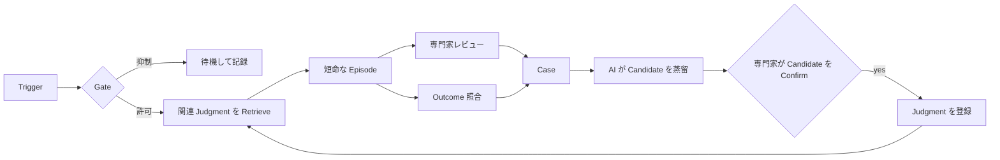
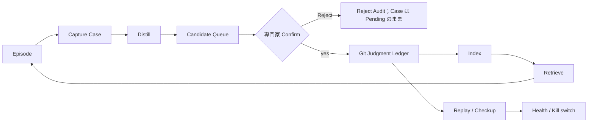
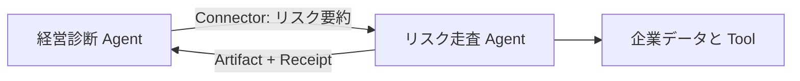

# 専門家のフィードバックから実行可能な Judgment へ：OSCA オープン仕様ホワイトペーパー

> 実行・監査・Replay が可能で、現実のフィードバックを通じて適応できる AI 認知ワークフローのオープン仕様

- **ホワイトペーパー版：** 1.0（ソフトウェア 1.0 のリリースを意味しない）
- **公開日：** 2026-07-12
- **仕様ベースライン：** OSCA SPEC v0.3 + v0.4 draft（2026-07-12 Profile）
- **参照実装の状態：** 公開 Host 0.2.0、ファーストパーティのフィードバック・フライホイール（M3）は実装完了、実業務での検証は未完了

**言語：** [English](OSCA-WHITEPAPER-v1.0.en.md) · [简体中文](OSCA-WHITEPAPER-v1.0.zh-CN.md) · **日本語**

## 要旨

現在の Agent は、言語理解、知識検索、ツール呼び出し、複数ステップの作業を実行できる。OSCA が問うのは別の問題である。作業が終わったあと、専門家が下した判断を、次回の実行で自動的に利用でき、なおかつ検査・撤回・移植できる資産にするにはどうすればよいか。

OSCA は Agent を認知ワークのパイプラインとして定義する。Object、Structure、Connector、Aware は、目的、安定した手順、外部能力、起動条件を表す。現実のフィードバックから生まれ、専門家の Confirm により登録された Judgment は、適切な文脈で後続実行を制約する。したがって Agent は単なるモデル呼び出しではなく、引き渡し可能なテキスト形式の作業定義と、帰属可能な Judgment Ledger である。

重要な位置に人を残すのは、人が常に AI より優れた判断をするからではない。人はシステム境界の外にいて、方針、目標、責任、リスクの変化をパイプラインへ持ち込めるからである。AI は実際の Case から Candidate を蒸留できるが、独自に立法することはできない。専門家が Candidate を Confirm し、Runtime が権限、予算、承認、停止を強制する。観測可能な Outcome は第二の Evidence 経路となる。

Oscaware は OSCA の参照ツール、Runtime、およびファーストパーティのフィードバック・フライホイール実装である。公開 CLI/Host は検査・実行できる。非公開フライホイールには保守者テストと合成 fixture がある。しかし、実 Connector、製品 UI、実業務での検証は未完了であり、高頻度の一つの実シナリオで 20 件以上の実 Judgment と独立した後続利用 Evidence はまだ得られていない。本書は、実行可能だが事業価値が未証明のオープン仕様を説明する。

## 10 分で理解する OSCA

### 一つの問い

> **作業終了後、専門家の判断を、次回に実行でき、同時に検査・撤回できる資産へどう変えるか。**

Prompt、Knowledge Base、会話メモリ、コードの例外、Fine-tuning はいずれも Agent の振る舞いを変えられる。しかし、誰が判断したか、どの実作業が根拠か、どの条件で有効か、今も有効か、モデル変更後にどうなるかを同時には答えにくい。OSCA はこれらを明示的な資産、Judgment Ledger に収める。

### 一つの例

月次経営診断 Agent が、ある部門の出張費 45% 増を異常一覧に追加したとする。専門家は当月が設備検修期間であることを知り、その段落を削除して次のように追記する。

> 検修期間中の出張費増は通常報告しない。ただし、その部門の過去 3 年の検修期間ピークを超える場合を除く。

通常の Workflow はここで終わる。OSCA は実際の修正を Case として保存する。AI が類似 Case を Candidate に蒸留し、権限を持つ専門家が Candidate を Confirm したときだけ Judgment になる。次回、Runtime は同じ Object、タイミング、文脈でそれを見つけ、通常のノイズを抑制しながら、過去ピーク超過という例外を残す。

公開されている経営診断 Package は、この連鎖の合成成果物を示す。人物、データ、Case、Judgment は形式・挙動確認用 fixture であり、実業務検証（P0）の Evidence ではない。Lint は参照整合性を検査できるが、Evidence が実作業から生まれたことまでは証明できない。

### 一つの式

```text
OSCA Agent
= O  Object：どの対象と目的を扱うか
+ S  Structure：安定した手順をどう構成するか
+ C  Connector：データをどこから取得し、どこへ作用するか
+ A  Aware：どの変化で起動する価値があるか
+ J  Judgment：専門家の Confirm で登録された判断がいつ適用されるか
```

O/S/C/A は安定した作業骨格を定義し、J は現場環境に応じて変わる文脈的判断を保存する。モデルは認知能力を提供するが、パイプライン全体ではない。

### 一回の実行と一回のフィードバック



三つの権限境界が常に維持される。機械は原始 Evidence を忠実に保存し、AI は蒸留だけを行い、正式な Judgment は権限を持つ専門家の Confirm を必要とする。Policy はモデル外で強制される。Replay は健康状態を検査するが、Ledger を自動改変しない。

### 現在の能力概要

| 層 | 状態 |
|---|---|
| SPEC v0.3 | 安定版仕様を公開済み |
| Lint / Pack / Load / 単一 Judgment Replay | 実装済み、公開自動テストあり |
| Host 7 コンポーネント、Episode、3 段階停止、Settle | 実装済み、合成/デモ素材で演習済み |
| Capture → Distill → Queue/Confirm/Reject → Ledger → Retrieve/Checkup | ファーストパーティ M3 実装、合成 fixture で演習済み |
| 一つの高頻度実シナリオで 20 件以上を登録し、一部に後続利用 Evidence、低頻度シナリオは別集計 | 実作業待ち、未検証 |
| 専門家 UI、Creator、本番統合 | 未完了 |

これは能力の概要にすぎない。日付と Evidence 上限を含む唯一の段階スナップショットは第 10 章に示す。

### 三つの読み方

- **OSCA が自分に関係するか判断する（約 10 分）：** 本節、第 1～2、8、12 章。
- **最初の Agent を定義する（約 30 分）：** 第 3～9 章を読み、公開サンプルを実行する。
- **特定 OSCA Profile 向け Runtime またはフライホイールを実装する：** 全文、付録、SPEC、Lint Rules。

## 第 I 部：なぜ OSCA が必要か

### 第1章：反復する認知作業では、Agent は従業員よりパイプラインに近い

> **AI Native 組織は認知ワークのパイプラインである。AI は安定して動くパイプラインそのものであり、専門家はライン上の Judgment ノードであると同時に、ライン外の作者・所有者である。**

「デジタル従業員」という比喩は、一時的で自由度が高く、会話中心の作業には有用である。OSCA が対象とするのは、月次診断、リスク走査、チケット処理、審査、価格決定のように、安定した目標、手順、システム接続、起動条件を持って繰り返される作業である。各成果物は完結しても、作業システムまで毎回ゼロから作り直すべきではない。

「AI がパイプライン」とは、モデルプロセスを常時思考させることではない。Scheduling、権限、予算、承認、決定論的なデータ取得、数値最適化、停止はモデルの即興に任せない。言語理解、例外処理、文章化は短命な認知 Episode で行える。

#### なぜ重要な位置に人が立つのか

人が残る理由は、人が AI より本質的に判断上手だからではない。目標が安定しデータが十分な局所問題では、AI やアルゴリズムのほうが高速で一貫している場合がある。人の固有の位置はシステム境界の外にある。データベースに反映される前の新方針、検修による一時的増加、新しい責任関係で失効した Judgment を知ることができる。

削除、書き換え、注記は、現在の成果物の修正であると同時に、パイプラインが前提とする世界の変化を報告している場合がある。OSCA は専門家に同じレビューを永遠に繰り返させるのではなく、その行為を Evidence として残す。後続利用で繰り返し維持された判断はパイプラインへ移し、人は新しい例外へ注意を向ける。

専門家は二つの役割を持つ。

- ライン上では、承認、最終レビュー、修正のノードである。
- ライン外では、Judgment 資産の所有者として Candidate を Confirm し、既存 Judgment を疑問視または Supersede する。

価格、売上、損失、故障などを Connector で観測できれば、Outcome も現実の変化を戻せる。現実は第二の専門家だが、万能の審判ではない。指標は欠損、遅延、交絡することがある。

#### オンデマンドの進化

OSCA はモデルに無監督で自己改変させない。Case を機械が記録し、AI が蒸留し、専門家が Candidate を Confirm し、Runtime が実行し、Replay が検査する。Evidence がなければ変更せず、Evidence があっても自動化を増やすとは限らない。

「進化」は中立語である。使うほど良くなるとは約束しない。現在の環境に合わせ続ける能力だけを約束し、その結果として使いやすくなる可能性がある。適合とは、Judgment の Supersede、Trust の低下、権限の縮小、作業を人に戻すことも含む。改善したかどうかは、手戻り、overruled、Outcome、専門家負担で判断する。

### 第2章：OSCA が追加するのは Judgment の基盤

既存 Agent スタックにはモデル、RAG、Tool、Workflow、Observability がある。OSCA はより長い時間軸の層、すなわち実作業の判断を残し、次の適切な文脈で再び作用させる方法を加える。

#### Knowledge と Judgment は同じではない

| | Knowledge | Judgment |
|---|---|---|
| 内容 | 事実、制度、文書、背景 | 特定文脈で何を判断すべきか |
| 利用 | 検索、閲覧、要約 | 経路や成果物を直接制約 |
| 例 | 検修期間は出張費が増えやすい | 過去ピークを超えない限り検修期間の出張費を報告しない |
| 変化 | 文書・Index 更新 | 登録、後続維持、overrule、Supersede、review |

> **Knowledge Base は Agent が参照する。適用可能な Judgment は実行へ入ってくる。**

これは自然言語を疑問視できない Hard Code にすることではない。Runtime が候補を絞り、少数の Judgment と代表 Case を Episode に入れる。Policy はモデル外で権限を強制する。

#### 定義

> **OSCA は、AI 認知ワークフローを Plain Text で定義するオープン仕様である。作業目的、手順、外部能力、起動条件を記述し、現実のフィードバックから生まれ、専門家の Confirm で登録された Judgment を後続実行で作用させる。**

OSCA はモデル、Cloud、Vector Store、Agent Framework を指定しない。可搬な Agent 資産が何を表現すべきか、Runtime が Evidence、権限、状態、Replay に対してどの契約を守るべきかを定める。

#### OSCA と Oscaware

```text
OSCA      オープン仕様、Package 形式、Ledger 規律、Runtime 契約
Oscaware  参照 Tool、Runtime、ファーストパーティのフィードバック・フライホイール
```

開発者は SPEC だけで Package を作成でき、別の言語・Architecture で Runtime を実装できる。Oscaware は最初の実行可能な回答であり、テストを通じて仕様の曖昧さを明らかにするが、唯一の正解ではない。

#### OSCA ではないもの

- 新しいモデル、または基盤モデルの全欠陥を埋めるものではない。
- RAG、BPM、RPA、Rule Engine の代替ではない。
- Prompt 集、すべての会話を入れる Vector Store ではない。
- AI が自律的に立法するシステムではない。
- 実業務価値が証明済みの「継続学習」の約束ではない。

## 第 II 部：OSCA は Agent をどう定義し実行するか

### 第3章：O/S/C/A/J の 5 層モデル

| 層 | 問い | 経営診断での対応 |
|---|---|---|
| Object | どの対象と目的を扱うか | 月次レポート、費用 Alert、収束目標 |
| Structure | 安定した手順をどう構成するか | 取得、診断、文章化、レビュー、照合 |
| Connector | データをどこから取り、どこへ作用するか | 財務明細、検修計画、レポート送信 |
| Aware | どの変化で起動する価値があるか | 毎月 9 日、締め状態変化、手動 Event |
| Judgment | Confirm で登録された判断がいつ適用されるか | 検修期出張費の抑制と例外 |

#### Object：共通語彙を作る

Object は入力、出力、指標、最適化目標を定義し、Structure、Connector、Judgment、Settle が同じ対象を理解できるようにする。最初から企業全体の Ontology を作る必要はなく、現在のパイプラインが実際に参照する対象だけでよい。

#### Structure：薄い工程骨格

Structure は Step、依存関係、Performer を記述する。決定論的取得は Connector、数値最適化は Optimizer、最終レビューは Human に任せる。「検修期の出張費を報告しない」という `if/else` を書こうとしているなら、恒久工程ではなく Evidence を持つ Judgment である可能性が高い。

#### Connector：能力と環境を分ける

```text
Manifest  Package 内で必要な Interface、入出力、権限を宣言
Binding   配備環境で論理能力を実 Endpoint と Secret 名へ対応付け
Executor  SQL、OpenAPI、MCP などで実行
```

実接続文字列や鍵は Package に入れない。Interface が欠落・変更された場合、Runtime は明示的に拒否し、モデルに似た呼び出しを推測させない。

#### Aware：Trigger は起動そのものではない

Trigger は時刻、状態、Event を報告するだけである。Gate が combination、Precondition、Debounce、Enabled を評価して Episode を作るか決める。月次診断は日付が来ても財務が締まっていなければ文章化を開始しない。

#### Judgment：Evidence を持つ文脈的判断

Judgment は、何に適用するか、何を要求するか、なぜ信頼するかを答える。Object/Aware/Guard からなる Signature、短い Body、出生 Evidence、作者・利用 Counter、Replay 宣言を持つ。Expiry は再審査を必要とする変化を示すことが望ましい。

O/S/C/A は安定骨格、J はその上の判断層である。Domain 構造変更、Interface 移行、権限 Policy を Judgment に詰め込まず、現場で変わる判断をコードへ恒久的に埋め込まない。

### 第4章：`.osca` Package は引き渡し可能な資産

```text
my-agent.osca/
├── osca.yaml
├── AGENT.md
├── policy.yaml
├── structure.yaml
├── objects/
├── connectors/
├── aware/
├── judgments/       # 初版は空でもよい
├── cases/           # 実運用後に生成
└── bindings.example.yaml
```

`AGENT.md` はモデルが理解する Identity、Goal、Advice を与える。`policy.yaml` は Runtime が強制する Tool Allowlist、Approval、Budget、Egress、Redaction、Kill switch である。「越権しないでください」という Prompt は強制機構の代わりにならない。

Package には三つの状態がある。

- **開発状態：** Text Directory と Git History。作者が編集し Lint を実行する。
- **配布状態：** 実 Binding と Cache を除いた再現可能 Archive。Integrity Manifest を持つ。
- **実行状態：** Runtime が検証し、環境能力を Binding し、Index を再構築し Trigger を Arm する。

File が資産の真実であり、Index は Cache である。Judgment、Case、Policy は読める状態を保ち、Signature/Vector Index は削除・再構築できる。Git は追記 History、帰属、Version Replay を保持する。Checksum は変更を検出できるが発行者 Identity を証明しない。信頼署名と Supply Chain は配備側の責任である。

顧客は自分の Package と Judgment Ledger を保持できるべきである。ただし契約、作者権限、Privacy 削除は別途 Governance を必要とする。

### 第5章：二つの Plane による Runtime モデル

```text
Control plane：いつ起動するか、何ができるか、いくら使えるか、いつ停止するか
Cognitive plane：今回の文脈をどう理解し、判断し、文章化し、説明するか
```

Host または互換 Runtime が Control plane を担う。モデルに Scheduling を任せず常駐し、Load、Trigger、Gate、Policy、Connector、Audit、Stop、Settle を担当する。Cognitive plane は Gate 通過後にだけ短命な Episode を作る。Episode は ID、Budget、Context、Step、Output、Terminal State を持つ。

二つの Plane は物理的に別 Process でなくてよい。参照 Host は一つの Process 内の別 Thread でモデルを呼べるが、Scheduling、権限、Budget、停止はモデル出力で決めない。

#### 一回の Episode

```text
Trigger → Gate → Ledger と Health を更新
→ Object/Aware で Judgment を Hard Filter
→ AGENT + Structure + Discretion + Objects
  + top 3–7 Judgment + 各 1 件の代表 Case を組み立て
→ Pipeline 実行 → Human / Settle
```

公開 Host は現在 Trust と `confirmed` で並べる。非公開のファーストパーティ Retriever は小さな候補 Bucket 内で Semantic Ranking できる。自然言語 Guard は決定論的に評価されていないため、意味類似を業務条件成立とみなしてはならない。

#### 5 種類の Performer

- **Connector：** 決定論的な取得と実行。
- **Agent：** 理解、例外処理、文章化、説明。
- **Optimizer：** Judgment が制約する実行可能領域での数値最適化。
- **Human：** 承認、最終レビュー、新しい変化の持ち込み。
- **Runtime：** Scheduling、State、Settle、Stop。

#### 権限境界と三つの停止範囲

Policy は Tool Call、LLM Call、外部アクセスの入口を守る。不正な Safety 設定を無制限 Budget や承認不要へ劣化させてはならず、Runtime は Lint を迂回した不正設定にも防御する。各 LLM 呼び出し前に Package Revocation、Kill switch、Token Budget 枯渇を確認する。実 Token 数は Gateway 応答後に判明するため、これは損失上限である。呼び出し後に超過した場合 Episode を即停止し、事前の厳密予約が可能だったかのように見せない。

| 停止範囲 | 意味 |
|---|---|
| Episode | 今回が完了、失敗、または Budget 到達 |
| Aware | 一つの起動 Entry を Disarm |
| Package | Agent を Revoke。後続 Call を拒否し、実行中 Episode を安全境界で停止 |

Objective Object は Settle を宣言できる。Runtime は後で Reality を取得し、Decision と照合して Outcome Case を作る。複雑な営業 Calendar や遅延 Scheduling は配備適応が必要である。

## 第 III 部：Judgment Ledger とフィードバック・フライホイール

### 第6章：フィードバックから Judgment 資産へ

専門家の修正はまだ Judgment ではない。まず忠実に保存された Evidence となり、蒸留と権限付与を経て初めて後続実行へ影響する。

| 資産 | 意味 | 権限 |
|---|---|---|
| Case | 実際の Diff、Outcome、または帰属可能な口述 | Evidence のみ |
| Candidate | Case Cluster から AI が起草した Judgment | Package 外で待機、実行権限なし |
| Judgment | 専門家 Confirm、Lint、Git 後の正式 Entry | Active のみ実行権限。他 State は Audit/Replay 用 |

#### Judgment の 5 要素

1. **Signature：** 適用対象 Object、Aware、Guard。
2. **Body：** 必要な「ただし」を含む 1～3 文の判断。
3. **Evidence：** 一つ以上の出生 Case。
4. **Meta：** 作者、Batch、State、`confirmed`、`overruled`、Trust。
5. **Expiry / Replay：** 再審査条件と検査方法。

Confirm は Candidate を Ledger へ入れる専門家の行為であり、`confirmed +1` ではない。新 Judgment は `confirmed: 0`、Provisional Trust で登録される。後続の実利用を責任専門家が維持した場合、または将来定義される Outcome Attribution で支持された場合だけ Counter を増やせる。現在のファーストパーティ実装は Expert Diff からのみ `confirmed/overruled` を更新し、Outcome Sweep は Case を記録するだけである。参照規律では、overrule なしに確認回数が閾値へ達すれば High に昇格し、overrule が閾値まで累積すれば Review に入る。閾値は P0 で校正が必要である。

#### Ledger の 5 規律

1. Ledger History は追記のみで消去しない。既存 Body/Evidence を上書きせず、新 Judgment が旧 Judgment を Supersede し、旧 Entry は定義済み Lifecycle だけ遷移する。
2. 各 Judgment は少なくとも一つの実出生 Case を持つ。
3. Candidate は専門家 Confirm なしに Ledger へ入れない。
4. Trust は後続利用 Counter で決まり、人が High と直接入力できない。
5. 正の判断と Noise を抑える負の判断は同等であり、Structure の `if/else` に Domain 判断を隠さない。

Supersedes は一方向、非循環、非分岐の Chain である。Superseded Judgment は Counter を凍結するが Audit/Replay 可能である。失敗記録ではなく、環境変化に伴う組織判断の History である。

#### 二つの主要 Evidence 経路

**Expert Diff** は Agent Draft、Expert Final、Context、Time、Source、当時の Active Judgment Set を保存する。参照 Collector の保守的帰属は、責任専門家がレビューし Judgment ID 付き段落をそのまま維持 → `confirmed +1`、段落消失 → `overruled +1`、書き換え → Counter 変更なしで Diff を Distill 待ちとする。段落移動、複数 Judgment、表現変更の影響を受ける近似であり、真実そのものではない。

**Outcome** は Objective、Decision、後の Reality、Settle Time、Data Source を保存する。Reality は Judgment を支持・反証できるが、遅延、欠損、交絡により判定不能な場合もある。現実は第二の専門家であり、Ledger を自動改変する Reward Score ではない。

現行仕様は作者、時間、文脈、原文を持つ帰属可能な口述 Case も認める。ただし Runtime Evidence との関係や単独 Replay 可否は未解決であり、「常識」を理由に Evidence を省略できない。

### 第7章：フライホイール——AI が蒸留し、人が決定する



#### Capture、Distill、Confirm

Capture は意図的に知能を持たず、一件の Feedback を一件の Case と一つの Git Commit にする。Evidence と Counter 更新は同一 Transaction に含める。複数 Writer には Package Lock、Atomic ID、Rollback が必要である。

非公開の `oscapipe` Distill は現在、`agent_draft` と `expert_final` を持つ Pending Diff Case だけを処理し、Outcome と口述 Case を除外する。専門家 Action と共有 Context で決定論的に Group 化し、必要に応じて Embedding で類似 Cluster を統合する。LLM は Signature、Body、Expiry、Replay、確認質問を起草できるが、Evidence は機械 Cluster の Case に固定され、Meta と ID は機械が設定する。Cluster 外 Evidence や存在しない Object を参照した Candidate は無効になる。

Candidate は Package 外に置く。非公開 `oscapipe` CLI は Confirm と Reject を提供するが、公開 `osca` CLI は提供しない。Rewrite は独立 Action ではなく、編集後の再 Distill である。Confirm は Lock 内で Evidence がまだ新鮮であることを確認し、J-ID を割り当て、Supersedes と Case State を更新し、Lint を実行し、一 Judgment 一 Commit で登録する。Reject 理由と時刻も残すべきだが、構造化 Reject Audit は未完成である。

合成経営診断では、`C-0091` が通常の検修期出張費 Alert を削除し、`C-0094` が過去ピーク超過を残す。両者は「通常は抑制、ただしピーク超過を除く」という Candidate が専門家 Confirm を通じ Judgment `J-0417` になる関係を示すが、P0 Evidence ではない。

#### Index と Retrieve

Index は Active Signature Table と任意の Guard+Body Vector Index を再構築する。同じ Content Hash は再 Embedding せず、Model 変更時は全再構築する。現在二経路は未統合である。公開 Host は Active/Object/Aware で Hard Filter し、Trust/`confirmed` で top 3–7 を並べ代表 Case を付ける。非公開 Retriever は同じ Bucket 内を Semantic Ranking するが、Host の代表 Case Assembly へ未接続である。Degradation は明示し、決定論的 Ranking へ戻す。

#### 単一 Judgment Replay

Replay は同じ Historical Case 上で二つの Arm を実行する。Without は当時の Judgment Set から対象を除き、With は他条件を固定して対象を追加する。参照 Evaluator は Output が Agent Draft から Expert Final 方向へ移動したかを見る。再現・監査可能だが完全な意味正しさではなく、表現差やモデル非決定性の影響を受ける。

次月に `J-0417` が再度 Hit し専門家が判断を維持すれば Diff Capture は `confirmed +1`、段落削除なら `overruled +1` とする。モデル変更後、Replay は `J-0417` の有無を比較し、なお Expert Final 方向へ作用するかを調べる。

#### Ledger 全体の Checkup と Health Archive

Checkup は全 Active Judgment に単一 Replay を適用する。一 Judgment 内は、いずれか Red → Red、そうでなく Error があれば Error、すべて Green なら Green。Top Level は Assertion ではなく Judgment 数を数える。

```text
red_rate = Red Judgment / (Green Judgment + Red Judgment)
```

Error は証明不能であり分母に入れない。Red は注入が期待方向へ動かなかったことを表すが、自動 Downgrade/Delete はしない。Replay は健康診断であり処刑ではない。

Health Archive は Kill switch を駆動する Safety Input である。

| 制約 | 意味 |
|---|---|
| 判定可能 | Green または Red が最低一つ必要。全 Error は Unavailable であり 0% Red ではない |
| 同一 Version | 現 Package Fingerprint（`ledger_tree`）へ Binding。Content 変更で旧 Archive は無効 |
| 完全性 | 最終整合確認と Atomic Publish は Ledger Write Lock 内。途中変更なら Publish 拒否。Host が Schema/Count/Version を照合 |
| 保守的 | Kill は元の整数 Count で比較。Unavailable は Tripped を Clear せず、既存 Clear を新規 Trip もしない |

Kill switch は Tripped、Clear、Unavailable の三状態を持ち、`red_rate` は表示値にすぎない。Lock と Atomic File の詳細は実装文書に属する。Archive は Wall Clock Age を検査せず、実行頻度は配備側が保証する。Restart 時に再評価し、永続 Stop List は運用機能である。モデル変更前に旧 Archive を外部保存し、新モデルで再実行して比較する。

#### 現在の Evidence 境界

Capture、Distill、Confirm、Git Ledger、Index、Retrieve、Checkup は非公開ファーストパーティ実装と合成 End-to-End Test があり、Health Contract は公開 Host に接続済みである。実 Cluster 閾値、Ranking、専門家負担、手戻り推移は未検証。Outcome Case は保存・Sweep できるが、自動 Distill は Expert Diff のみを処理する。

## 第 IV 部：OSCA の導入

### 第8章：OSCA に適するシナリオ

三つを問う。

1. **Repeat：** 同じ目的と工程が再び起こるか。
2. **Judgment：** 類似 Input でも文脈や例外により異なる対応が必要か。
3. **Feedback：** 専門家修正または Outcome を戻せるか。

| Repeat | Judgment 密度 | Feedback | 適した開始点 |
|---|---|---|---|
| 高 | 高 | あり | OSCA 優先シナリオ |
| 高 | 低 | 任意 | Rule、BPM、RPA |
| 低 | 高 | あり | Copilot/Project。反復 Sub-process を探す |
| 高 | 高 | なし | 進化を約束する前に、所有者と Evidence Return を作る |
| 低 | 低 | なし | 通常 OSCA 不要 |

最初は高頻度、Feedback が速い、Human Step または Approval Gate で Error を止められる作業を選ぶ。月次経営診断は価値が高いが供給が遅い。Report、QA、Script は Capture/Clustering/Retrieve の校正に向く。生鮮価格のように Outcome が速く戻る作業も有効である。

毎回目標がゼロから変わる、権限専門家も観測結果もない、Evidence 保存権がない、不可逆 Error に承認・停止がない、問題が決定論的、Feedback が意味のない Click だけ、といった場合は避けるか範囲を狭める。OSCA は責任境界やデータ権利のない組織 Process を自動修復しない。

### 第9章：公開サンプルの検証と最初の Package 計画

公開再現可能な能力と完全な導入経路を分けて説明する。

#### 現在の能力境界

| 能力 | 公開参照 | 配備適応 | ファーストパーティ状態 | 第三者の選択 |
|---|---|---|---|---|
| SPEC、Lint、Pack、Load | 外部設定なしで検証 | | | 直接利用 |
| 単一 Replay | 公開実装と Mock Test | 実行に LLM/mock | | Evaluator 交換可 |
| Mock Host、Trigger/Gate、Episode、三段階停止 | 公開実装/Test | Full Episode に Binding/fixture/LLM | | Runtime 交換可 |
| 実 SQL/OpenAPI/MCP Executor、Identity、HA | | 必須 | | 環境別実装 |
| Capture、Distill、Confirm、Vector Retrieve、全体 Checkup | | | M3 完了、非公開 | 公開規律から独自実装 |
| Diff/Confirm UI、Console、Approval Card | | 製品適応 | M4 未完 | 独自 UI |

第三者は非公開 `oscapipe` なしで OSCA を導入できるが、公開 Ledger 規律に基づく Feedback Transaction が必要である。

#### 10 分で公開サンプルを検証

Repository Root から実行する。

```bash
cd cli
uv sync --locked
uv run osca lint ../examples/oper-diagnosis.osca
uv run osca pack ../examples/oper-diagnosis.osca
uv run osca load demo-group-oper-diagnosis.osca.zip --dest ./deploy
```

Lint は 0 Error / 0 Warning、Archive は再現可能である。`load` に `--bindings` がないため、ここで検証するのは静的 Package、Integrity、Index 再構築だけであり、未注入能力が表示されるが、環境接続が整っていることを意味しない。

Host の Load と Registry を見る。

```bash
cd ../host
uv sync --locked
uv run osca-host run --load ../examples/oper-diagnosis.osca
```

別 Terminal の `host/` で実行する。

```bash
uv run osca-host status
uv run osca-host disable demo-group-oper-diagnosis AW-001
uv run osca-host enable demo-group-oper-diagnosis AW-001
uv run osca-host unload demo-group-oper-diagnosis
uv run osca-host stop
```

Full Episode には Binding、Connector Mock Fixture、LLM Mock/Gateway が必要である。詳細は [Host Guide](../host/README.md)。Host が起動しても企業 System 接続済みとは限らない。

#### 最小 Starter

公開 Repository にはまだ `osca init` や製品版 Creator がない。サンプルの Directory 形状を参照しつつ、業務 Context、Case、Judgment をコピーしない小さな Package を手作業で作る。

| 初版資産 | 最小内容 |
|---|---|
| `osca.yaml` + `AGENT.md` | Package Identity、Entry、主要 Goal、Language、Boundary |
| 一つの Object + 薄い Structure | 一つの主要成果物、Data → Cognition → Human Review |
| 一つの Connector Manifest | 論理 Interface のみ。実 Binding/Secret は環境側 |
| 一つの Aware | 手動 Event から開始し、後で Schedule/Watch |
| `policy.yaml` | Default Deny、最小 Allowlist、Budget、Approval、Egress、Stop |
| 空の `judgments/` + `cases/` | Best Practice を先に埋めず、実作業を待つ |

初版の成功は「賢い」ことではない。Lint 0/0、2 回の Pack が同 Hash、Load が必要 Binding を表示、Host が Entry を Register/Disable/Unload、Controlled Episode が Step/Receipt/Terminal State を記録し、最初の実 Expert Edit を Case にできることである。

#### サンプルから自分の Package へ

1. 主要 Object、Delivery Standard、責任専門家、Evidence Source を定義する。
2. 薄い Structure を作り、取得、最適化、認知、レビューを適切な Performer へ割り当てる。
3. Connector Manifest を書き、Binding/Secret は環境に置く。
4. 最小 Aware を手動 Event で作る。
5. AGENT と Policy を分離し、Stop Scope を検証する。
6. 空の Judgment Ledger から始め、専門家 Rule を捏造しない。
7. Lint、Pack、Load、Controlled Episode を実行する。
8. 最初の実 Case を保存し、Distill と Expert Confirm を行う。
9. Index を再構築し、後続 Batch で Retrieve する。
10. 新 Judgment を Replay し、定期 Checkup を行う。

空 Ledger は欠陥ではない。P0-A の 20 件以上の L1 は Content Gate であり Runtime 前提ではない。まず実行しなければ、信頼できる Case は生まれない。公開 Repository だけの場合、8～10 は仕様準拠 Transaction の手作業または独自フライホイール実装が必要で、非公開コマンドは Quickstart の約束に含まれない。

## 第 V 部：参照実装、互換性、検証

### 第10章：Oscaware 参照実装と段階スナップショット

参照実装は実現可能性を示し、失敗経路から曖昧さを発見し、比較可能な挙動基準を提供する。OSCA 互換性は Python、同じ Thread Model、ファーストパーティ商用 Component を要求しない。

#### 公開、ファーストパーティ非公開、顧客非公開

| 境界 | 内容 | 意味 |
|---|---|---|
| 公開 | SPEC、Lint、CLI、単一 Replay、Host、Demo Sample、Test | 第三者が検査し Package/互換 System を作れる |
| ファーストパーティ非公開 | `oscapipe` Clustering、Distill、Retrieve、全体 Checkup | 実装/商用選択であり OSCA 必須依存ではない |
| 顧客非公開 | 実 Case、作者、Judgment、Binding、Secret、Runtime Archive | 顧客または許可環境が管理 |

公開読者はファーストパーティ全フライホイールを検査できない。「M3 実装済み」は保守者の実装 Claim であり、公開 CLI/Host は直接確認できる。実 P0 素材は公開 Repository にも非公開 Engineering Repository にも入れず、管理された顧客/Local Corpus に残す。

#### 2026-07-12 時点の唯一の段階表

| 段階 | Deliverable | 状態と Evidence 上限 |
|---|---|---|
| M0 | Python Skeleton、Test、Redaction Hook | 完了 |
| M1 | SPEC v0.3、22 Lint Rule、Pack/Load、公開 Sample | 完了、公開検査可能 |
| M2 | Host 7 Component、Episode Runner、Policy、Stop、Settle、単一 Replay | 完了、合成/Demo 演習 |
| M3 | Capture/Sweep、Distill/Queue/Confirm/Reject、Index/Retrieve、Checkup、三状態 Kill | W1～W4 完了、非公開 Flywheel、公開 Health Contract |
| P0 | P0-A ≥20 L1 と一部 L3/L4、P0-B 別集計 | 未完、事業価値未検証 |
| M4 | Diff/Confirm、運用、Approval UI | 未完 |
| M5 | Creator Interview Assistant、Editor | 未完 |
| M6 | 実 Connector 規約、本番統合、Software 1.0 | 未完 |

Software 1.0 には P0-A Evidence、M4～M6、仕様、参照実装、Replay 可能な管理された実 Sample Ledger が必要である。Whitepaper 1.0 は文書版にすぎない。実 Ledger は顧客の Data 権利に従い、Raw Ledger の公開を意味しない。

#### 実装が仕様へ返すもの

実装は仕様を変えてきた。Lint は不正 YAML、`binding_ref`、Object Kind、SQL 欠落を発見した。外部 Payload URI は Binding 解決 Logical Pointer になり、自由文 Schedule は構造化され、Data Watch は Package 間共有をやめ、Kill は Active Judgment のみ数え、Health Archive は Package Tree OID に Binding し 0/0 を Unavailable とした。

これは実装上の小話ではない。Open Specification は Code、Test、Failure Path から修正を受けなければならない。Lint は 22 の主要規律を機械化するが、SPEC 全体の証明ではない。自然言語 Guard、一部 Kind、History 上の「削除・再利用禁止」は実装と Git Transaction も必要である。

### 第11章：互換実装と Agent Composition

互換性は二値 Badge ではない。最低四層を宣言する。

| 層 | 比較可能な挙動 |
|---|---|
| Format | Package Version、ID、Reference、Dependency、Zero-secret 境界 |
| Discipline | Normative Error、Ledger Invariant、Admission Gate |
| Runtime | Trigger/Gate、Policy、Connector、Budget、State、Stop |
| Replay | Historical Context、A/B Isolation、Model、Green/Red/Error、Denominator |

自然言語出力、Process、Model、Vector Store、UI は同一でなくてよい。権限境界、State Transition、Evidence Chain は同等である必要がある。未知の重要 Field、未対応 Performer、評価不能条件は明示拒否または保守的 Degrade と Audit を行い、推測実行しない。

v0.4 は Draft であり、独立認証機関や正式 Conformance Suite はない。第三者は Package Version、Runtime Semantics Snapshot、対応 Trigger/Executor、Guard 処理、Replay Evaluator を宣言すべきである。将来の Conformance は、正負 Package、Lint Result、Runtime Event Trace、Policy Failure、固定 Mock Replay、Upgrade を比較し、Class 名や Log 文言を比較しない。

#### Connector としての Agent

OSCA Agent は API、Message、MCP で型付き能力を公開でき、別 Agent が Connector Manifest で依存を宣言し、環境が Endpoint を Binding する。MCP は実装選択であり必須ではない。



能力 Composition は Ledger Merge ではない。上流 Output はまず Artifact であり、信頼済み Judgment ではない。Package は独立 Policy、Budget、Kill switch、Private Ledger を持つ。Package 間 Call は Receipt と Provenance を必要とし、下流 Approval を迂回しない。

Package 間 Judgment はさらに難しい。Trust は Local Evidence、Author、Use History から生まれ、似た名前だけで顧客間継承できない。現在の安全境界は型付き Artifact 交換であり、相手 Judgment を暗黙 Retrieve/累積しない。業界 Template は Local Candidate になり得るが、顧客 Ledger への登録には Local Evidence と Confirm が必要である。

#### オープン仕様の Governance

OSCA は現在 Oscaware Project 主導で、独立標準団体ではない。当面は SPEC、Change Log、Rule、Fixture を公開し、提案を「実 Scenario → 期待挙動 → 仕様影響 → 失敗 Fixture」で記述する。Extension Namespace、Deprecation、Certification は第二・第三実装の実際の不一致後に整備する。

### 第12章：OSCA の検証方法と未解決問題

#### 四つの Evidence 層は代替できない

| 層 | 問い | 代表 Evidence |
|---|---|---|
| Mechanism | 連鎖が仕様通り動くか | Lint、Test、Episode、Replay |
| Judgment | Case が有用 Judgment となり正しく Hit するか | Confirm Rate、Retrieve Relevance、Coverage、Overrule |
| Work | 手戻り、Error、Cycle、Cost、Outcome が改善するか | Scenario Baseline、後続 Batch |
| Organization | 専門家が供給を続け、資産を Governance できるか | 追加負担、参加、Audit、Portability |

North Star 候補は「後続利用で確認された実 Judgment Decision Point」である。Active Judgment が新 Episode に実際に参加し、Output が Judgment ID へ Trace でき、責任専門家が維持または説明可能な Outcome が支持する。File/Reference 数ではなく事前定義した重複排除 Decision Point を数え、一点に複数 Judgment があっても一件とする。

Guardrail として、単位手戻り、Active Overrule Ratio、有効 Coverage、Candidate Confirm/Reject/Pending/再 Distill、Retrieve Miss、Replay Red/Error、専門家時間、Episode Cost/Latency を同時表示する。Coverage が高くても False Hit と Overrule が高ければ進歩ではない。

#### P0-A と P0-B

月次経営診断は 2～4 週で 4 Round を正直に供給できない。そのため P0 は混合しない二系統に分ける。

- **P0-A 高頻度校正：** 低 Risk で自然な最終レビューがある Report/QA/Script。2～4 週で 4 Independent Batch 以上。20 件以上の実 Judgment Content Gate を担当。
- **P0-B 低速 Asset：** 月次診断など高価値・低頻度作業を自然 Pace で蓄積し、短期収束を主張しない。

P0 Judgment は、Sample/合成ではなく許可された実作業から生まれ、Evidence、Author、Time、Context を保持し、Episode 由来なら Active Judgment Set も保持する。権限専門家の Confirm、Lint、Independent Commit を経て、`confirmed: 0` と Provisional Trust で登録し、Replay を持ち、Copy/同義分割で水増ししない。Expiry は推奨。口述 Rule が確定するまでは口述 Case は補助 Evidence のみ。Outcome Attribution と実行可能 Replay Profile が確定するまでは Outcome Case も補助のみで、P0-A Judgment は少なくとも一つの Replay 可能 Expert Diff Case を含む。

成熟度は 5 段階に分かれる。

```text
L0  実 Case を Capture
L1  Candidate を Confirm して登録
L2  Judgment を Deploy、Replay 可能
L3  新しい実 Context で再適用・参加
L4  その利用を専門家または Outcome が後続支持
```

20 件は主に L1 Content Gate であり、価値 Signal には L3/L4 が必要である。各 Batch 開始時に Ledger Commit を Freeze し、新 Judgment は次 Batch から有効にする。出生 Evidence に自己検証させない。4 Round 後も手戻りが減らない、False Hit/Overrule が増える、専門家負担が増える、維持 Cost が便益を超える場合、拡大を止め前提を再審査する。

P0 の Sample は小さく、Feasibility と方向性は示せても一般因果は示せない。Model Upgrade、Prompt 変更、簡単な Input、専門家学習でも同じ Trend が起こる。

#### 未解決問題

- **Guard：** 自然言語は文脈を保つが Runtime 間で決定論的評価できない。
- **Outcome Attribution：** 一回の良い結果では立法できず、Window、Confounding、最小 Evidence が未定。
- **口述 Case：** 帰属可能だが、単独出生と Replay Rule が弱い。
- **複数専門家 Governance：** Conflict、Delegation、Tenure、Authorship、Dispute の共通 Semantics がない。
- **Reject Audit：** ファーストパーティの構造化 Reject Reason は未完成。
- **本番 Engineering：** 実 Executor、Event、Recovery、HA、Security、Identity は未完。
- **Health Archive Age：** Host は Content Version を検証するが Wall Clock Expiry は検証しない。巡回頻度は配備側が担う。
- **Ecosystem：** 第二実装、Extension Negotiation、Conformance、正式 Governance がない。

OSCA の核心を反証し得る結果には、Feedback を安定して Case にできない、Judgment が再適用されない、Ledger が増えても手戻りが減らない、Governance Cost が便益を超える、Model 変更時に実用的 Migration List が得られない、非公開 Semantics なしに第三者実装できない、などがある。未解決問題は延期した約束ではなく、反証条件である。

## 結論：人の判断をシステムに残す

モデルは強くなり、Tool は安定し、認知 Cost は下がる。それでも組織には、世界が変わり専門家が判断したあと、その判断を次の適切な文脈で作用させ、検査・撤回・移植可能にできるかという問題が残る。

OSCA は AI を認知ワーク・パイプラインに置く。O/S/C/A は Goal、Skeleton、外部能力、起動条件を定義する。Judgment Ledger は実 Evidence から生まれ、人の Confirm で登録され、後続検証を受け続ける判断を保持する。Model は能力を提供し、Runtime は権限を強制し、専門家はシステムがまだ表現していない現実を戻す。

これは「使うほど賢くなる」という約束ではない。オンデマンド進化は Judgment 追加だけでなく、Supersede、Trust 低下、権限縮小、人への返却も含む。改善したかは実手戻り、Overrule、Outcome、人の負担だけが答える。

仕様、Sample、公開 Tool、参照 Host、ファーストパーティ Flywheel Engineering は存在する。欠けているのは実パイプライン、実 Ledger、後続利用 Evidence である。次は主張を拡大するのではなく P0 を実行する。

Open であるかは、別 Team が公開 CLI/Host の挙動を再現し、公開仕様だけで Flywheel を独自実装または置換し、実 Case で仕様を修正できるかに依存する。第二実装が現れるまで証明されていない。

## 付録 A：10 の設計公理

これらは設計選択であり、事業で証明された自然法則ではない。

1. **実 Case がなければ正式 Judgment を作らない。**
2. **Runtime Evidence は主に Expert Diff と Outcome から得る。現実は第二の専門家だが万能ではない。**
3. **Governance 対象 Judgment は Model Weight ではなく Text に残す。**
4. **File が真実、Index は再構築可能 Cache。**
5. **Advice と Cage を分離する。AGENT は挙動を形成し、Policy は権限を強制する。**
6. **決定論的に取得・最適化できるものを LLM に推測させない。**
7. **Judgment は実行可能領域を制約し、Agent 能力や Optimizer Algorithm を代替しない。**
8. **隠れた長命 Session に依存せず、認知は短命 Episode で行う。**
9. **Package と環境を分離し、Package に Secret を入れず、顧客が Ledger を保持する。**
10. **Ledger Health は Safety Signal。Overrule/Replay 異常は行動を停止できるが Judgment を自動改変しない。**

## 付録 B：主要用語

| 用語 | 意味 |
|---|---|
| OSCA | 認知 Workflow、Judgment 資産、Runtime 契約のオープン仕様 |
| Oscaware | OSCA の参照 Tool、Runtime、ファーストパーティ Feedback Flywheel |
| Package | 一 Agent の引き渡し可能 Text 資産 |
| Object / Structure / Connector / Aware | 目的対象 / 安定手順 / 外部能力契約 / 起動条件 |
| Episode | Budget と Terminal State を持つ一回の短命認知実行 |
| Case | 実 Feedback または Outcome の原始 Evidence |
| Candidate | AI が蒸留し、実行権限をまだ持たない Draft |
| Judgment | Expert Confirm、Lint、Commit 後の正式 Entry |
| Confirm / `confirmed` | Candidate を登録する行為 / 後続実利用が維持された回数 |
| Trust | 人が入力する Confidence ではなく後続利用 Counter で決まる State |
| Supersedes | History を消さず新 Judgment が旧 Judgment を置換する一方向 Chain |
| Replay / Checkup | 一 Judgment の A/B 検査 / 全 Active Ledger の検査 |

## 付録 C：文書ナビゲーションと Evidence 表明

| Entry | 用途 |
|---|---|
| [OSCA SPEC v0.3](OSCA-SPEC-v0.3.md) | 安定 Package 形式と Ledger 規律 |
| [OSCA SPEC v0.4 draft](OSCA-SPEC-v0.4-draft.md) | Runtime、Settle、Replay、Health の増分 Semantics |
| [Lint Rules](OSCA-LINT-RULES.md) | 機械化された Finding と既知 Limit |
| [経営診断 Sample](../examples/oper-diagnosis.osca/README.md) | 合成/Demo Package、実 P0 ではない |
| [CLI Guide](../cli/README.md) | Lint、Pack、Load、単一 Replay |
| [Host Guide](../host/README.md) | 参照 Runtime 能力と境界 |
| [歴史的 v0.1 拡張 Draft](OSCA-WHITEPAPER-v0.1.zh-CN.md) | 設計背景のみ。状態と結論は v1.0 を優先 |

本書は四段階の Evidence 表現を使う。

| 表現 | 意味 |
|---|---|
| Design principle | 互換 System がどう振る舞うべきかという Normative Claim |
| Implemented | 対応 Code と Automated Test が存在 |
| Exercised | 合成/Demo 素材で Mechanism を実行 |
| Validated | 実作業、実専門家、継続結果が支持 |

第 10 章が唯一の段階 Snapshot である。本書と Stable SPEC が矛盾する場合は SPEC を優先する。Specification Text と本 Whitepaper は Project Notice に基づき CC BY 4.0、Code と公開 Sample は Repository LICENSE を適用する。OSCA/Oscaware の名称・Mark はこれらの License で自動許諾されない。
