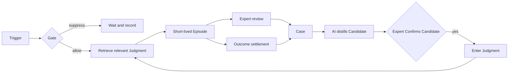
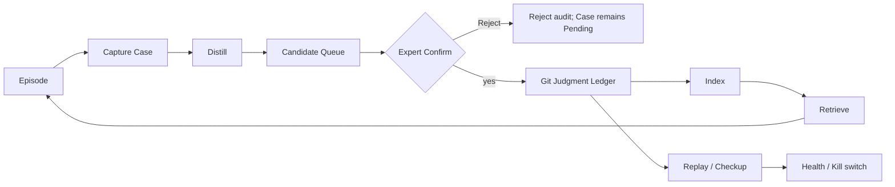
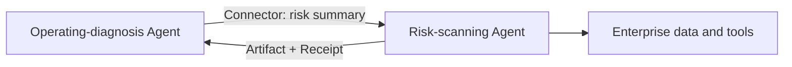

# From Expert Feedback to Executable Judgment: The OSCA Open Specification Whitepaper

> An open specification for AI cognitive workflows that are runnable, auditable, replayable, and able to adapt through real feedback

- **Whitepaper version:** 1.1 (document version, not a software release)
- **Published:** 2026-07-12
- **Specification baseline:** OSCA SPEC v0.3 + v0.4 draft (2026-07-12 Profile)
- **Reference implementation status:** public Host 0.2.0; first-party feedback-flywheel engineering (M3) complete; real-world validation not complete

**Languages:** **English** · [简体中文](OSCA-WHITEPAPER-v1.1.zh-CN.md) · [日本語](OSCA-WHITEPAPER-v1.1.ja.md)

## Abstract

Today's Agents can understand language, retrieve knowledge, call tools, and carry out multi-step work. OSCA asks a different question: after a task ends, how can an expert's decision become an asset that the next run can use automatically while remaining inspectable, reversible, and portable?

OSCA defines an Agent as a cognitive-work pipeline. Object, Structure, Connector, and Aware describe its goals, stable steps, external capabilities, and wake-up conditions. A Judgment born from real feedback and entered through expert Confirm constrains later runs in the right context. An Agent is therefore more than a model call: it is a deliverable textual work definition plus an attributable Judgment Ledger.

Humans remain at key positions not because they always judge better than AI, but because they live outside the system boundary and can bring changes in policy, goals, responsibility, and risk back into the pipeline. AI may distill Candidate Judgments from real Cases, but it cannot legislate. Experts Confirm Candidates; Runtime enforces permissions, budgets, approvals, and stops; observable Outcomes provide a second evidence channel.

Oscaware is the reference tooling, Runtime, and first-party feedback-flywheel implementation for OSCA. The public CLI and Host are inspectable and runnable; the private flywheel is supported by maintainer tests and synthetic fixtures. Real Connectors, product interfaces, and business validation remain incomplete: no high-frequency scenario has yet produced at least 20 real Judgments with independent later-use evidence. This whitepaper therefore describes a runnable open specification whose business value is not yet proven.

## OSCA in Ten Minutes

### One question

> **After work ends, how does an expert's decision become an asset that can execute next time and still be inspected and revoked?**

Prompts, knowledge bases, conversation memory, code exceptions, and fine-tuning can all change Agent behavior. They rarely answer all of these questions together: who made the decision, from which real task, under what conditions, whether it is still valid, and what happens after a model change. OSCA gives those questions an explicit home: the Judgment Ledger.

### One example

A monthly operating-diagnosis Agent sees a 45% increase in travel expenses and adds it to the anomaly list. The expert knows that the month is an overhaul period, removes the paragraph, and adds:

> Travel increases during an overhaul are normally not reported, unless they exceed that unit's overhaul-period peak for the previous three years.

A conventional workflow ends there. OSCA saves the real edit as a Case. AI distills similar Cases into a Candidate; only an authorized expert can Confirm the Candidate into a Judgment. On the next run, Runtime finds it under the same Object, timing, and context: ordinary noise is suppressed while the historical-peak exception is still reported.

The public operating-diagnosis pack contains synthetic products of this chain. Its people, data, Cases, and Judgments are format and behavior fixtures, not real-business P0 evidence. Lint can verify references; it cannot prove that evidence came from real work.

### One formula

```text
OSCA Agent
= O  Object: what object and goal the work concerns
+ S  Structure: how stable steps are composed
+ C  Connector: where data comes from and where actions go
+ A  Aware: what change is worth waking for
+ J  Judgment: when a decision entered through expert Confirm applies
```

O/S/C/A define the stable work skeleton. J stores contextual decisions that change with the operating environment. A model supplies cognitive ability; it is not the whole pipeline.

### One run and one feedback loop



Three authority boundaries hold throughout: machines preserve source evidence, AI may only distill, and an authorized expert must Confirm a Candidate before it becomes a formal Judgment. Policy is enforced outside the model. Replay checks health; it never rewrites the ledger automatically.

### Current capability summary

| Layer | Status |
|---|---|
| SPEC v0.3 | Published stable specification |
| Lint / Pack / Load / single-Judgment Replay | Implemented with public automated tests |
| Seven-component Host, Episode, three stop scopes, Settle | Implemented; exercised with synthetic/demo material |
| Capture → Distill → Queue/Confirm/Reject → Ledger → Retrieve/Checkup | First-party M3 implementation; synthetic fixtures exercised |
| ≥20 entered Judgments in one real high-frequency scenario, some with later-use evidence; slow scenario separate | Awaiting real work; not validated |
| Expert interfaces, Creator, and production integration | Not complete |

This is only a capability summary. Chapter 10 contains the dated stage snapshot and its evidence ceiling.

### Three reading paths

- **Decide whether OSCA is relevant (about 10 minutes):** this section, Chapters 1–2, 8, and 12.
- **Define your first Agent (about 30 minutes):** Chapters 3–9, then run the public sample.
- **Implement a Runtime or flywheel for a declared OSCA Profile:** the whole paper, appendices, SPEC, and Lint rules.

## Part I: Why OSCA

### Chapter 1: For Repeated Cognitive Work, an Agent Is More Like a Pipeline

> **An AI-native organization is a cognitive-work pipeline: AI is the pipeline that runs steadily; experts are judgment nodes on the line and authors and owners outside the line.**

The “digital employee” metaphor is useful for temporary, open-ended, conversational work. OSCA addresses another class of work: monthly diagnosis, risk scanning, ticket handling, review, and pricing recur with stable goals, steps, system connections, and wake-up conditions. Each output may end, but the work system should not reinvent itself every time.

“AI is the pipeline” means an AI-driven work system, not a model process that thinks forever. Scheduling, permissions, budgets, approval, deterministic data access, numerical optimization, and stopping must not depend on model improvisation. Language understanding, exceptions, and drafting can happen inside one short-lived cognitive Episode.

#### Why people stand at key positions

People are not there because they inherently judge better. On stable, data-rich local problems, AI or algorithms may be faster and more consistent. A person is unique because they stand outside the system boundary: they know that a policy has changed before the database does, that an increase came from an overhaul, or that an old Judgment has expired under a new responsibility structure.

A deletion, rewrite, or note corrects the current output and may also report that the world assumed by the pipeline has changed. OSCA does not ask experts to repeat the same review forever. It asks the action to leave evidence so repeatedly retained decisions can move into the pipeline while people focus on new exceptions.

Experts therefore hold two roles:

- on the line, they are approval, final-review, and correction nodes;
- outside the line, they own Judgment assets: they Confirm Candidates and challenge or supersede existing Judgments.

When prices, sales, losses, or faults can be observed through a Connector, Outcome can bring reality back as well. Reality is a second expert, not an infallible judge: metrics may be missing, delayed, or confounded.

#### Evolution on demand

OSCA does not let a model rewrite itself without supervision. A Case appears; the machine records it; AI distills; an expert Confirms the Candidate; Runtime executes; Replay checks. No evidence means no change, and evidence does not imply movement toward more automation.

“Evolution” is neutral. The system does not promise to get better with use. It promises the capacity to keep fitting the present environment and may therefore become easier to use. Better fit can mean superseding a Judgment, lowering Trust, tightening permissions, or returning a step to a human. Only rework, overruling, Outcome, and expert burden can show whether the result improved.

### Chapter 2: OSCA Adds Judgment Infrastructure

Agent stacks already have models, RAG, tools, workflows, and observability. OSCA adds a longer-timescale layer: how decisions from real work remain and take effect in the next applicable context.

#### Knowledge is not Judgment

| | Knowledge | Judgment |
|---|---|---|
| Content | Facts, policies, documents, background | What to decide in a particular context |
| Use | Retrieved, read, summarized | Constrains a route or output directly |
| Example | Overhauls usually increase travel | Do not report overhaul travel unless it exceeds the historical peak |
| Change | Update documents or indexes | Enter, retain, overrule, supersede, review |

> **An Agent looks up a knowledge base; an applicable Judgment enters the run.**

This does not turn natural language into unquestionable hard code. Runtime first narrows applicable candidates, then injects a few Judgments and representative Cases. Policy still enforces authority outside the model.

#### Definition

> **OSCA is an open specification for defining AI cognitive workflows in plain text. It describes work goals, composed steps, external capabilities, and wake-up conditions, and allows Judgments born from real feedback and entered through expert Confirm to take effect in later runs.**

OSCA does not mandate a model, cloud, vector store, or Agent framework. It defines what a portable Agent asset must express and the behavioral contracts a Runtime must follow for evidence, authority, state, and Replay.

#### OSCA and Oscaware

```text
OSCA      Open specification, package format, ledger discipline, runtime contracts
Oscaware  Reference tooling, Runtime, and first-party feedback-flywheel implementation
```

Developers can create packages from the SPEC or build a Runtime in another language and architecture. Oscaware is the first runnable answer and uses tests to expose ambiguities; it is not the only valid implementation.

#### What OSCA is not

- not a new model or a cure for every base-model weakness;
- not a replacement for RAG, BPM, RPA, or rule engines;
- not a prompt collection or a vector store of every conversation;
- not an autonomous AI legislature;
- not a proven “continuous learning” promise.

## Part II: How OSCA Defines and Runs an Agent

### Chapter 3: The O/S/C/A/J Model

| Layer | Question | Operating-diagnosis mapping |
|---|---|---|
| Object | What object and goal does the work concern? | Monthly report, expense alert, convergence target |
| Structure | How are stable steps composed? | Data access, diagnosis, drafting, review, settlement |
| Connector | Where does data come from and where do actions go? | Finance details, overhaul plan, report delivery |
| Aware | What change is worth waking for? | Ninth day of month, closing-state change, manual Event |
| Judgment | When does a decision entered through expert Confirm apply? | Suppression and exception for overhaul travel |

#### Object: shared nouns

Object defines input, output, metric, or optimization goal so Structure, Connector, Judgment, and Settle refer to the same thing. A first package need not model the whole enterprise; it needs only the objects actually referenced by this pipeline.

#### Structure: a thin process skeleton

Structure describes steps, dependencies, and Performer. Deterministic data access belongs to Connector, numerical optimization to Optimizer, final review to Human. If you are adding an `if/else` for “do not report overhaul travel,” it is probably an evidence-bearing Judgment rather than a permanent process step.

#### Connector: separate capability from environment

```text
Manifest  Declares required interfaces, input/output, and permissions inside the package
Binding   Maps logical capability to real endpoint and Secret name in the deployment environment
Executor  Performs the call through SQL, OpenAPI, MCP, or another protocol
```

Real connection strings and keys do not belong in the package. If an interface is missing or drifts, Runtime must reject the call explicitly rather than let the model guess a similar one.

#### Aware: Trigger is not wake-up

Trigger only reports time, state, or Event. Gate then evaluates combination, Precondition, Debounce, and Enabled before creating an Episode. A monthly diagnosis must not draft merely because the date arrived if finance is not closed.

#### Judgment: contextual decision with evidence

Judgment answers three questions: what it applies to, what it requires, and why it should be trusted. It contains a Signature made from Object/Aware/Guard, a short Body, birth Evidence, author and use counters, plus Replay declarations. Expiry should state what change requires review.

O/S/C/A form the stable skeleton; J is the decision layer above it. Do not put domain-structure change, interface migration, or permissions into Judgment, and do not bury changing field decisions permanently in code.

### Chapter 4: A `.osca` Package Is a Deliverable Asset

```text
my-agent.osca/
├── osca.yaml
├── AGENT.md
├── policy.yaml
├── structure.yaml
├── objects/
├── connectors/
├── aware/
├── judgments/       # may be empty in the first version
├── cases/           # produced by real runs
├── indexes/         # machine-generated cache; rebuildable; excluded from delivery
└── bindings.example.yaml
```

`AGENT.md` gives the model identity, goals, and advice. `policy.yaml` is the Runtime-enforced tool allowlist, approvals, budgets, Egress, redaction, and Kill switch. A prompt saying “do not exceed authority” cannot replace enforcement.

A package has three states:

- **Development:** text directory and Git history; authors edit and run Lint.
- **Delivery:** reproducible archive excluding real Bindings and caches, with an integrity manifest.
- **Runtime:** Runtime validates, binds environment capabilities, rebuilds indexes, and arms triggers.

Files are the asset truth; indexes are caches. Judgments, Cases, and Policy remain readable, while signature/vector indexes can be deleted and rebuilt. Git retains append-only history, attribution, and version replay. Checksums detect content changes but do not prove publisher identity; trusted signing and supply-chain controls remain deployment responsibilities.

A running Agent is only the compiled artifact; the textual package and its Judgment Ledger are the source code, and the model and Runtime act as a replaceable compiler. Customers should be able to hold that source code—their own package and Judgment Ledger. That design goal does not itself solve contracts, author rights, or privacy deletion; deployments still need governance.

### Chapter 5: The Dual-Plane Runtime Model

```text
Control plane: when to wake, what may run, how much it may spend, when to stop
Cognitive plane: how this Episode understands, judges, drafts, and explains
```

Host or another Runtime owns the control plane. It stays resident without asking a model to schedule work and handles loading, Trigger, Gate, Policy, Connector, audit, stopping, and Settle. The cognitive plane creates a short-lived Episode only after Gate allows it. Every Episode has an ID, budget, context, steps, output, and terminal state.

The planes need not be separate processes. The reference Host may call a model from another thread in one process, but scheduling, permissions, budget, and stopping do not depend on model output.

#### One Episode

```text
Trigger → Gate → refresh ledger and health
→ hard-filter Judgment by Object/Aware
→ assemble AGENT + Structure + Discretion + Objects
  + top 3–7 Judgments + one representative Case each
→ execute Pipeline → Human / Settle
```

The public Host currently sorts by Trust and `confirmed`; the private first-party retriever can semantically rank a small candidate bucket. Natural-language Guard is not yet evaluated deterministically, so semantic similarity must not be treated as a satisfied business condition.

#### Five Performers

- **Connector:** deterministic data access and actions;
- **Agent:** understanding, exception handling, drafting, explanation;
- **Optimizer:** numerical optimization inside a Judgment-constrained feasible region;
- **Human:** approval, final review, and reporting new change;
- **Runtime:** scheduling, state, settlement, and stopping.

#### Authority and three stop scopes

Policy guards tool calls, LLM calls, and external access. Malformed safety configuration must not degrade into unlimited budget or missing approval, and Runtime must defend against invalid configuration that bypassed Lint. Before every LLM call, the reference implementation checks package revocation, Kill switch, and whether the Token budget is already exhausted. Actual Token use arrives after a gateway response, so this is a loss limit: if the call takes the Episode over budget, the Episode stops immediately rather than pretending exact pre-reservation was possible.

| Stop scope | Meaning |
|---|---|
| Episode | This run completes, fails, or reaches budget |
| Aware | Disarm one trigger entry point |
| Package | Revoke the Agent; reject later calls and stop in-flight Episodes at safe boundaries |

An objective Object may declare Settle. Runtime later obtains Reality and records an Outcome Case against the Decision. Complex business calendars and delayed scheduling still require deployment adaptation.

## Part III: Judgment Ledger and Feedback Flywheel

### Chapter 6: From Feedback to Judgment Asset

An expert edit is not a Judgment. It first becomes preserved evidence; only distillation and authorization give it power over later runs.

| Asset | Meaning | Authority |
|---|---|---|
| Case | A real Diff, Outcome, or attributable spoken account | Evidence only |
| Candidate | AI-drafted Judgment from a Case cluster | Waits outside the package; no runtime authority |
| Judgment | Formal entry after expert Confirm, Lint, and Git | Only Active has runtime authority; other states remain for audit and Replay |

#### Five parts of a Judgment

1. **Signature:** Object, Aware, and Guard where it applies.
2. **Body:** one to three sentences of decision, including necessary “unless.”
3. **Evidence:** one or more birth Cases.
4. **Meta:** author, batch, `confirmed`, `overruled`, and Trust (lifecycle status is a top-level file field).
5. **Expiry / Replay:** what requires review and how to check behavior.

Confirm is the expert act that admits a Candidate; it is not `confirmed +1`. A new Judgment enters with `confirmed: 0` and Provisional Trust. Only later real use retained by the responsible expert—or, in a future profile, supported through defined Outcome attribution—can increase the counter. The current first-party implementation updates `confirmed/overruled` only from expert Diff; Outcome Sweep records a Case but does not update counters. The reference discipline promotes Trust to High when confirmations reach a threshold without overruling, and moves a Judgment into Review when overruling accumulates to its threshold; both thresholds still require P0 calibration.

#### Five ledger disciplines

1. Ledger history is append-only and never erased. Existing Body/Evidence is not overwritten in place; revision adds a new Judgment that Supersedes the old one, while the old item may only make defined lifecycle transitions.
2. Every Judgment has at least one real birth Case.
3. A Candidate cannot enter the ledger without expert Confirm.
4. Trust is driven by later-use counters; a person cannot simply type High.
5. Positive decisions and noise-suppressing negative decisions have equal status; Structure must not hide domain decisions in `if/else`.

Supersedes is a one-way, acyclic, non-branching chain. A Superseded Judgment freezes counters but remains auditable and replayable. It is not a failure record; it is the history of organizational Judgment changing with the environment.

#### Two principal evidence channels

**Expert Diff** preserves Agent Draft, Expert Final, context, time, source, and the active Judgment set. The reference collector uses conservative attribution: if the responsible expert reviews and preserves a paragraph carrying a Judgment ID, `confirmed +1`; if the paragraph disappears, `overruled +1`; if rewritten, no counter changes and the Diff remains for distillation. Reordering, multiple Judgments, and wording changes make this an approximation, not truth.

**Outcome** preserves the objective, Decision, later Reality, settlement time, and data source. Reality may support or challenge a Judgment, or remain indeterminate because of delay, missing data, and confounding. Reality is a second expert, not a reward score that rewrites the ledger.

The current specification also allows attributable spoken Cases with author, time, context, and original wording. Their relationship to runtime evidence and ability to support Replay independently remain open questions; “common sense” cannot bypass Evidence.

### Chapter 7: The Flywheel—AI Distills, People Decide



#### Capture, Distill, Confirm

Capture is deliberately unintelligent: one feedback event becomes one Case and one Git Commit; evidence and counter updates share a transaction. Multiple writers require a package lock, atomic IDs, and rollback discipline.

The private first-party `oscapipe` Distill currently processes only Pending Diff Cases containing both `agent_draft` and `expert_final`; it skips Outcome and spoken Cases. It groups by expert action and shared context, then may merge semantically similar clusters through Embedding. An LLM may draft Signature, Body, Expiry, Replay, and the confirmation question, but Evidence equals the Cases selected by deterministic clustering, and machines fill Meta and ID. A reference outside the cluster or to a missing Object invalidates the Candidate.

Candidates remain outside the package. The private `oscapipe` CLI supports Confirm and Reject; the public `osca` CLI does not. Rewriting currently means editing and redistilling, not a separate Rewrite action. Confirm verifies under the lock that the evidence is still fresh, allocates a J-ID, updates Supersedes and Case state, runs Lint, and commits one Judgment per Commit. Reject reason and time should remain; the first-party implementation does not yet record this structured audit.

In the synthetic operating-diagnosis example, `C-0091` removes an ordinary overhaul-period travel alert while `C-0094` keeps an above-peak exception. Together they illustrate how the Candidate “normally suppress, unless above the peak” becomes Judgment `J-0417` through expert Confirm. They demonstrate asset relationships, not P0 evidence.

#### Index and Retrieve

Index rebuilds the Active Signature Table and optional Guard+Body vector index. Unchanged content hashes avoid repeated Embedding; a model change rebuilds the table. Two paths are not yet integrated: the public Host hard-filters Active/Object/Aware, sorts top 3–7 by Trust/`confirmed`, and attaches a representative Case; the private retriever semantically ranks the hard-filtered bucket but is not wired into Host representative-Case assembly. Degradation must be explicit and return to deterministic ranking.

#### Single-Judgment Replay

Replay runs two arms over the same historical Case. Without reconstructs the captured Judgment set minus the target; With holds everything else fixed and adds the target. The reference evaluator checks whether output moves from Agent Draft toward Expert Final. It is repeatable and auditable but not full semantic correctness; wording and model nondeterminism can mislead it.

If a later monthly diagnosis hits `J-0417` and the expert preserves the decision, Diff Capture gives `confirmed +1`; if the paragraph disappears, `overruled +1`. After a model change, Replay compares arms with and without `J-0417` to reveal whether it still moves output toward the expert final.

#### Whole-ledger Checkup and health archive

Checkup reuses single-Judgment Replay for every Active Judgment. Within one Judgment: any Red → Red; otherwise any Error → Error; otherwise all Green. The top-level counts Judgments, not assertions:

```text
red_rate = Red Judgment / (Green Judgment + Red Judgment)
```

Error means unable to prove and is excluded from the red-rate denominator. Red means injection did not move output as expected. It recommends review; it does not downgrade or delete automatically—Replay is a checkup, not an executioner.

Because the health archive drives Kill switch, it is safety input rather than an ordinary report:

| Constraint | Meaning |
|---|---|
| Decidable | At least one Green or Red; all Error is Unavailable, not 0% red |
| Same version | Archive binds the current package fingerprint (`ledger_tree`); content change invalidates it |
| Complete | Final consistency check and atomic publication occur under the ledger write lock; intervening change rejects publication; Host cross-checks schema, counts, and version |
| Conservative | Kill compares original integer counts; Unavailable neither clears Tripped nor trips an existing Clear state |

Kill switch therefore has Tripped, Clear, and Unavailable states; `red_rate` is display only. Locking and atomic-file details belong in implementation documentation. The archive does not enforce wall-clock age; deployment owns checkup cadence. Restart reevaluates state, while persistent stop lists remain an operations feature. Before changing models, preserve the old archive externally and rerun with the new model for a real migration comparison.

#### Current evidence boundary

Capture, Distill, Confirm, Git Ledger, Index, Retrieve, and Checkup exist in the private first-party implementation with synthetic end-to-end tests; the health contract reaches the public Host. Real clustering thresholds, ranking, expert burden, and rework trend are unvalidated. Outcome Cases can be written and swept, but current automatic Distill explicitly handles expert Diff only.

## Part IV: Adopting OSCA

### Chapter 8: Which Scenarios Fit OSCA

Ask three questions:

1. **Repeat:** will the same goal and process recur?
2. **Judgment:** can similar inputs require different action because of context or exception?
3. **Feedback:** can expert edits or observable Outcome return to the system?

| Repeat | Judgment density | Feedback | Better starting point |
|---|---|---|---|
| High | High | Yes | OSCA-priority scenario |
| High | Low | With or without | Rules, BPM, RPA |
| Low | High | Yes | Copilot/project work; find a repeated sub-process first |
| High | High | No | Establish ownership and evidence return before promising evolution |
| Low | Low | No | Usually no need for OSCA |

Start with high frequency, fast feedback, and errors that a Human step or approval gate can catch. Monthly operating diagnosis has valuable Judgment but feeds slowly; reports, QA, and scripts are better for calibrating capture, clustering, and retrieval. Perishable pricing is another useful class because Outcome returns quickly.

Avoid or narrow OSCA when goals start from zero each time, no authorized expert or observable result exists, evidence cannot be retained, errors are irreversible without approval and stops, the problem is deterministic, or “feedback” is merely a click without decision semantics. OSCA cannot repair an organizational process with no ownership or data rights.

### Chapter 9: Verify the Public Sample and Plan Your First Package

This chapter separates publicly reproducible capabilities from the complete adoption route.

#### Current capability boundary

| Capability | Public reference | Deployment adaptation | First-party status | Third-party choice |
|---|---|---|---|---|
| SPEC, Lint, Pack, Load | Zero-external-config verification | | | Adopt directly |
| Single Replay | Public implementation and Mock tests | Real execution needs LLM/mock | | Replace Evaluator |
| Mock Host, Trigger/Gate, Episode, three stop scopes | Public implementation/tests | Full Episode needs Binding/fixture/LLM | | Replace Runtime |
| Real SQL/OpenAPI/MCP Executor, identity, HA | | Required | | Implement for environment |
| Capture, Distill, Confirm, vector Retrieve, whole Checkup | | | M3 complete, private | Implement from public discipline |
| Diff/Confirm UI, console, approval cards | | Product adaptation | M4 incomplete | Build another UI |

Third parties can adopt OSCA without private `oscapipe`, but must implement feedback transactions from the public ledger discipline.

#### Verify the public sample in ten minutes

From the repository root:

```bash
cd cli
uv sync --locked
uv run osca lint ../examples/oper-diagnosis.osca
uv run osca pack ../examples/oper-diagnosis.osca
uv run osca load demo-group-oper-diagnosis.osca.zip --dest ./deploy
```

Expect 0 Errors and 0 Warnings and a reproducible archive. Because `load` has no `--bindings`, it verifies static package content, integrity, and index rebuild only; it will list the capabilities still requiring injection, which does not mean the environment connections are ready.

To observe Host loading and registry state:

```bash
cd ../host
uv sync --locked
uv run osca-host run --load ../examples/oper-diagnosis.osca
```

In another terminal under `host/`:

```bash
uv run osca-host status
uv run osca-host disable demo-group-oper-diagnosis AW-001
uv run osca-host enable demo-group-oper-diagnosis AW-001
uv run osca-host unload demo-group-oper-diagnosis
uv run osca-host stop
```

A full Episode also needs deployment Binding, Connector Mock fixtures, and an LLM Mock/gateway; see the [Host guide](../host/README.md). Host startup does not mean an enterprise system is connected.

#### Your minimum Starter

The public repository does not yet provide `osca init` or a productized Creator. The honest route is to hand-create a smaller package that follows the sample directory shape without copying its business context, Cases, and Judgments:

| First asset | Minimum content |
|---|---|
| `osca.yaml` + `AGENT.md` | Package identity, entry, main goal, language, boundaries |
| One Object + thin Structure | One main deliverable; data → cognition → Human review |
| One Connector Manifest | Logical interface only; real Binding and Secret stay in environment |
| One Aware | Start with manual Event; add Schedule/Watch later |
| `policy.yaml` | Default deny, minimum allowlist, budget, approval, Egress, stops |
| Empty `judgments/` + `cases/` | Do not prefill “best practices”; wait for real work |

Success does not mean “already smart.” It means Lint 0/0; two Packs have the same hash; Load lists required Bindings; Host can register, disable, and unload the entry; a controlled Episode records steps, receipts, and terminal state; and the first real expert edit can become a Case.

#### From sample to your package

1. Define the main Object, delivery standard, responsible expert, and evidence source.
2. Define a thin Structure and assign deterministic access, optimization, cognition, and review to the right Performers.
3. Write Connector Manifest; keep Binding and Secret in the environment.
4. Write a minimal Aware, first with manual Event.
5. Separate AGENT from Policy and verify all stop scopes.
6. Start with an empty Judgment Ledger; do not invent expert rules.
7. Lint, Pack, Load, and run a controlled Episode.
8. Save the first real Case, then Distill and obtain expert Confirm.
9. Rebuild Index and Retrieve in a later real batch.
10. Replay new Judgments and run periodic Checkup.

An empty ledger is not a defect. P0-A's ≥20 L1 real Judgments are a content gate, not a Runtime prerequisite; only real runs produce credible Cases. With only the public repository, steps 8–10 require manual specification-compliant transactions or an independently implemented flywheel; private first-party commands are not promised by this Quickstart.

## Part V: Reference Implementation, Compatibility, and Validation

### Chapter 10: Oscaware Reference Implementation and Stage Snapshot

A reference implementation proves feasibility, exposes ambiguity through failure paths, and provides a behavioral baseline. OSCA compatibility does not require Python, the same thread model, or first-party commercial components.

#### Public, first-party private, and customer private

| Boundary | Content | Meaning |
|---|---|---|
| Public | SPEC, Lint, CLI, single Replay, Host, demo sample, tests | Third parties can inspect, create packages, and implement a compatible system |
| First-party private | `oscapipe` clustering, distillation, retrieval, whole Checkup | Implementation/commercial choice, not a required OSCA dependency |
| Customer private | Real Cases, authors, Judgments, Bindings, Secrets, runtime archives | Controlled by customer or authorized environment |

Public readers cannot inspect the whole first-party flywheel. “M3 implemented” is therefore a maintainer implementation claim; public CLI and Host can be inspected directly. Real P0 material enters neither the public repository nor the private engineering repository; it remains in a controlled customer/local Corpus.

#### Sole stage snapshot as of 2026-07-12

| Stage | Delivery | Status and evidence ceiling |
|---|---|---|
| M0 | Python skeleton, tests, redaction hook | Complete |
| M1 | SPEC v0.3, 22 Lint rules, Pack/Load, public sample | Complete; publicly inspectable |
| M2 | Seven Host components, Episode Runner, Policy, stops, Settle, single Replay | Complete; synthetic/demo exercise |
| M3 | Capture/Sweep, Distill/Queue/Confirm/Reject, Index/Retrieve, Checkup, three-state Kill | W1–W4 complete; private flywheel, public health contract |
| P0 | P0-A ≥20 L1 and some L3/L4; P0-B separate | Incomplete; business value unvalidated |
| M4 | Diff/Confirm, operations, approval interfaces | Incomplete |
| M5 | Creator interview assistant and editor | Incomplete |
| M6 | Real Connector conventions, production integration, software 1.0 | Incomplete |

Software 1.0 requires P0-A evidence, M4–M6, the specification, reference implementation, and a replayable controlled real sample ledger. Whitepaper 1.0 is only this document version; the real ledger remains subject to customer data rights and does not mean a published raw ledger.

#### How implementation feeds the specification

Implementation has changed the specification: Lint exposed invalid YAML, missing `binding_ref`, Object Kind, and SQL; external payload URI became a Binding-resolved logical pointer; free-text Schedule became structured; data Watch stopped sharing across packages; Kill counts Active Judgments only; health archives bind package Tree OID and treat 0/0 as Unavailable.

These are not implementation trivia. An open specification must accept correction from code, tests, and failure paths. Lint mechanizes 22 key disciplines, not the whole SPEC: natural-language Guard, some Kind constraints, and historical “never delete/reuse” rules still require implementation and Git transactions.

### Chapter 11: Compatible Implementations and Agent Composition

Compatibility is not a binary badge. Implementations must declare at least four levels:

| Level | Comparable behavior |
|---|---|
| Format | Package version, IDs, references, dependencies, zero-secret boundary |
| Discipline | Normative errors, ledger invariants, admission gates |
| Runtime | Trigger/Gate, Policy, Connector, budget, state, stop |
| Replay | Historical context, A/B isolation, model, Green/Red/Error, denominator |

Natural-language output need not match byte for byte, nor must process, model, vector store, or UI. Authority boundaries, state transitions, and evidence chains must remain equivalent. Unknown critical fields, unsupported Performers, and unevaluable conditions must be rejected or conservatively degraded with an audit trail, never guessed.

v0.4 is still a draft; there is no independent certifier or formal Conformance Suite. Third parties should declare Package version, runtime semantics snapshot, supported Trigger/Executor, Guard behavior, and Replay Evaluator. Future conformance should compare positive/negative packages, Lint results, Runtime event traces, Policy failures, fixed Mock Replay, and upgrades—not class names or log wording.

#### Agent as Connector

An OSCA Agent may expose typed capability through API, messaging, or MCP; another Agent declares it in Connector Manifest and the environment binds the endpoint. MCP is an implementation choice, not a requirement.



Capability composition is not ledger merging. Upstream output is first an Artifact, not a trusted Judgment. Packages keep independent Policy, budgets, Kill switches, and private Ledgers. Cross-package calls need receipts and provenance and cannot bypass downstream approval.

Cross-package Judgment is harder. Trust comes from local evidence, authors, and use history; similar names do not transfer it across customers. The current safe boundary exchanges typed Artifact without silently retrieving or accumulating another ledger. An industry template may become a local Candidate, but entry still needs local Evidence and Confirm.

#### Governing the open specification

OSCA is currently led by the Oscaware project, not an independent standards body. Near-term governance should keep SPEC, change records, rules, and fixtures open; proposals should state “real scenario → expected behavior → specification impact → failing fixture.” Extension namespaces, deprecation, and certification should follow real disagreement from second and third implementations.

### Chapter 12: How to Validate OSCA and What Remains Open

#### Four evidence layers cannot substitute for one another

| Layer | Question | Typical evidence |
|---|---|---|
| Mechanism | Does the chain behave as specified? | Lint, tests, Episode, Replay |
| Judgment | Do Cases form useful Judgments and hit correctly? | Confirm rate, retrieval relevance, coverage, overruling |
| Work | Do rework, error, cycle, cost, or Outcome improve? | Scenario baseline and later batches |
| Organization | Will experts keep contributing and can assets be governed? | Extra burden, participation, audit, portability |

A possible north-star metric is a “real Judgment decision point confirmed after use”: an Active Judgment actually participates in a new Episode, output traces to its ID, and the responsible expert preserves it or an explainable Outcome supports it. Count predefined deduplicated decision points, not files or references; several Judgments at one point still count once.

Show guardrails beside it: unit rework, Active overrule ratio, effective coverage, Candidate Confirm/Reject/Pending/redistill, retrieval misses, Replay Red/Error, expert time, Episode cost and latency. High coverage with high false hits and overruling is inflation, not progress.

#### P0-A and P0-B

Monthly operating diagnosis cannot honestly supply four rounds in two to four weeks. P0 is therefore split into separately reported, never-pooled lines:

- **P0-A high-frequency calibration:** low-risk, naturally reviewed report/QA/script work; at least four independent batches in two to four weeks; owns the ≥20 real-Judgment content gate.
- **P0-B slow-scenario asset line:** monthly diagnosis and other high-value slow work accumulate Cases and Judgments at natural pace and cannot claim short-cycle convergence.

A Judgment that counts toward P0 must, at minimum:

- come from authorized real work, not sample or synthetic data;
- retain Evidence, author, time, and context—and, if born in an Episode, the active Judgment set at that time;
- receive authorized expert Confirm, pass Lint, and enter through an independent Commit;
- enter with `confirmed: 0` and Provisional Trust, and carry Replay;
- involve no copying or synonym-splitting to inflate the count.

Expiry is recommended but distinct from mandatory Replay. Until spoken-evidence rules stabilize, a spoken Case is supplemental Evidence only and cannot alone give birth to or count as a P0 Judgment; until Outcome attribution and an executable Replay Profile stabilize, an Outcome Case is likewise supplemental. A P0-A Judgment must include at least one replayable expert Diff Case.

Maturity has five levels:

```text
L0  Real Case captured
L1  Candidate entered through Confirm
L2  Judgment deployed and replayable
L3  Judgment applies and participates again in a new real context
L4  That use receives later expert or Outcome support
```

Twenty is primarily an L1 content gate; value signals must include L3/L4. Freeze the Ledger Commit at each batch start and activate new Judgments no earlier than the next batch, so birth evidence cannot validate itself. If four rounds show no rework decrease, more false hits or overruling, extra expert burden, or maintenance cost exceeding benefit, stop expansion and review the premise.

P0 is small and can show feasibility and direction, not general causality. Model upgrades, prompt changes, easier inputs, or expert learning may explain the same trend.

#### Open questions

- **Guard:** natural language preserves context but is not deterministically evaluable across Runtimes.
- **Outcome attribution:** one good result cannot legislate; windows, confounding, and minimum evidence are undefined.
- **Spoken Case:** attributable, but independent birth and Replay rules remain weak.
- **Multi-expert governance:** conflict, delegation, tenure, authorship, and dispute lack common semantics.
- **Reject audit:** the first party does not yet retain structured Reject reasons and times.
- **Production engineering:** real Executors, events, recovery, HA, security, and identity are unfinished.
- **Health archive age:** Host validates content version, not wall-clock expiry; deployment owns cadence.
- **Ecosystem:** no second implementation, extension negotiation, Conformance, or formal governance yet.

Results that challenge OSCA include feedback that cannot reliably become Case, Judgments that rarely apply again, ledger growth without rework reduction, governance cost greater than benefit, model changes without an actionable migration list, or third parties unable to implement without undisclosed semantics. Open questions are falsification conditions, not deferred promises.

## Conclusion: Keep Human Decisions in the System

Models will improve, tools will stabilize, and cognitive cost will fall. Organizations will still face the same long-term question: after the world changes and an expert decides, can that decision take effect in the next relevant context while remaining inspectable, reversible, and portable?

OSCA places AI in a cognitive-work pipeline. O/S/C/A define goals, skeleton, external capability, and wake-up conditions. Judgment Ledger holds decisions born from real Evidence, entered through human Confirm, and continuously open to later challenge. Models provide ability; Runtime enforces authority; experts bring back reality that the system does not yet represent.

This is not a promise to “get smarter with use.” Evolution on demand may add a Judgment, supersede one, lower Trust, tighten permission, or return work to a person. Real rework, overruling, Outcome, and human burden decide whether it improved.

The specification, sample, public tools, reference Host, and first-party flywheel engineering exist. What is missing is a real pipeline, a real ledger, and later-use evidence. The next step is P0, not a larger claim.

Openness depends on another team reproducing public CLI/Host behavior and implementing or replacing the flywheel from the public specification alone, then using real Cases to force further correction. Until a second implementation exists, that remains unproven.

## Appendix A: Ten Design Axioms

These are design choices, not business-proven laws.

1. **No real Case, no formal Judgment.**
2. **Runtime evidence primarily comes from expert Diff and real Outcome; reality is a second expert, not an infallible judge.**
3. **Governable Judgment remains in text, not model weights.**
4. **Files are truth; indexes are rebuildable caches.**
5. **Advice and cage are separate: AGENT shapes behavior, Policy enforces authority.**
6. **Do not ask an LLM to guess what can be fetched or optimized deterministically.**
7. **Judgment constrains the feasible region; it does not replace Agent ability or Optimizer algorithms.**
8. **No model depends on a hidden long-lived session; cognition occurs in short-lived Episodes.**
9. **Package and environment are separate; packages contain no secrets, and customers hold their ledgers.**
10. **Ledger health is a safety signal; overruling or Replay anomalies may stop action but never rewrite Judgment automatically.**

## Appendix B: Core Terms

| Term | Meaning |
|---|---|
| OSCA | Open specification for cognitive workflows, Judgment assets, and runtime contracts |
| Oscaware | Reference tooling, Runtime, and first-party feedback flywheel for OSCA |
| Package | Deliverable textual asset for one Agent |
| Object / Structure / Connector / Aware | Goal object / stable steps / external capability contract / wake-up condition |
| Episode | One short-lived, budgeted cognitive run with terminal state |
| Case | Source evidence from real feedback or Outcome |
| Candidate | AI-distilled draft with no runtime authority |
| Judgment | Formal entry after expert Confirm, Lint, and Commit |
| Confirm / `confirmed` | Act admitting Candidate / count of later real uses retained |
| Trust | State driven by later-use counters, not hand-entered confidence |
| Supersedes | One-way chain where a new Judgment replaces an old one without erasing history |
| Replay / Checkup | A/B check for one Judgment / whole-Active-ledger check |

## Appendix C: Document Navigation and Evidence Claims

| Entry | Purpose |
|---|---|
| [OSCA SPEC v0.3](OSCA-SPEC-v0.3.md) | Stable package format and ledger discipline |
| [OSCA SPEC v0.4 draft](OSCA-SPEC-v0.4-draft.md) | Incremental Runtime, Settle, Replay, and health semantics |
| [Lint rules](OSCA-LINT-RULES.md) | Machine-enforced findings and known limits |
| [Operating-diagnosis sample](../examples/oper-diagnosis.osca/README.md) | Synthetic/demo package; not real P0 |
| [CLI guide](../cli/README.md) | Lint, Pack, Load, single Replay |
| [Host guide](../host/README.md) | Reference Runtime capabilities and boundaries |
| [Historical v0.1 extended draft](OSCA-WHITEPAPER-v0.1.zh-CN.md) | Design background only; v1.1 controls status and conclusions |

This paper uses four evidence levels:

| Label | Meaning |
|---|---|
| Design principle | Normative claim about how a compatible system should behave |
| Implemented | Corresponding code and automated tests exist |
| Exercised | Synthetic or demo material ran through the mechanism |
| Validated | Real work, real experts, and continuing results support the claim |

Chapter 10 is the sole stage snapshot. If this paper conflicts with the stable SPEC, the stable SPEC controls. Specification text and this whitepaper use CC BY 4.0 under the project notice; code and public samples use the repository LICENSE. OSCA/Oscaware names and marks are not automatically licensed by either.
