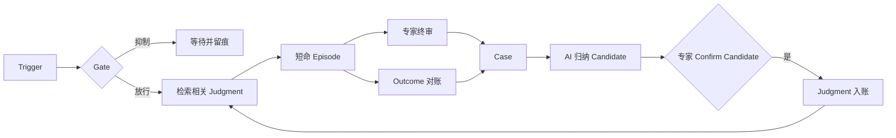
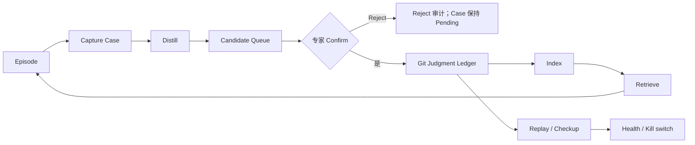

# 从专家反馈到可执行判断：OSCA 开放规范白皮书

> 一种可运行、可审计、可回放，并能从真实反馈中持续适应的 AI 认知工作流程开放规范

- **白皮书版本：** 1.1（文档版本，不代表软件版本）
- **发布日期：** 2026-07-12
- **规范基线：** OSCA SPEC v0.3 + v0.4 draft（2026-07-12 Profile）
- **参考实现状态：** 公开 Host 0.2.0、第一方反馈飞轮（M3）工程收官；真实业务验证尚未完成

**语言：** [English](OSCA-WHITEPAPER-v1.1.en.md) · **简体中文** · [日本語](OSCA-WHITEPAPER-v1.1.ja.md)

## 摘要

今天的 Agent 已经能理解语言、检索知识、调用工具和执行多步任务。OSCA 追问的是另一个
问题：一次任务结束后，专家刚刚作出的裁决，怎样成为下一次运行可以自动使用、又始终能够
被检查、推翻和迁移的资产？

OSCA 把 Agent 定义为一条认知工作流水线。Object、Structure、Connector 和 Aware 描述
目标、步骤、外部能力与启动时机；经真实反馈出生、由专家 Confirm 入账的 Judgment 在恰当
情境中约束后续运行。一个 Agent 因而不只是一次模型调用，而是一份可交付的文本工作定义，
外加一本可署名的判断账本。

关键位置保留人，不是因为人必然比 AI 更会判断，而是因为人生活在系统边界之外，能把政策、
目标、责任和风险的变化带回流水线。AI 可以从真实 Case 归纳 Candidate，但不能自行立法；
专家负责 Confirm Candidate，Runtime 负责权限、预算、审批与停止，现实 Outcome 则提供第二条
证据通道。

Oscaware 是 OSCA 的参考工具、Runtime 与第一方反馈飞轮实现。公开 CLI/Host 已可检查和运行；
私有反馈飞轮已有维护者测试与合成夹具支持。真实 Connector、产品界面和业务验证仍未完成：
高频场景尚未形成至少 20 条真实 Judgment，也没有后续独立使用证据。因此，本白皮书描述的
是已经可运行、但尚未得到真实业务价值证明的开放规范。

## 十分钟读懂 OSCA

### 一个问题

> **一次工作结束后，专家刚刚作出的裁决，怎样成为下一次运行可以自动执行、又始终能够被人检查和撤销的资产？**

Prompt、知识库、对话记忆、代码特例和微调都能改变 Agent 行为，却很难同时回答：谁作出
这条裁决？依据哪次真实工作？在哪些情境生效？现在是否仍然有效？换模型后怎么办？OSCA
把这些问题收束到一种显式资产：Judgment Ledger（判断账本）。

### 一个例子

月度经营诊断 Agent 发现某单位差旅费上涨 45%，于是把它写进异常清单。专家知道当月正值
计划检修期，删除整段并补充：

> 检修期差旅通常不报，除非涨幅超过该单位近三年检修期峰值。

普通工作流到此结束；OSCA 则把这次真实修改保存为 Case。相似 Case 聚集后，AI 归纳一条
Candidate，有权专家 Confirm Candidate 后才成为 Judgment。下次运行，Runtime 在相同对象、
时机和情境下找到它：普通噪音被压制，超过历史峰值的例外仍然上报。

公开经营诊断包呈现了这条链路的合成产物，但人物、数据与 Case 不计入真实业务验证（P0）。
其中的 Case/Judgment 文件是格式与行为夹具，不是正式业务账本；Lint 能检查证据引用，不能
证明证据来自真实工作。

### 一条公式

```text
OSCA Agent
= O  Object：围绕什么对象和目标
+ S  Structure：稳定步骤怎样组合
+ C  Connector：从哪里取数、向哪里行动
+ A  Aware：什么变化值得启动
+ J  Judgment：经专家 Confirm 入账的裁决何时生效
```

O/S/C/A 定义工作的稳定骨架，J 保存会随现场变化的情境化裁决。模型提供认知能力，但不
等于整条流水线。

### 一次运行和一次反馈



三条权力边界贯穿始终：原始证据由机器保真，AI 只能归纳，正式判断由有权专家 Confirm
Candidate。Policy 在模型之外强制执行；Replay 负责体检，不自动改写账本。

### 当前做到哪里

| 层 | 状态 |
|---|---|
| SPEC v0.3 | 已发布的稳定规范 |
| Lint/Pack/Load/单条 Replay | 已实现并有公开自动测试 |
| Host 七组件、Episode、三级停、Settle | 已实现，演示/合成材料已演练 |
| Capture → Distill → Queue/Confirm/Reject → Ledger → Retrieve/Checkup | 第一方 M3 已实现，合成夹具已演练 |
| 高频真实场景 ≥20 条入账判断，部分获得后续使用证据；慢场景单列 | 尚待真实工作，未验证 |
| 专家界面、Creator 与生产集成 | 尚未完成 |

本表只给能力摘要；带日期和证据上限的唯一阶段快照见第 10 章。

### 三条阅读路径

- **判断是否相关（约 10 分钟）：** 本节、第 1～2 章、第 8 章、第 12 章。
- **创建自己的 Agent（约 30 分钟）：** 第 3～9 章，再运行公开样例。
- **实现面向某一 OSCA Profile 的 Runtime 或飞轮：** 全文、附录、SPEC 与 Lint 规则清单。

## 第一部分：为什么需要 OSCA

### 第 1 章：对重复认知工作，Agent 更像流水线

> **AI Native 组织是一条认知工作流水线——AI 是稳定运转的流水线本身，专家是线上的判断节点，同时是线外的作者与所有者。**

“数字员工”是一个有用隐喻：用户派发任务，Agent 理解、调用工具并交付答案。它很适合
临时、开放和以对话为中心的工作。OSCA 关注的是另一类任务：月度诊断、风险扫描、工单
处置、审核和定价会反复发生，有稳定目标、步骤、系统连接和启动条件。每次产出可以结束，
负责产出的工作系统却不能每次从零发明。

这里的“AI 是流水线”指 AI 驱动的工作系统，不是一个模型进程永远在线。调度、权限、预算、
审批、确定性取数、数值寻优和停止不应随模型临场发挥；语言理解、例外处理和成文则可以在
一次短命认知 Episode 中完成。

#### 为什么关键位置要站人

人留下来不是因为他天然比 AI 更会判断。对目标稳定、数据充分的局部问题，AI 或算法完全
可能更快、更一致。人的独特位置在系统边界之外：他知道新政策还没进入数据库，却已经改变
风险口径；知道这次上涨源于检修；也知道某条旧判断在新的责任关系下已经过期。

一次删除、改写或备注既是对当前结果的修正，也可能是在报告：流水线依据的世界已经变化。
OSCA 要做的不是让专家永远重复同一终审，而是让这次动作留下证据。已被后验多次保留的裁决
交给流水线；人把注意力移向新的例外和边界。

专家因此有两种身份：

- 在线上，他是审批、终审和纠错的判断节点；
- 在线外，他是判断资产的作者与所有者，可以 Confirm Candidate，并质疑或取代既有 Judgment。

当价格、销量、损耗、故障等结果已经能够被 Connector 观测，Outcome 也能把现实变化带回
系统。现实是第二位专家，但不是万能裁判：指标可能缺失、延迟或受到其他变量干扰。

#### 按需进化

OSCA 不让模型在无人监督下持续改写自己。Case 出现后，机器记录，AI 归纳，专家 Confirm
Candidate，Runtime 执行，Replay 再检查。这是一种按需进化：没有证据就不改；有证据也不
保证只向“更自动”方向改。

“进化”是中性词。系统不承诺越用越好，只承诺有能力持续贴合当下，因而可能越用越顺手。
贴合也可能意味着推翻旧判断、降低 Trust、收紧权限，甚至把一步重新交还给人。是否真的
改善，仍要由返工、推翻、Outcome 和专家负担决定。

### 第 2 章：OSCA 补上的是判断基础设施

现有 Agent 技术栈已经拥有模型、RAG、工具调用、工作流和观测系统。OSCA 不替代它们，而是
补一个更长时间尺度的问题：真实工作中的裁决如何留下，并在下一次恰当情境中重新生效。

#### 知识不等于判断

| | 知识 | 判断 |
|---|---|---|
| 内容 | 事实、制度、文档、经验说明 | 特定情境下应该怎样裁决 |
| 使用 | 被查询、阅读、总结 | 直接约束流程去向或产出 |
| 例子 | 检修期通常增加差旅支出 | 检修期差旅不报警，除非超过历史峰值 |
| 变化 | 更新文档或知识索引 | 入账、后验保留、推翻、取代、重审 |

> **知识库是 Agent 去查它；判断账本是它自己生效。**

“自己生效”不是把自然语言当成不可质疑的硬编码，而是 Runtime 先缩小适用候选，再把少量
Judgment 与代表 Case 带入本次 Episode。Policy 仍在模型之外强制权限。

#### 一句话定义

> **OSCA 是一种用纯文本定义 AI 认知工作流程的开放规范。它描述工作目标、组合步骤、外部能力与触发时机，并允许经真实反馈出生、由专家 Confirm 入账的判断在后续运行中生效。**

OSCA 不规定模型、云、向量库或 Agent 框架。它规定一份可移植 Agent 资产需要表达什么，
以及兼容 Runtime 对证据、权限、状态和回放应遵守什么行为契约。

#### OSCA 与 Oscaware

```text
OSCA      开放规范、包格式、账本纪律与运行契约
Oscaware  OSCA 的参考工具、Runtime 与第一方反馈飞轮实现
```

开发者可以只按 SPEC 创建包，也可以实现不同语言和架构的 Runtime。Oscaware 提供第一套
可运行答案，用测试暴露规范歧义；它不是唯一合法实现。

#### OSCA 不是什么

- 不是新模型，也不弥补基础模型的一切缺陷；
- 不是 RAG、BPM、RPA 或规则引擎的替代品；
- 不是 Prompt 合集或把所有对话写进向量库；
- 不是 AI 自主立法系统；
- 不是已经得到业务价值证明的“持续学习”承诺。

## 第二部分：OSCA 怎样定义和运行 Agent

### 第 3 章：O/S/C/A/J 五层定义

| 层 | 回答的问题 | 经营诊断映射 |
|---|---|---|
| Object | 围绕什么对象和目标？ | 月度报告、费用报警、收敛目标 |
| Structure | 稳定步骤怎样组合？ | 取数、诊断、成文、终审、对账 |
| Connector | 数据从哪来，动作到哪去？ | 财务明细、检修计划、报告发送 |
| Aware | 什么变化值得启动？ | 每月 9 日、关账变化、人工 Event |
| Judgment | 经专家 Confirm 入账的裁决何时生效？ | 检修期差旅的压制与例外 |

#### Object：建立共同名词

Object 定义输入、产出、指标或寻优目标，使 Structure、Connector、Judgment 和 Settle 对
“同一件东西”有一致理解。第一版不必建立整个企业本体，只需覆盖当前流水线真正引用的对象。

#### Structure：保持薄的工艺骨架

Structure 描述步骤、依赖和 Performer。确定性取数交给 Connector，数值寻优交给 Optimizer，
终审交给 Human。若开发者正准备在 Structure 里写“检修期差旅不报”的 `if/else`，通常说明
它是一条应当带证据进入账本的 Judgment，而不是永久焊死的工艺步骤。

#### Connector：把能力与环境分开

```text
Manifest  包内声明需要什么接口、输入输出和权限
Binding   部署环境决定真实端点和 Secret 名
Executor  SQL、OpenAPI、MCP 或其他协议怎样执行
```

包内不放真实连接串和密钥。接口缺失或漂移时，Runtime 应明确拒绝，不能让模型猜一个相似
接口继续工作。

#### Aware：触发不等于唤醒

Trigger 只报告时间、状态或 Event 发生；Gate 再根据组合条件、Precondition、Debounce 与
Enabled 决定是否创建 Episode。月度诊断即使到了日期，财务尚未关账也不应开始成文。

#### Judgment：带证据的情境化裁决

Judgment 回答三个问题：对什么生效、要求怎样做、凭什么相信。它包含 Object/Aware/Guard
组成的 Signature、简短 Body、出生 Evidence、作者和使用计数，以及 Replay 声明。Expiry
建议说明什么变化会触发重审。

O/S/C/A 是稳定骨架，J 是其上的裁决层。不要把领域结构变化、接口迁移或权限策略都塞进
Judgment；也不要把会随现场变化的裁决永久埋进代码。

### 第 4 章：`.osca` 包是一份可交付资产

```text
my-agent.osca/
├── osca.yaml
├── AGENT.md
├── policy.yaml
├── structure.yaml
├── objects/
├── connectors/
├── aware/
├── judgments/       # 第一版可以为空
├── cases/           # 真实运行后产生
├── indexes/         # 机器生成缓存，坏了可重建，不进交付件
└── bindings.example.yaml
```

`AGENT.md` 是给模型理解的身份、目标与劝告；`policy.yaml` 是 Runtime 强制的工具白名单、
审批、预算、Egress、脱敏和 Kill switch。不能让模型阅读一段“请勿越权”来代替笼子执行。

包有三个状态：

- **开发态：** 文本目录与 Git 历史，作者编辑并运行 Lint；
- **交付态：** 排除真实 Binding 和缓存的可复现归档，带完整性清单；
- **运行态：** Runtime 校验、绑定环境能力、重建索引并布防。

文件是资产真相，索引是缓存。判断、Case 与 Policy 必须可读；签名表和向量索引坏了应能
删除重建。Git 保存追加历史、归属和版本回放。Checksums 能发现内容变化，但不能单独证明
发布者身份；可信签名和供应链仍属于外部部署能力。

运行中的 Agent 只是编译产物；这份文本包与判断账本才是源代码，模型与 Runtime 则像
可以更换的编译器。客户应能持有自己的源代码——包和 Judgment Ledger。这个设计目标
不自动解决合同、作者授权和隐私删除，真实部署仍需相应制度。

### 第 5 章：双平面运行模型

```text
控制平面：什么时候醒、能做什么、花多少、何时停
认知平面：本次情境怎样理解、判断、成文和解释
```

控制平面由 Host 或兼容 Runtime 承担。它常驻且不依赖模型作调度决定，负责装载、Trigger、
Gate、Policy、Connector、审计、停止与 Settle。认知平面只在 Gate 放行后创建短命 Episode；
每次都有 ID、预算、上下文、步骤、产出和终态。

控制与认知不一定物理拆成两个进程。参考 Host 可以在同一进程的独立线程调用模型，但调度、
权限、预算与停止不由模型输出决定。

#### 一次 Episode

```text
Trigger → Gate → 刷新账本与健康状态
→ Object/Aware 硬过滤 Judgment
→ 组装 AGENT + Structure + Discretion + Objects
  + top 3–7 Judgment + 每条一个代表 Case
→ 沿 Pipeline 执行 → Human / Settle
```

公开 Host 当前按 Trust 与 `confirmed` 排序；第一方私有检索器可在小候选桶内做语义排序。
自然语言 Guard 尚未被确定性求值，不能把语义相似当成业务条件已满足。

#### 五类 Performer

- **Connector：** 确定性取数和执行；
- **Agent：** 理解、例外处理、成文与解释；
- **Optimizer：** 在 Judgment 限定的可行域内数值寻优；
- **Human：** 审批、终审和带回新变化；
- **Runtime：** 调度、状态、对账与停止。

#### 权力边界与三级停

Policy 把守工具调用、LLM 调用与外部访问入口。安全配置形状错误不能退化成无限额度或无需
审批；Runtime 也要防御绕过 Lint 的错误配置。每次 LLM 调用前，参考实现统一检查包是否撤销、
Kill switch 是否触发和 Token 额度是否已经用尽。由于实际 Token 用量要在网关返回后才知道，
它采用止损顶：本次调用记账后若超顶，Episode 就地停止，不把“硬顶”伪装成事前精确预扣。

| 停止范围 | 含义 |
|---|---|
| Episode 停 | 本次完成、失败或达到预算 |
| Aware 停 | 撤防一个触发入口 |
| Package 停 | 撤销整个 Agent，后续调用拒绝，在途 Episode 在边界停止 |

Objective 型 Object 可以声明 Settle。Runtime 在结果到期后取得 Reality，与当时 Decision
形成 Outcome Case；复杂营业日历和延迟调度仍需部署适配。

## 第三部分：判断账本与反馈飞轮

### 第 6 章：从反馈到判断资产

一次专家修改不是 Judgment。它首先是需要保真的证据，再经过归纳与授权，才获得影响后续
运行的权力。

| 资产 | 是什么 | 权力 |
|---|---|---|
| Case | 一次真实 Diff、Outcome 或可核实口述 | 只能作证 |
| Candidate | AI 从一簇 Case 归纳的判断草案 | 包外等待，无运行权力 |
| Judgment | 专家 Confirm、Lint 通过并进入 Git 的正式判断 | 仅 Active 状态有运行权力；其他状态供审计与 Replay |

#### 一条 Judgment 的五段式

1. **Signature：** 对哪个 Object、Aware 和 Guard 生效；
2. **Body：** 一至三句裁决，包含必要的“除非”；
3. **Evidence：** 一个或多个出生 Case；
4. **Meta：** 作者、批次、`confirmed`、`overruled` 与 Trust（生命周期状态为文件顶层字段）；
5. **Expiry / Replay：** 什么变化要重审，以及怎样体检。

Confirm 是专家批准 Candidate 入账的动作，不等于 `confirmed +1`。新 Judgment 入账时
`confirmed: 0`、Trust 为 Provisional；只有后续真实使用被责任专家保留，或按未来的 Outcome
归因规则获得支持，才有资格增加确认次数。当前第一方实现只从专家 Diff 机械更新
`confirmed/overruled`；Outcome Sweep 只落 Case，尚不更新计数。参考纪律在确认次数达到阈值
且没有推翻时升为 High；推翻累积到阈值则进入 Review。阈值仍待 P0 校准。

#### 五条账本纪律

1. 账本历史只追加、不抹除；旧 Judgment 的 Body/Evidence 不原地覆盖，修订时以新判断
   Supersede 旧判断，并只允许旧项发生规定的生命周期状态迁移；
2. 每条 Judgment 至少有一个真实出生 Case；
3. Candidate 未经专家 Confirm 不得进入正式账本；
4. Trust 由后续使用计数驱动，人不能手填 High；
5. 正判断与压制噪音的负判断同权，Structure 不用 `if/else` 偷藏领域裁决。

Supersedes 是单向、无环、无分叉的取代链。旧判断变为 Superseded 后冻结计数，但仍可审计和
回放。它不是失败记录，而是组织判断随环境改变的历史。

#### 两条主要证据通道

**专家 Diff** 保存 Agent Draft、Expert Final、情境、时间、来源和当时生效 Judgment 集。
参考采集器采用保守归属：责任专家完成终审且带 Judgment ID 的段落原样保留 →
`confirmed +1`；整段消失 → `overruled +1`；被改写 → 暂不计数，原始 Diff 留待蒸馏。
这个机械近似会受段落重排、多个
Judgment 和措辞变化影响，不能当成天然真相。

**Outcome** 保存当时目标、Decision、后来的 Reality、对账时间与数据来源。Reality 可以
支持或推翻判断，也可能因延迟、缺失和混杂变量而无法裁决。现实是第二位专家，不是一个
自动重写账本的奖励分数。

现行规范还允许可追溯的口述 Case。它必须保留作者、时间、语境和原话；不能以“这是常识”
绕过 Evidence。口述 Case 与两条运行证据通道的关系、能否单独支撑 Replay，仍是待澄清的
规范问题。

### 第 7 章：反馈飞轮——归纳给 AI，拍板给人



#### 方法论出处：为什么采集纠错，而不是访谈专家

"归纳给 AI，拍板给人"不只是工程取舍，它有认知科学的方法论出处。自然决策研究的基本发现
（Klein, Calderwood & MacGregor, 1989；Crandall, Klein & Hoffman, *Working Minds*, 2006）是：
专家判断以模式识别形式存在——线索触发模式，模式带出预期与行动（RPD 模型）——不经过可
言说的推理层。直接问专家"你是怎么判断的"，得到的是事后合理化的概括，而且往往与其实际
行为对不上；不是专家藏私，是判断本身说不出来。

Klein 团队由此发展的关键决策法（CDM）立下三条引出纪律：只谈具体事件、不谈一般规律——
判断藏在情景记忆里，不在被合理化的概括里；只挖非常规事件——常规处专家与新手行为相同，
判断只在例外处显形；探针瞄准线索与预期、不瞄准步骤——问"做了什么"得到流程，问"注意到
什么、预期什么"才得到判断。

OSCA 的采集设计与这三条一一对应，还占了一处结构性便宜：专家从不被要求陈述规则，只对
机器归纳的 Candidate 做一句话拍板；采集只取纠错 Diff——纠错即例外，正是判断显影处；
CDM 必须靠回溯访谈重建关键事件，而在 OSCA 的交付流里关键事件自然发生——专家每一次改稿
都是发生在当下的决策点，不依赖记忆重构。

Judgment 五段式与 CDM 的认知成分也逐项对应，其中三处比访谈产物更硬：

| CDM 认知成分 | Judgment 落点 | 硬在哪里 |
|---|---|---|
| 线索 Cue | Signature 的 Guard | 机器可求值的触发条件，不是自然语言描述 |
| 判断 | Body（含"除非"） | 压制噪音的负判断同权 |
| 预期 Expectancy | Replay 断言 | 可执行检验——Checkup 即批量验证预期 |
| 边界 Boundary | "除非"子句与 Expiry | 接推翻计数驱动的自动重审纪律 |
| 案例 Analogue | Evidence 出生 Case | 不是可选字段，是 Lint 门禁 |

预期是断言、案例是门禁——这是判断资产与访谈笔记的分界线。也要诚实标注：本节给出的是
设计出处，不是效果证明；"嵌入交付流的采集比访谈式引出收得更多真判断"，仍是待 P0 真实
语料检验的命题。

#### Capture、Distill 与 Confirm

Capture 零智能、忠实记账：一条反馈成为一个 Case 和一条 Git Commit，证据与计数更新处于
同一事务。多个写入者必须共享包级锁、原子 ID 和回滚纪律。

第一方私有 `oscapipe` 的 Distill 当前只批量处理同时带 `agent_draft` 与 `expert_final` 的
Pending Diff Case；Outcome 与口述 Case 会被明确跳过。它先按专家动作和共享情境做确定性
分组，再可选使用 Embedding
合并情境相似的簇。LLM 可以起草 Signature、Body、Expiry、Replay 与确认问句，但 Evidence
等于机器实际聚类的 Case，Meta 和 ID 由机器填写；模型引用簇外证据或不存在对象时，
Candidate 作废而不是猜测修复。

Candidate 默认在包外。第一方私有 `oscapipe` CLI 当前支持 Confirm 与 Reject；公开 `osca`
CLI 不提供这些命令。改写需要人工调整后重新蒸馏，尚无独立 Rewrite 动作。Confirm 在锁内
验证证据仍然新鲜，分配 J-ID，更新 Supersedes 和 Case 状态，运行 Lint，并以一条 Judgment
一个 Commit 入账。Reject 也应保留原因和时间；第一方实现尚未落地这项结构化审计。

回到经营诊断例子：`C-0091` 删除检修期普通差旅报警，`C-0094` 保留超过历史峰值的异常。
两条合成 Case 共同示意“通常压制，除非超过峰值”的 Candidate 怎样经专家 Confirm 成为
`J-0417`。它们展示资产关系，不是 P0 真实证据。

#### Index 与 Retrieve

索引器重建 Active Judgment 的 Signature Table，以及可选的 Guard+Body 向量索引；内容哈希
不变则不重复 Embedding，模型改变时整表重建。当前有两条尚未合并的路径：公开 Host 先按
Active、Object、Aware 硬过滤，再按 Trust/`confirmed` 排出 top 3–7，并为每条附一个代表
Case；第一方私有检索器在同类硬过滤后的桶内做语义排序，但结果尚未接入 Host 的代表 Case
装配。退化时必须明确回到确定性排序，不能假装仍在语义检索。

#### 单条 Replay

Replay 在同一个历史 Case 上运行两臂：Without 使用采集当时的 Judgment 集并移除目标判断，
With 保持其他条件相同并加入目标判断。参考机器判据检查输出是否从 Agent Draft 向 Expert
Final 移动。它可重复、可审计，但不等于完整语义正确；措辞变化和模型非确定性都会造成误判。

次月经营诊断若重新命中 `J-0417`，专家原样保留相应裁决，Diff Capture 才会让它
`confirmed +1`；若整段删除，则 `overruled +1`。换模型后，Replay 再用历史 Case 比较有无
`J-0417` 的两臂，帮助发现这条判断是否仍能推动输出朝专家终稿移动。

#### 整本 Checkup 与健康档案

Checkup 对全部 Active Judgment 复用单条 Replay。一条 Judgment 内的聚合顺序固定为：任一
断言 Red → Red；否则任一 Error → Error；否则全 Green。顶层按 Judgment 数量统计，不按
断言数统计：

```text
red_rate = Red Judgment / (Green Judgment + Red Judgment)
```

Error 表示无法证明，不进入红灯率；Red 表示注入没有带来期望方向的移动。Red 只进入重审
建议，不自动降级或删除——Replay 是体检，不是处决。

因为健康档案会驱动 Kill switch，它必须像安全输入，而不是普通报表：

| 设计约束 | 含义 |
|---|---|
| 必须可判 | 至少有一个 Green 或 Red；全 Error 是 Unavailable，不冒充 0% 红灯 |
| 必须同版 | 档案绑定当前包内容指纹（`ledger_tree`）；内容变化后旧档案失效 |
| 必须完整 | 最终一致性检查与整体发布在账本写锁内，与写事务互斥；中途变化即拒发；Host 交叉校验结构、计数和版本 |
| 必须保守 | Kill 依据原始整数计数比较阈值；Unavailable 不清除已触发状态，也不凭缺口新触发 |

因此 Kill switch 有 Tripped、Clear、Unavailable 三态，`red_rate` 只是展示值。具体锁、原子
发布和字段校验属于技术实现细节，见历史扩展稿与参考代码。

档案不校验墙钟年龄，巡检频率由部署侧保证。进程重启会重新评估；持久化停机名单属于运维
能力。换模型前应先外部保存旧健康档案，再用新模型重跑，才能形成真实的新旧迁移对比。

#### 当前证据边界

M3 的 Capture、Distill、Confirm、Git Ledger、Index、Retrieve 与 Checkup 已有第一方实现和
合成端到端测试，健康档案已接入公开 Host。真实聚类阈值、排序、专家负担和返工收敛尚未
验证；Outcome Case 可以落盘与 Sweep，但当前自动蒸馏只处理专家 Diff，明确跳过 Outcome
与口述 Case。

## 第四部分：怎样采用 OSCA

### 第 8 章：什么场景适合 OSCA

先问三件事：

1. **重复：** 同一目标和工艺是否会再次发生？
2. **判断：** 相同输入是否会因语境和例外需要不同处置？
3. **反馈：** 专家修改或现实 Outcome 能否回到系统？

| 重复 | 判断密度 | 反馈 | 更合适的起点 |
|---|---|---|---|
| 高 | 高 | 有 | OSCA 优先场景 |
| 高 | 低 | 有或无 | 规则、BPM、RPA |
| 低 | 高 | 有 | Copilot 或项目制，先寻找重复子流程 |
| 高 | 高 | 无 | 先补责任人和证据回流，不承诺进化 |
| 低 | 低 | 无 | 通常无需 OSCA |

第一个场景优先高频、反馈快、错误可由 Human 步骤或审批门拦住。月度经营诊断判断价值高，
却供料慢；报告、质检、话术等高频工作更适合校准采集、聚类和检索。临期定价代表另一类
场景：Outcome 返回快，可以检验现实证据。

以下情况应谨慎或直接放弃：目标每次从零开始；没有有权专家或可观测结果；无权保留证据；
错误不可逆却没有审批与停止；真正问题可以用确定性算法解决；所谓反馈只有点击而没有裁决
语义。OSCA 不会自动修复一个本来没有责任边界和数据权利的组织过程。

### 第 9 章：验证公开样例与创建路线

本章分清“今天公开可复现的能力”和“完整采用路线”，避免把第一方私有飞轮伪装成公开
Quickstart。

#### 当前能力边界

| 能力 | 公开参考 | 部署方适配 | 第一方状态 | 第三方选择 |
|---|---|---|---|---|
| SPEC、Lint、Pack、Load | 可零外部配置验证 | | | 可直接采用 |
| 单条 Replay | 有公开实现与 Mock 测试 | 真实执行需 LLM/mock | | 可替换 Evaluator |
| Mock Host、Trigger/Gate、Episode、三级停 | 有公开实现与测试 | 完整 Episode 需 Binding/fixture/LLM | | 可替换 Runtime |
| 真实 SQL/OpenAPI/MCP Executor、身份与高可用 | | 必需 | | 按环境实现 |
| Capture、Distill、Confirm、向量 Retrieve、整本 Checkup | | | M3 已完成，私有 | 可按公开纪律自研 |
| Diff/确认、控制台、审批卡 | | 产品化适配 | M4 机制完成，私有 | 可自研界面 |

第三方不依赖第一方 `oscapipe` 也可以采用 OSCA，但需要按公开账本纪律实现自己的反馈接口。

#### 十分钟验证公开样例

从仓库根目录开始：

```bash
cd cli
uv sync --locked
uv run osca lint ../examples/oper-diagnosis.osca
uv run osca pack ../examples/oper-diagnosis.osca
uv run osca load demo-group-oper-diagnosis.osca.zip --dest ./deploy
```

预期 Lint 为 0 Error、0 Warning，并得到可复现归档。这里的 `load` 没有传 `--bindings`，只
验证静态包、完整性和索引重建；命令会提示待注入能力，不代表环境连接已经就绪。若要观察
Host 的包装载和注册表：

```bash
cd ../host
uv sync --locked
uv run osca-host run --load ../examples/oper-diagnosis.osca
```

另开终端，在 `host/` 目录运行：

```bash
uv run osca-host status
uv run osca-host disable demo-group-oper-diagnosis AW-001
uv run osca-host enable demo-group-oper-diagnosis AW-001
uv run osca-host unload demo-group-oper-diagnosis
uv run osca-host stop
```

完整 Episode 还需要部署 Binding、Connector Mock 固件和 LLM Mock/网关；具体口径见
[Host 指南](../host/README.md)。不要把“Host 能启动”误写成真实企业系统已经接通。

#### 自己的最小 Starter

公开仓尚未提供 `osca init` 或产品化 Creator。今天最诚实的起点，是参照样例的目录形状手工
创建一个更小的包，而不是复制其中的业务语境、Case 和 Judgment：

| 第一版资产 | 只写到什么程度 |
|---|---|
| `osca.yaml` + `AGENT.md` | 包身份、入口、主要目标、语言和边界 |
| 一个 Object + 一条薄 Structure | 一个主要交付物，以及取数 → 认知 → Human 终审 |
| 一个 Connector Manifest | 只声明逻辑接口；真实 Binding 与 Secret 留在环境 |
| 一个 Aware | 先用人工 Event；确认链路后再接 Schedule 或 Watch |
| `policy.yaml` | 默认拒绝、最小白名单、预算、审批、Egress 与三级停 |
| 空 `judgments/` + 空 `cases/` | 不预填“最佳实践”；等待第一次真实运行供料 |

第一版的成功门不是“已经聪明”，而是：Lint 0 Error/Warning；两次 Pack 得到同一哈希；Load
能明确列出待注入 Binding；Host 能注册、停用和卸载入口；受控 Episode 能留下步骤、回执和
终态；责任专家的第一次真实修改能够保存为 Case。达到这里，才开始积累自己的 Judgment。

#### 从样例走向自己的包

1. 写下主要 Object、交付标准、责任专家和证据来源；
2. 定义薄 Structure，把确定性取数、寻优、认知和终审分给不同 Performer；
3. 写 Connector Manifest，真实 Binding 与 Secret 留在环境；
4. 写一个最小 Aware，先用人工 Event 演练，再接 Schedule/Watch；
5. 分开写 AGENT 与 Policy，并验证三级停；
6. **从空 Judgment Ledger 开始**，不要凭想象伪造专家规则；
7. Lint、Pack、Load，跑一个受控 Episode；
8. 保存第一条真实 Case，再经过 Distill 与专家 Confirm 入账；
9. 重建 Index，在下一批真实任务中 Retrieve；
10. 对新 Judgment Replay，定期 Checkup。

空账本不是缺陷。P0-A 的“≥20 条 L1 真实 Judgment”是内容线验收，不是 Runtime 启动前置条件。
先运行，才会产生可信 Case。若只使用公开仓，步骤 8～10 需要人工执行规范事务或实现兼容
飞轮；第一方命令属于私有产品能力，不在本公开 Quickstart 中承诺。

## 第五部分：参考实现、兼容与验证

### 第 10 章：Oscaware 参考实现与唯一阶段快照

参考实现的作用不是规定所有人必须怎样写代码，而是证明规范可实现、用失败路径发现语义
歧义，并给第三方一套可比较的行为基线。兼容 OSCA 不要求使用 Python、相同线程模型或
第一方商业组件。

#### 公开、第一方私有与客户私有

| 边界 | 内容 | 含义 |
|---|---|---|
| 公开 | SPEC、Lint、CLI、单条 Replay、Host、演示样例与测试 | 第三方可检查、创建包和实现兼容系统 |
| 第一方私有 | `oscapipe` 的聚类、蒸馏、检索与整本 Checkup 工艺 | 实现/商业选择，不是 OSCA 必需依赖 |
| 客户私有 | 真实 Case、作者、Judgment、Binding、Secret、运行档案 | 由客户或获授权环境控制，不因使用某实现转移所有权 |

公开仓读者目前不能独立复核全部第一方飞轮代码。因此“第一方 M3 已实现”是维护者实现
声明；公开 CLI 与 Host 则可以从仓库直接检查。真实 P0 语料不进入公开仓或私有工程仓，只能
留在受控客户/本地 Corpus 中。

#### 截至 2026-07-12 的唯一状态表

其他章节描述设计或长期目标；时间敏感状态以本表为准。

| 阶段 | 交付 | 状态与证据上限 |
|---|---|---|
| M0 | Python 工程骨架、测试与脱敏钩子 | 完成 |
| M1 | SPEC v0.3、22 条 Lint、Pack/Load 与公开样例 | 完成；公开可检查 |
| M2 | Host 七组件、Episode Runner、Policy、三级停、Settle 与单条 Replay | 完成；合成/演示材料已演练 |
| M3 | Capture/Sweep、Distill/Queue/Confirm/Reject、Index/Retrieve、Checkup 与三态 Kill | W1～W4 完成；第一方私有飞轮，健康契约已接入公开 Host |
| P0 | P0-A ≥20 条 L1 与部分 L3/L4；P0-B 慢场景单列 | 未完成；业务价值未验证 |
| M4 | Diff/确认、运营与审批三种界面 | 机制完成；第一方私有 |
| M5 | Creator 访谈助手与配置编辑器 | 机制完成；第一方私有 |
| M6 | 真实 Connector 约定、全链路集成、软件 v1.0 发布 | 机制集成完成；对接约定入 SPEC v0.4 附录 B，软件 v1.0 以「机制可验」口径发布 |

软件 v1.0 已按「机制可验」口径发布：交付物是规范 v0.4 定稿、参考实现与可回放的合成样例
（`osca replay` 可亲验判断把输出从改前移向改后），**不含业务效果证明**。原定于 1.0 的真实
内容门槛整体移至 1.x（不删）：P0-A 至少 20 条 L1 真实 Judgment 与部分 L3/L4 后续使用证据、
可回放的受控真实样例账本、生产环境接通——在此之前一切指标均为机制口径。白皮书 1.0 只是
本设计文档的版本；真实账本受客户数据权利约束，不等于公开原始账本。

维护者另有一条内部 R 线设计探索，用于保存“当前体系消化不了什么”的原始残差，并研究长期
护栏与受控影子对照。它目前不是 OSCA SPEC、公开 Profile 或已实现能力：残差簿、四仪表、
影子对照和季度评审均不得由本白皮书读者视为交付承诺或现有证据。

#### 实现怎样反哺规范

开发过程已经改变过多项规范语义：Lint 抓出样例 YAML、`binding_ref`、Object Kind 和
缺失 SQL；大报文完整 URI 被改为通过 Binding 解析的逻辑指针；自由文本 Schedule 被改为
结构化语法；数据 Watch 不再跨包共享；Kill switch 只统计 Active Judgment；健康档案最终
绑定包内容 Tree OID，并把 0/0 定义为 Unavailable。

这些不是实现细节炫技，而是说明开放规范必须接受代码、测试和失败路径的反向审查。Lint
目前机器化 22 条关键纪律，但仍不是完整 SPEC 证明：自然语言 Guard、部分 Kind 字段、历史
“从未删除/复用”等约束仍需要实现与 Git 事务共同保证。

### 第 11 章：兼容实现与 Agent 组合

兼容不是一个布尔徽章。至少要声明四个层次：

| 层 | 必须可比较的内容 |
|---|---|
| Format | 包版本、ID、引用、依赖和零密钥边界 |
| Discipline | 规范性错误、账本不变量和入账门禁 |
| Runtime | Trigger/Gate、Policy、Connector、预算、状态与停止 |
| Replay | 历史情境、A/B 隔离、模型、Green/Red/Error 与分母 |

不同实现不必产生逐字相同的自然语言，也不必使用相同进程、模型、向量库和界面。它们必须
对同一资产保持等价的权力边界、状态变化和证据链。未知关键字段、未支持 Performer 或不可
求值条件应明确拒绝或保守退化并留痕，不能猜测执行。

v0.4 仍是草案，当前没有独立认证机构或正式 Conformance Suite。第三方应声明 Package
版本、运行语义快照、支持的 Trigger/Executor、Guard 处理和 Replay Evaluator。未来公共
测试应比较正反包、Lint 结果、Runtime 事件轨迹、Policy 失败路径、固定 Mock Replay 和
版本升级，而不是比较参考实现的类名与日志措辞。

#### Agent 作为 Connector

一个 OSCA Agent 可以通过 API、消息协议或 MCP 暴露类型化能力；另一个 Agent 在 Connector
Manifest 中声明依赖，环境再绑定实际端点。MCP 是一种实现选择，不是 OSCA 强制依赖。


能力组合不等于账本合并。上游输出对下游首先是 Artifact，不是天然可信 Judgment；两个包
保持独立 Policy、预算、Kill switch 和私有 Ledger。跨包调用需要回执和来源，不能绕过下游
审批。

跨包 Judgment 更困难。Trust 来自本地证据、作者和使用历史，不能因为名称相似就跨客户
继承。当前安全边界是交换类型化 Artifact，不静默检索或累计对方 Judgment。行业模板未来
可以作为本地待验证 Candidate，但进入客户账本仍需本地 Evidence 与 Confirm。

#### 开放规范也要被治理

OSCA 当前由 Oscaware 项目主导演化，没有正式认证或独立标准组织。近期更有价值的治理是：
SPEC、变更记录、规则与夹具公开；语义提案用“真实场景 → 期望行为 → 规范影响 → 失败夹具”
表达；等第二、第三个实现产生真实分歧后，再建立扩展命名空间、弃用策略和认证。

### 第 12 章：怎样验证 OSCA，哪些问题仍然开放

#### 四层证据不能互相冒充

| 层 | 问题 | 典型证据 |
|---|---|---|
| 机制 | 链路是否按约定工作 | Lint、测试、Episode、Replay |
| 判断 | Case 能否形成可用 Judgment 并正确命中 | Confirm 率、检索相关性、覆盖、推翻 |
| 工作 | 真实返工、错误、周期、成本或 Outcome 是否改善 | 场景基线与后续批次 |
| 组织 | 专家是否愿意持续供料，资产能否治理 | 额外负担、参与、审计、迁移 |

北极星可以定义为“被后验确认的真实 Judgment 裁决点”：Active Judgment 在新的 Episode 中
实际参与裁决，产出能追到 Judgment ID，并经责任专家终审保留或得到可解释 Outcome 支持。
计数单位应是预先定义、去重的裁决点，而不是文件数或引用数；同一裁决点依赖多条 Judgment
仍只计一次。

它必须与护栏同屏：单位返工、Active 推翻比、有效覆盖率、Candidate Confirm/Reject、Pending
与重蒸馏、检索错漏、Replay Red/Error、专家额外时间、Episode 成本与时延。覆盖率高但
错命中和推翻也高，是灌水，不是进步。

#### P0-A 与 P0-B

开发计划中的月度经营诊断供料太慢，无法在 2～4 周内诚实跑四轮。P0 因而应拆成两条独立
报告、不能混池的内容线：

- **P0-A 高频飞轮校准线：** 低风险、高频、自然终审的报告、质检或话术工作，2～4 周至少
  四个独立批次，承担 ≥20 条真实 Judgment 的内容闸门；
- **P0-B 慢场景资产线：** 月度经营诊断按自然节奏积累高价值 Case 和 Judgment，按季度
  观察，不冒充短周期收敛结论。

一条计入 P0 的真实 Judgment 至少应：

- 来自授权真实工作，而非样例或合成数据；
- 保留 Evidence、作者、时间和情境；若出生于 Episode，还要保留当时活动 Judgment 集；
- 经有权专家 Confirm Candidate，通过 Lint，并以独立 Commit 入账；
- 入账时 `confirmed: 0`、Trust 为 Provisional，并带 Replay；
- 没有复制或同义拆分凑数。

Expiry 建议填写，不与强制 Replay 混为一项。在口述证据规则定稿前，口述 Case 只能作为
补充 Evidence，不得单独出生或计入 P0 的真实 Judgment；在 Outcome 归因与可执行 Replay
Profile 定稿前，Outcome Case 同样只能作为补充 Evidence。计入 P0-A 的 Judgment 至少包含
一个可回放的专家 Diff Case。

成熟度分五级：

```text
L0  真实 Case 已采集
L1  Candidate 经 Confirm 入账
L2  Judgment 已部署并可 Replay
L3  在新的真实情境中再次适用并参与裁决
L4  该次使用得到专家或 Outcome 后验支持
```

≥20 条主要是 L1 内容闸门；价值信号至少要出现 L3/L4。每个批次开始前冻结 Ledger Commit，
本批新 Judgment 最早从下一批生效，避免出生证据同时充当验证。四轮后返工无下降、错命中或
推翻上升、专家认为添活、维护成本超过收益，都应停止扩面并重审，而不是继续堆功能。

P0 样本很小，最多提供可行性与方向信号。没有随机或可信准实验前，返工下降只能写关联；
模型升级、Prompt 修改、输入变简单和专家熟悉任务都可能产生同样结果。

#### 仍未解决的关键问题

- **Guard：** 自然语言保留语境，却尚不能被不同 Runtime 确定求值；
- **Outcome 归因：** 一次好结果不足以立法，窗口、混杂与最低证据量未定；
- **口述 Case：** 可追溯，但独立出生与 Replay 规则仍需收紧；
- **多专家治理：** 冲突、代理授权、任期、署名与争议状态没有通用语义；
- **Reject 审计：** 第一方尚未保留结构化的拒绝原因与时间；
- **生产工程：** 真实 Executor、事件、恢复、高可用、安全与身份尚未完成；
- **健康档案年龄：** Host 校验内容版本，不校验墙钟过期；巡检策略归部署侧；
- **生态：** 第二实现、扩展协商、跨包复用、Conformance 和正式治理尚未形成。

任何以下结果都会挑战 OSCA 的核心判断：真实反馈无法稳定成为 Case；Judgment 很少再次
命中；账本增长但返工不降；维护与治理成本超过收益；换模型后无法得到可操作迁移清单；
第三方离开未公开语义就无法实现兼容系统。开放问题不是延期承诺，而是项目必须接受的
证伪条件。

## 结语：把人的裁决留在系统里

模型会更强、工具会更稳定、认知成本会下降。但组织长期面对的难题仍然是：当世界变化、
专家作出裁决后，这个裁决能否在下一次恰当情境中生效，并且始终可检查、可推翻、可迁移。

OSCA 把 AI 放在认知工作流水线的位置。O/S/C/A 定义目标、骨架、外部能力和启动条件；
Judgment Ledger 保存经真实 Evidence 出生、经人 Confirm、继续接受后验检验的裁决。模型
提供能力，Runtime 执行权力边界，专家把尚未被系统表达的新现实带回来。

这不是“越用越聪明”的承诺。按需进化可能增加判断，也可能推翻旧判断、降低 Trust、收紧
权限或把一步交还给人。是否变好，只能由真实返工、推翻、Outcome 和人的负担回答。

当前已经有规范、样例、公开工具、参考 Host 和第一方飞轮工程实现；真正缺少的是一条真实
流水线、一本真账本和后续使用证据。下一步不是继续扩大主张，而是启动 P0，让真实专家和
现实结果决定 OSCA 哪些部分应当保留、修改或放弃。

开放是否成立，也不取决于作者怎样命名它。它取决于其他团队能否从公开仓复现 CLI/Host 的
公开行为，并且仅依据公开规范独立实现或替换反馈飞轮，再用真实 Case 迫使规范继续修正自己。
在第二个实现出现前，这一点尚未得到证明。

## 附录 A：十条设计公理

这些是设计选择的根，不是已经由业务证明的自然定律。

1. **无真实 Case，不得产生正式 Judgment。**
2. **运行证据主要来自专家 Diff 与现实 Outcome；现实是第二位专家，但不是万能裁判。**
3. **需要治理的判断留在文本层，不内化进模型权重。**
4. **文件是真相，索引是可重建缓存。**
5. **劝告与笼子分离：AGENT 塑造行为，Policy 强制权力。**
6. **能确定性取数或寻优的工作，不交给 LLM 猜。**
7. **Judgment 限定可行域，不替代 Agent 能力或 Optimizer 算法。**
8. **不存在依赖隐藏会话长期运行的模型；认知按短命 Episode 发生。**
9. **Package 与环境分离；包内零密钥，客户持有自己的账本。**
10. **账本健康也是安全信号；推翻或 Replay 异常可以停止行动，但不能自动改写 Judgment。**

## 附录 B：核心术语

| 术语 | 含义 |
|---|---|
| OSCA | AI 认知工作流程、判断资产与运行契约的开放规范 |
| Oscaware | OSCA 的参考工具、Runtime 与第一方反馈飞轮实现 |
| Package | 一个 Agent 的可交付文本资产 |
| Object / Structure / Connector / Aware | 目标对象 / 稳定步骤 / 外部能力契约 / 启动时机 |
| Episode | 一次短命、有预算、有终态的认知运行 |
| Case | 一次真实反馈或 Outcome 的原始证据 |
| Candidate | AI 归纳、尚未获得运行权力的判断草案 |
| Judgment | 经专家 Confirm、Lint 与 Commit 进入账本的正式判断 |
| Confirm / `confirmed` | 批准 Candidate 入账的动作 / 后续真实使用被保留的计数 |
| Trust | 由后续使用计数驱动的状态，不是人工置信度 |
| Supersedes | 新 Judgment 取代旧判断并保留历史的单向链 |
| Replay / Checkup | 单条 Judgment A/B 体检 / 全部 Active Judgment 的整本体检 |

## 附录 C：文档导航与证据声明

| 入口 | 用途 |
|---|---|
| [OSCA SPEC v0.3](OSCA-SPEC-v0.3.md) | 当前稳定包格式与账本纪律 |
| [OSCA SPEC v0.4 draft](OSCA-SPEC-v0.4-draft.md) | 运行、Settle、Replay 与健康档案增量语义 |
| [Lint 规则](OSCA-LINT-RULES.md) | 已机器化的错误、警告和已知边界 |
| [经营诊断样例](../examples/oper-diagnosis.osca/README.md) | 演示/合成包，不计入真实 P0 |
| [CLI 指南](../cli/README.md) | Lint、Pack、Load、单条 Replay |
| [Host 指南](../host/README.md) | 参考 Runtime 能力与边界 |
| [历史 v0.1 扩展草稿](OSCA-WHITEPAPER-v0.1.zh-CN.md) | 仅供设计背景；状态与结论以 v1.1 为准 |

本文使用四级证据口径：

| 口径 | 含义 |
|---|---|
| 设计原则 | 规范主张兼容系统应该怎样工作 |
| 已实现 | 对应代码与自动测试存在 |
| 已演练 | 合成或演示材料跑通 |
| 已验证 | 真实业务、真实专家与持续结果证明 |

阶段状态见第 10 章唯一快照；若本文与稳定 SPEC 冲突，以稳定 SPEC 为准。规范文本
与本白皮书按项目声明采用 CC BY 4.0；代码与公开样例按仓库 LICENSE；OSCA/Oscaware 名称
与标识不随上述许可自动授权。
